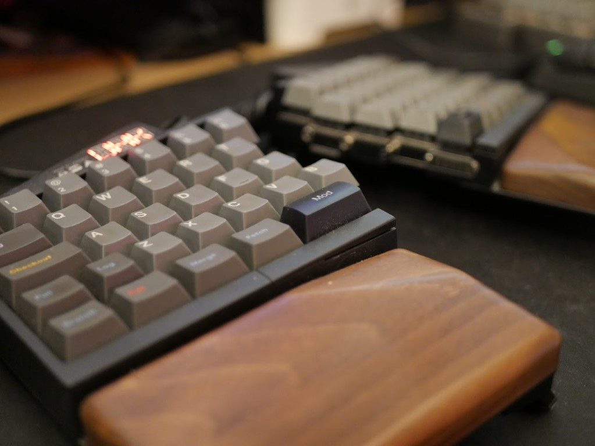
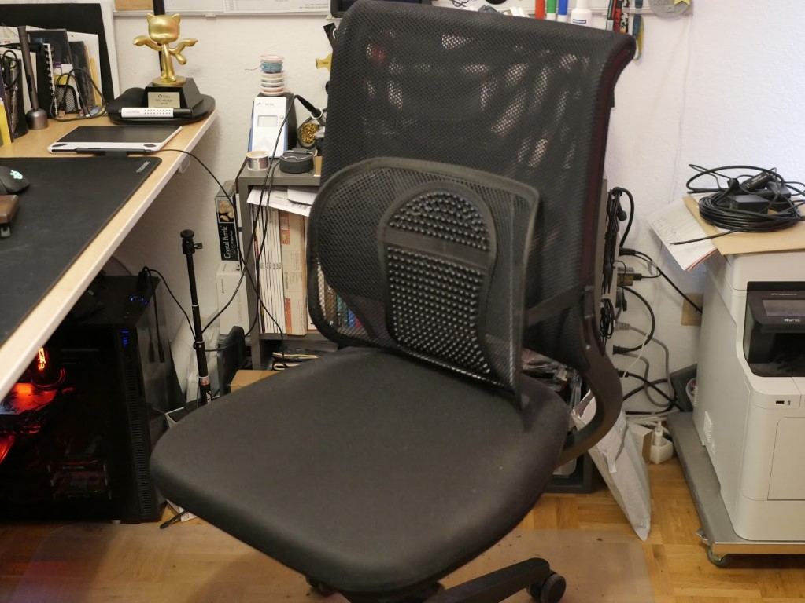
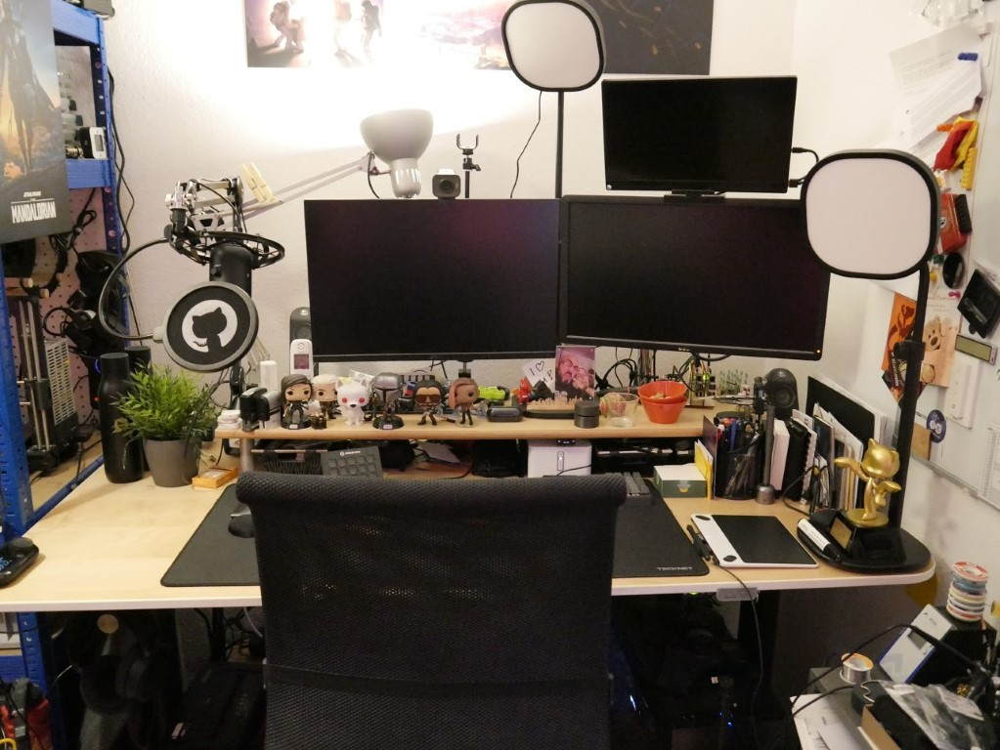

I've been working full time from my home office since mid-2014 now. At the time of writing this post this is nearing 7 years. Naturally, considering how much time I spend there, I've also spent a lot of thought and money on making sure my workplace helps to keep the usual side effects of the mostly sedentary lifestyle of a developer at bay.

Over the years I've had some run ins with RSI and backpain. My first wrist issues developed more than 10 years ago. Pain in my lower back beyond "all fine again after a good night's sleep" started in February of 2014. Both have been repeating visitors since then. You can probably imagine that that has led to a lot of research and experimentation to see what works and what doesn't for me. So, here's a summary of my findings as of March 2021. Quick disclaimer though, this is what has proven to work for **me**, that doesn't mean it will work for you, if in doubt please consult a professional. Also, I do link to some products here -- consider those references to give you more details on my setup, not official endorsement or anything like that.

## Keyboard and mouse

For my wrists, **ergonomic keyboards** have proven to be crucial in combating the dreaded pain and numbness. I started with a [Microsoft Natural Ergonomic Keyboard 4000](https://www.microsoft.com/en-us/p/natural-ergonomic-keyboard-4000/) (what a name...), switched over to an [Microsoft Ergo Sculpt](https://www.microsoft.com/en-us/p/microsoft-sculpt-ergonomic-desktop/), had a quick detour over a regularly shaped [Ducky One TKL](https://www.duckychannel.com.tw/en/Ducky-One-RGB-TKL) to get my feet wet in mechanical keyboards and these days have arrived at the 1st gen [Ultimate Hacking Keyboard](https://ultimatehackingkeyboard.com/). It's a mechanical split keybord, sized at 60% (which means it has less keys than your common 101-key keyboard, only 60% of them to be precise, and compensates for that with the use of layers reached through modified keys) and fully programmable. I'm still optimizing the macros I have configured on it. I got it with red switches (linear and non clicky, I can't stand keyboards I can't use while holding a conversation ;)) and put a Git-themed keyset on it which I absolutely adore. And it's finally made me switch to US ANSI layout, which indeed is way better suited for coding than ISO DE. The UHK also supports some additional modules, and I have a trackpoint and an additional thumb keycluster on order once they finally release.

No matter how good you can memorize keyboard shortcuts (or how well the mouse layer of the UHK works), you still also need a **mouse**. In my case that's been gaming mice exclusively for 15+ years now, with a ton of turnover due to wear out or quality issues. Currently I'm sporting a [Steelseries Rival 310](https://steelseries.com/gaming-mice/rival-310) after my last mouse, a Roccat Kone XTD, developed a flaky mouse wheel I couldn't fix, even though I tried my best. Apparently a design flaw. The Steelseries has so far worked nicely, but I've only had it for less than six months at the time of writing this. It's an asymmetric mouse tailored for use with the right hand. I can reach the side buttons easily and it isn't too heavy or too light either.

I also have a **trackball** though, dedicated to be used with my _left_ hand. Whenever I notice my right wrist acting up, I switch to exclusive trackball use for a while, and that has managed to still avert Bad Things a number of times now. If you find yourself regularly suffering from RSI issues on your mouse hand, I can really recommend to mix things up with a trackball on your left. Personally I got a [Kensington Slimblade](https://www.kensington.com/p/products/electronic-control-solutions/trackball-products/slimblade-trackball/). It's symmetrical and the buttons are easily remapped to fit a left hand operation. And the huge ball can also be used as a scrollwheel and is actually also a great fidget toy to have on the desk at all times ;)

## Desk and chair

In my opinion, there are two pieces of furniture you should never cheap out on: your **office chair** and your bed. I bought my [sedus netwin](https://www.sedus.com/en/products/chairs/netwin) office chair right after finishing university in 2007 and apart from having gotten a bit more dirty here and there it's as good as new. I initially got it with a set of arm rests, but quickly figured out that those were actually detrimental to my posture and made me pull my shoulders up, leading to tension related pain. So I removed them. I've also gotten it a bit more pronounced lumbar support through the aid of [an add-on](https://www.amazon.de/gp/product/B07PB7G3QJ/), the likes of which you can order online for less than 10€ a piece. If I were to buy a new chair today, I'd probably get one with a head rest to keep me a bit more from slouching during long debugging or gaming sessions, but all in all I'm still completely happy with it, and the mesh back has proven to make sitting on it on hot summer days more bearable.

I've now had an **electric standing desk** since January 2016. I'm currently trying to get into the habit of daily use of the standing mode again and so far it's looking good. I got the [IKEA Bekant](https://www.ikea.com/de/de/p/bekant-schreibtisch-sitz-steh-weiss-s69022537/) desk, and have since modified it to use the alternative [Megadesk](https://github.com/gcormier/megadesk) controller to give it position memory slots (and hopefully also to hook it up into my home automation system long term). I can't stress enough what a difference it can make to just stand for a while during your work day. Exclusively standing should definitely also be avoided (I've had to do this recently for a couple of days because my back would _not_ take sitting for an answer anymore, and it did a bit of a number on my ankles and knees), but regularly switching between sitting and standing is a great way not only to keep your posture intact but also to just get back your concentration. I currently work sitting until my lunch break, then switch to a couple hours of standing before either returning to sitting or calling it a day.

Speaking of sitting and standing -- I also recently acquired a bunch of accessories to make that more dynamic. While standing, I now regularly plant my feet on a **balance board** (a [Gymba](https://www.my-gymba.de/en) one in my case). It allows me to move while standing, to vary my stance more easily and frankly, it's also a ton of fun to seesaw back and forth while working. I use it with shoes - you can also use it barefoot/in socks, but frankly that was a bit to tough a surface or my feet. Your mileage may vary of course.

I also got myself a **wobble stool** from [Flexispot](https://www.flexispot.com/height-adjustable-wobble-stool-bh1b). Imagine a stool, but instead of being stable it has a rounded base that makes it constantly wobble around. You cannot easily slouch on that, you'll fall over. Mine can be height adjusted from 61 to 82cm, so I use it both while standing as a small break, but also while sitting. I'm still getting used to it and am experimenting with heights and best way to sit on it, but it's so far been a great addition and doesn't take up much space (a serious plus in my limited office space).

## Monitor mounts

Last but not least, I've got my two main monitors mounted on a **dual monitor mount**, in my case a [gas lift one from PureMounts](http://www.puremounts.de/pm-office-dm-23d.html) (the small third monitor is mounted to the second one with a self designed printed mounting solution). The stands usually included with monitors tend to not offer enough flexibility to truly dial in the position of the screen in my experience, and this also managed to free up a _ton_ of desktop real estate that I can now utilize. In my case, a wallmount is not an option due to the standing desk situation, so I instead went for a desk mount. A gas lift is not the most stable option in my experience: things can be a bit shaky when I accidentally bump against the desk due to the rather extreme lever position I had to chose to make things work in my office, but it has been working just fine now since 2012. Still, at some point I might get something a bit more static. In any case, a monitor mount is something I'd highly recommended for everyone really, even if you don't want if for ergonomic reasons -- I cannot emphasize the increase in desk space enough ;)

## tl;dr

Get a split ergo keyboard, a gaming mouse for your primary and a trackball for your off hand. Don't cheap out on your office chair, seriously consider investment in a standing desk, get a balance board with it and finally reclaim your desk and improve your workplace's ergonomy at the same time with a monitor mount.
