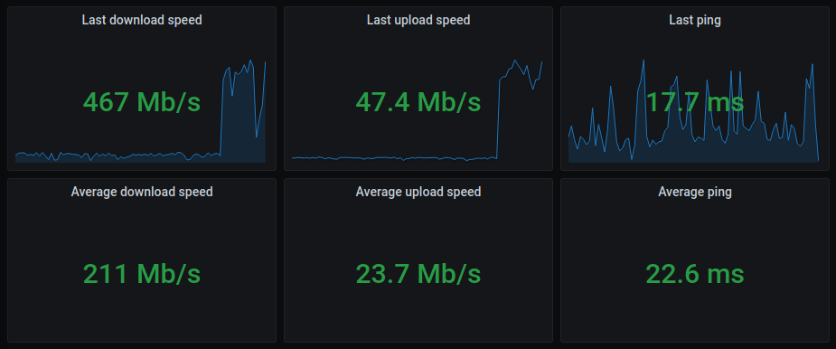
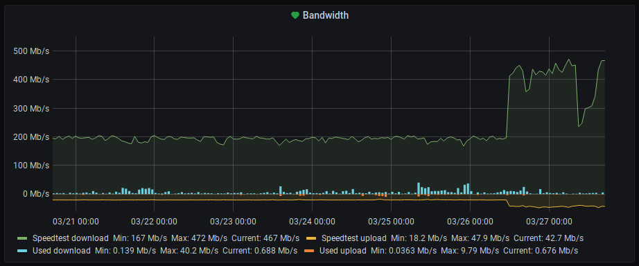
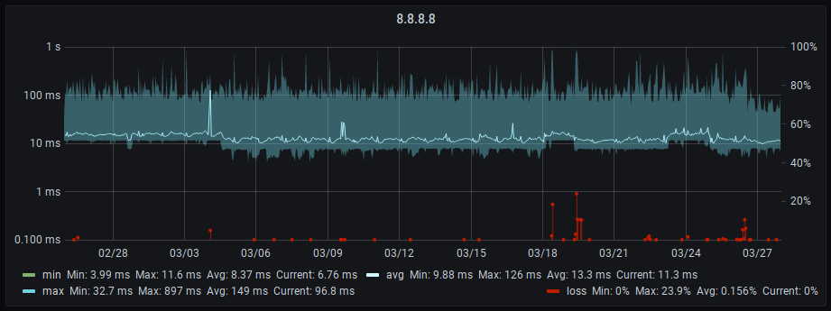
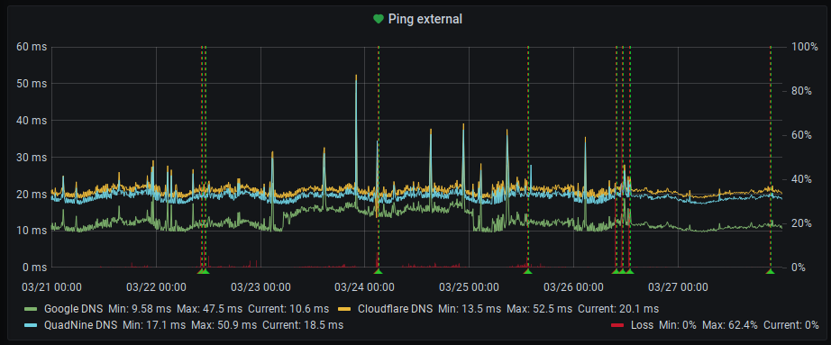
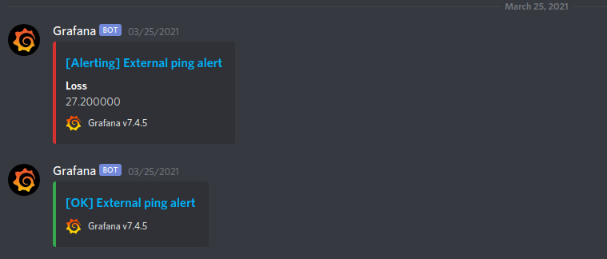

For a bit more than two years now I've been closely monitoring my network uplink. In the past I had a ton of issues with up- or download speeds not being what I paid for, packet loss issues and outright full blown outages. In order to put myself into a better position when reaching out to the ISP's support hotline I figured it would be good to be able to proof not only the existence of these issues but to also be able to determine the exact times they happened at and also to verify and show that in fact it was only external connections that were suffering and it was not an issue with my own internal network. Given that I don't trust the cable modem/router they force on me to be my edge router and instead have my own Unifi gear set up behind it (considering anything not exclusively under my control to be part of the hostile public internet) this otherwise will usually lead to endless attempts to blame my LAN when in fact the issue lies outside of my reach.

I already had an [InfluxDB](https://www.influxdata.com/) and [Grafana](https://grafana.com/) setup running anyhow for my [Home Assistant instance](https://home-assistant.io/) to dump values from my home climate sensors into, so it was a logical next step to simply add some additional sensors to the mix.

## Throughput

I currently run a speed test of the network throughput every 20min and log the results via MQTT into InfluxDB. I had to find out that neither the speed test integration in Home Assistant nor the official speedtest-cli tool were performing reliably enough for this -- I was constantly getting dips in measured throughput and thus alerts, even when everything was completely fine with my uplink.

I solved this by turning to [speedtest-rs](https://github.com/nelsonjchen/speedtest-rs) and a small shell script that parses the output and pushes it into MQTT to Home Assistant, which then processes it further for some visualization right on my dashboard but also forwards it further into InfluxDB. You can find the `Dockerfile` and the script plus some further info [in this gist](https://gist.github.com/foosel/ef98a5774d1a495ab3781eba8a157fee).

In Grafana I then use this data to provide me with some single stat panels for the current downstream, upstream and ping values as well as the averages over the selected time range:

Additionally, I also plot the down- and upstream speed in a timeline, together with the current bandwidth consumption as extracted by Home Assistant from my ISP's cable modem/router (thanks to the [Fritzbox NetMonitor integration](https://www.home-assistant.io/integrations/fritzbox_netmonitor/)). Together, this gives me a good picture of whether there is actually an issue when I see a dip in the measured values, or if it's just too high bandwidth utilization:

You can see in these screenshots that I recently upgraded my plan with my ISP -- from 200/20 to 500/50 MBit. The problem: The speedtest run by my monitoring setup doesn't hit the 500 mark, whereas running a manual test on speedtest.net works just fine. Looking at the `speedtest-rs` README it becomes apparent that this is a known issue with the legacy (open) Speedtest.net API:

> This tool currently only supports [HTTP Legacy Fallback](http://www.ookla.com/support/a84541858) for testing.
>
> High bandwidth connections higher than ~200Mbps may return incorrect results!
>
> The testing operations are different from socket versions of tools connecting to speedtest.net infrastructure. In the many FOSS Go versions, tests are done to find an amount of data that can run for a default of 3 seconds over some TCP connection. In particular, `speedtest-cli` and `speedtest-rs` tests with what Ookla calls the ["HTTP Legacy Fallback"](http://www.ookla.com/support/a84541858) for hosts that cannot establish a direct TCP connection.

I fear I might have to look into reimplementing the current speedtest-to-mqtt setup with another container utilizing the official (and sadly proprietary) Speedtest CLI tool to mitigate this issue. Thankfully, it should be quite easy to build a drop-in replacement thanks to the modularization in effect.

_Update from March 30th 2021_ I've now done that and [here's an updated gist](https://gist.github.com/foosel/70ecbeade55cc852dbc0a4f7c4040adc) that works identically to the `speedtest-rs` approach, but instead utilizes [Ookla's official command line tool](https://www.speedtest.net/apps/cli). The results are stable numbers that reflect the expected bandwidth and also match the web based test results.

_Update from March 31st, 2021_ I wasn't too happy with running a proprietary tool for my speed testing, went looking for an OSS alternative, came across [librespeed](https://librespeed.org/) and therefore have now [replicated the setup again using that](https://gist.github.com/foosel/f7d9a08c0445454ab90d6c4974a9e316). You might want to experiment a bit to find a server close to you and define that via `--server <id>`, the auto discovery appears to be a bit wonky. Or just use your own server list via `--server-json` or `--local-json`.

## Latency and packet loss

In addition to the available up- and downstream speeds, I constantly monitor latency and packet loss to a selected number of hosts both external and internal to my network as well. For this I ping some public DNS servers (Google, Cloudflare and Quadnine) and some of my own vservers for the remote side, and the ISP's Fritzbox, my managed network gear and internal servers for the LAN side. I used to do this via [Smokeping](https://oss.oetiker.ch/smokeping/), but when I set up my InfluxDB/Grafana stack I wanted to find a solution to have everything together in one place.

Thankfully I almost immediately found [this post by Tor Hveem](https://hveem.no/visualizing-latency-variance-with-grafana) who solved this with a little custom Go tool to run `fping` against a number of configurable hosts and push the results right into InfluxDB. This was exactly what I wanted and thus I replicated the outlined setup, albeit with a slightly different color scheme.

I use a [modified version of Tor's `infping` tool maintained by Nick Van Wiggeren](https://github.com/nickvanw/infping) and run that in a Docker container on my NAS. You can find everything needed to run this on your own [in this gist](https://gist.github.com/foosel/46804306d510d79f14117f95ed64b877).

As a result I get ping output for all hosts every 60 sec with times and packet loss information pushed right into InfluxDB. This is easily queried by Grafana and looks quite nice when visualized:

And on my network dashboard, I plot only the `avg` values across all hosts and a mean `loss` value into one single graph each for external and internal hosts:

This allows me a good overview of the current state of uplink and internal network at one glance.

## Alerts

Since just graphs won't give me an immediate heads-up when something goes wrong, I have a bunch of alerts set up in Grafana:

-   Measured download speed falls beneath 250MBit for more than one hour
-   Measured upload speed falls beneath 35MBit for more than one hour
-   Mean packet loss across all external hosts rises above 25% for more than ten minutes

All of those trigger a notification to a private Discord server (via Grafana's own notification mechanism). In theory this notification should even include a screenshot of the panel for which the alert was triggered for, but I'm having some problems with that still that I need to investigate.

This notification channel has an obvious problem: When the uplink goes out completely, I won't get the notification if my phone is in my LAN. I really need to add a local alert as well at some point 😅

Still, it usually will give me a heads-up in time for me to reach out to my ISP on short notice and request they start troubleshooting.

## Conclusion

This monitoring setup has proven valuable in debugging network performance issues and also getting an early heads-up about current ISP issues. I have successfully used screenshots for proving ongoing issues to my ISP, and also sped up the one or other troubleshooting session when there was in fact an issue with my LAN. In my book, that makes it absolutely worth the time it took me to set this up and maintain it. And: it kinda looks cool 😎

If you want to give this a go yourself, this might be of interest to you:

-   [Dockerfile, compose and instructions for speedtest container](https://gist.github.com/foosel/f7d9a08c0445454ab90d6c4974a9e316)
    -   [Ookla speedtest based version](https://gist.github.com/foosel/70ecbeade55cc852dbc0a4f7c4040adc)
    -   [speedtest-rs based version](https://gist.github.com/foosel/ef98a5774d1a495ab3781eba8a157fee)
-   [Dockerfile, compose and instructions for infping container](https://gist.github.com/foosel/46804306d510d79f14117f95ed64b877)
-   [Panel JSON for the mentioned visualizations](https://gist.github.com/foosel/ec0b6355d1d0c3ab65ee4df79d795a73)
