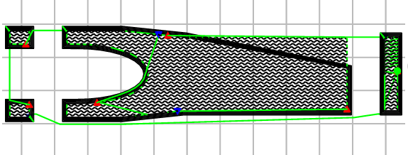
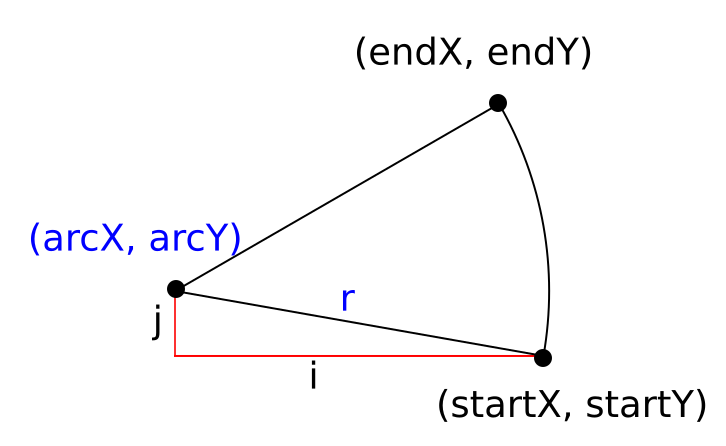
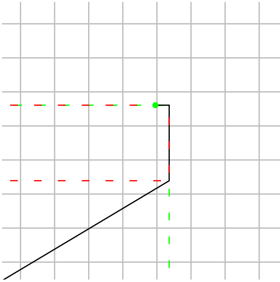
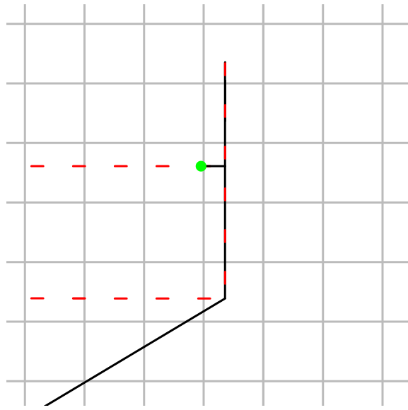
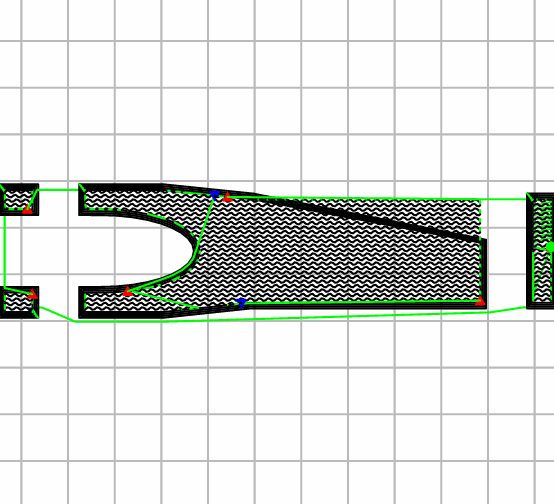

About a week ago I got a new [bug report](https://github.com/OctoPrint/OctoPrint/issues/4117) on [OctoPrint's](https://octoprint.org) issue tracker:

> **GCode Viewer Visualisation Problem**
>
> *The problem*
> 
> The visualisation in GCode viewer ist not correct. The print is OK.
> See gcode file (zip) on Layer 43 to 47 and 49
>
> And screenshot

You already saw the included screenshot, and it shows that there was a spike being visualized in the GCode Viewer that
wasn't actually there. My first attempt at reproduction failed spectacularly -- the file looked exactly like
it was supposed to. Then I noticed that the OP was using Google Chrome however (adding the detected user agent
to the system information contained in OctoPrint's new System Info Bundles already paid off!) and tried with that
instead of my usual Firefox, and lo and behold, I saw the issue.

Scrolling a bit through the file revealed further defects, as also mentioned by the OP, e.g. this one:



At this point it was clear that this was a Chrome-only issue. But was it a bug in OctoPrint or possibly a browser 
bug? More information for that was needed but not readily available, and the file was also too big to quickly
gleam anything from the GCode itself that could possibly help to narrow down on the problem. 

So the first step was to create a minimal GCode file that showed the same error. For this I took a look at 
the reported layer height in the viewer on the layer a defect was visible and then narrowed down on the affected lines
by using the horizontal command sliders to further limit the view. That way I quickly found that these were the 
problematic lines:

``` gcode
G1 X173.595 Y103.9 E247.16716
G3 X173.600 Y126.097 I-105613.507 J39.645 E248.20080
G1 X169.552 Y126.098 E248.38933
```

More specifically, the error was caused by the contained [`G3` command](https://reprap.org/wiki/G-code#G2_.26_G3:_Controlled_Arc_Move), 
which instructs the printer to move in a counter clockwise arc
from its current position to the given X and Y coordinates, with the center of said arc offset by the given I and J
parameters. In the case of these lines, that meant to move in an arc from `(173.595, 103.0)` to `(173.600, 126.097)`
with the arc's center at `x = 173.595 + (-105613.507) = -105439.912` and `y = 103.9 + 39.645 = 143.54500000000002`. 
Or in other words, a rather short arc with an enormous radius of over 105m that was more a straight line than
an arc really. And that line was being drawn too long, causing the weird spike in the rendition.

In order to understand how that could happen however we need to take a look at how the GCode viewer is implemented and how
arcs work in that implementation. At its core, the GCode viewer is an HTML5 2D canvas on which the path described in 
a GCode file gets drawn. Commands like `G0` and `G1` that describe straight lines are drawn using [`lineTo`](https://developer.mozilla.org/en-US/docs/Web/API/CanvasRenderingContext2D/lineTo),
arcs as described by `G2` and `G3` are drawn using [`arc`](https://developer.mozilla.org/en-US/docs/Web/API/CanvasRenderingContext2D/arc).

`arc` takes six parameters: the `x` and `y` coordinate of the center of the arc, the radius `r`, the `startAngle` determining from which angle to start
drawing the arc and the `endAngle` until which to draw the arc, and a flag that's `true` for counter clockwise and `false` or empty for clockwise.
It is obvious this doesn't directly translate to the data contained in the GCode itself, where we rather have three points defining the arc -- a start
point, and end point, and the arc's center. So we need to translate this into the data required by the `arc` method. Using some trigonometry,
that is fairly straightforward:

``` js
// given: G2/G3 X<endX> Y<endY> I<i> J<j>, <startX>, <startY>
arcX = startX + i;
arcY = startY + j;
r = Math.sqrt(i * i + j * j);
startAngle = Math.atan2(startY - arcY, startX - arcX);
endAngle = Math.atan2(endY - arcY, endX - arcX);
ccw = (command === "G3")
```



My first guess was that the result of this conversion was somehow different between Firefox and Chrome, and so I modified the GCode viewer to log
the calculated values and then compared the two outcomes. The values were completely identical between both browsers, so what was being fed
into the canvas `arc` command was identical and yet produces different results. Why?

My next approach was to add some more visual debug output to the viewer itself. I modified it such that the arc parameters as calculated would 
actually be drawn on the canvas as well, in form of a geometrical pizza slice showing the arc's center, its "legs" and its rim. And this is where
I saw a difference in the rendered output. Where in Firefox the arc's rim and its legs met perfectly:



in Chrome the rim overshot:



So while the calculated parameters were correct and in both cases provided to the `arc` method just the same, Chrome was rendering the wrong segment length! 

I suspected a rounding error and thus started searching for matching reports from other people. I couldn't find a specific bug report, but I came across a post on Stack Overflow that sounded mightily familiar: [HTML5 canvas arcs not rendering correctly in Google Chrome](https://stackoverflow.com/questions/8603656/html5-canvas-arcs-not-rendering-correctly-in-google-chrome), from 2011. A ten year old post... could it be?

Honestly, I still do not know if this indeed described the same issue or not, or if there's a Chrome ticket describing this behaviour -- I'll continue to look, but first and foremost I was focused on fixing this problem in OctoPrint's GCode viewer. The Stack Overflow post provided a code snippet that reimplements `arc` utilizing bezier curves, and so I gave this a try. Long story short, OctoPrint's GCode Viewer as part of version 1.7.0+ will ship with a Chrome-only `arc` replacement that will be enabled by default, but can also be disabled in real time, with great effect:



And the moral of the story: It rarely is a browser bug. But sometimes, all signs say it indeed *is* and a workaround is the easiest solution.
