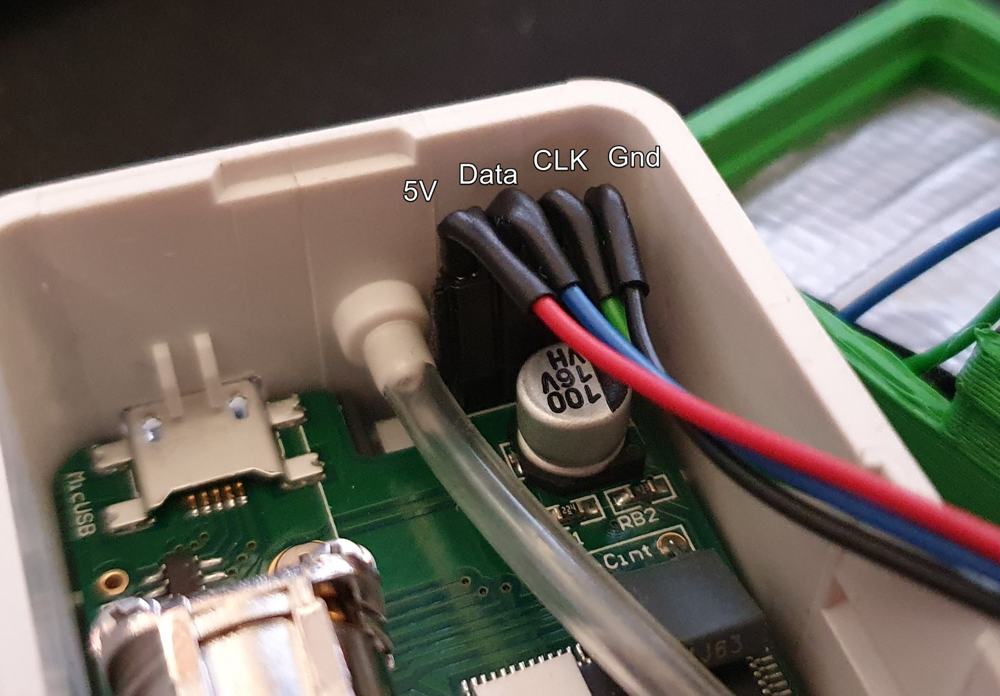
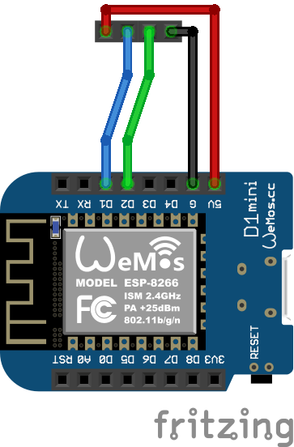
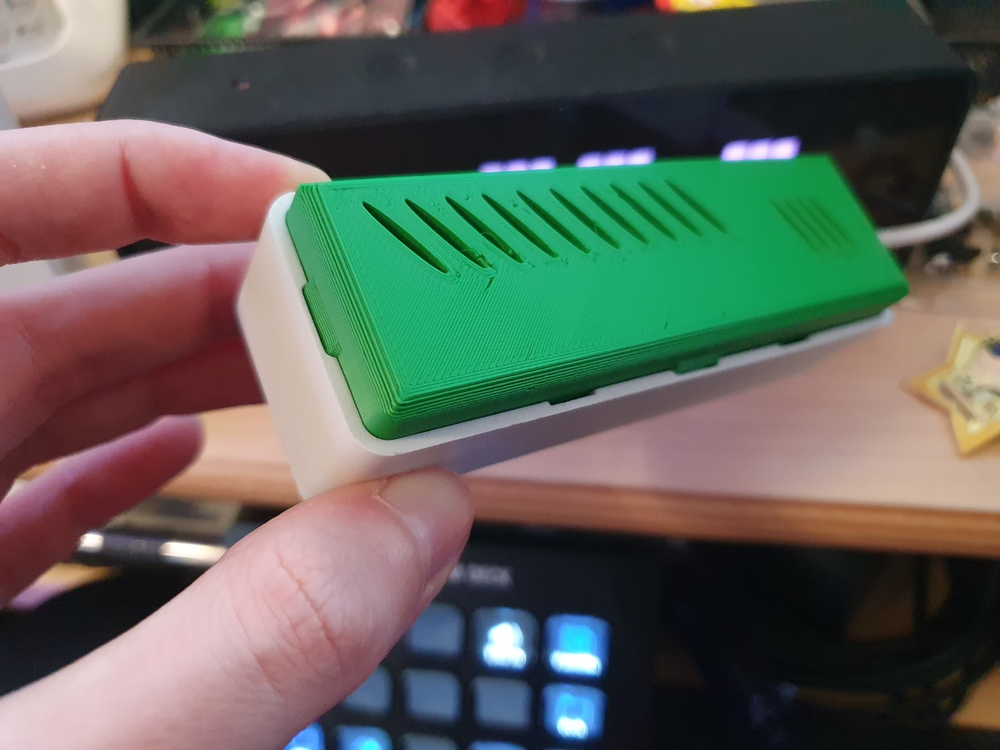
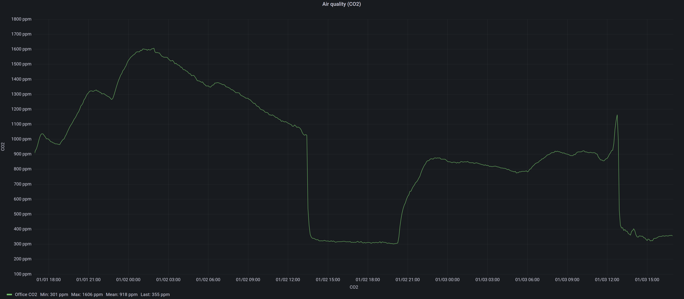

I attended RC3 from December 27th until December 30th. While it was (once again)
only a virtual edition of the Chaos Communication Congress, at least this time
around I managed to have a similar experience to 36c3, as in, I spent the last two days
mostly hanging out with a bunch of fellow geeks in a fun location (a jitsi conference
that also included a camera pointing at an aquarium full of fish) and nerding out
while tinkering around with electronics.

And thus I finally integrated the CO2 sensor unit I bought a couple weeks ago into
my Home Automation setup, with the help of a Wemos D1 Mini and [ESPHome](https://esphome.io). At first
I went with an ESP12, a voltage regulator and a [different firmware](https://github.com/schinken/esp8266-co2monitor),
but that didn't work out due to the ESP not wanting to behave (my guess is I didn't wire the barebone module
up correctly or the voltage regulator was causing issues) and I also got some weird readings 
reported by the firmware (20k ppm CO2 - I know the air in my office can get bad after a couple of hours of
coding, but not THAT bad).

The CO2 sensor is an "AIRCO2NTROL MINI" from TFA Dostmann, but it is also available under other names
with a very similar case and more or less the same internals, as I learned from the
[ESPHome docs](https://esphome.io/components/sensor/zyaura.html). Where my Dostmann edition seems to differ from the majority is the
pin order of the internal debug port, which turned out to have CLK and DATA swapped
in my case, which caused me quite the headache and a bit of frustration. So just for future reference,
the pin order I found in my device is 5V - Data - CLK - Gnd from left to right with the hose to the left:



I hooked these up to the Wemos D1 Mini (clone) like this:



So 5V to 5V, Gnd to Gnd, Data to D1 and CLK to D2.

The ESPHome config I then flashed to the D1 is the following:

``` yaml
esphome:
  name: dostmann-office
  platform: ESP8266
  board: d1_mini

logger:

mqtt:
  broker: !secret mqtt_iot_broker

ota:
  password: !secret ota_pass

wifi:
  ssid: !secret wifi_iot_ssid
  password: !secret wifi_iot_pass
  ap:
    ssid: "Dostmann Office Fallback"
    password: !secret fallback_pass
  power_save_mode: high

captive_portal:

sensor:
  - platform: zyaura
    clock_pin: D2
    data_pin: D1
    co2:
      name: "Office Dostmann CO2"
    temperature:
      name: "Office Dostmann Temperature"

  - platform: wifi_signal
    name: "Office Dostmann WiFi Signal"
    update_interval: 60s
```

(If you are wondering about the `!secret` stuff, those values are contained in 
a `secret.yaml` file in my esphome folder, and you can read all about that
[in the ESPHome docs here](https://esphome.io/guides/faq.html#tips-for-using-esphome).)

And with that I could now see the sensor in my Home Assistant instance and forward the data
easily to my InfluxDB & Grafana monitoring stack.

To put everything together physically, fully contained, I used [this alternative backplate](https://www.thingiverse.com/thing:4225732)
by Stefan Kern. 



However, I've noticed a temperature increase of around 3°C with it and the ESP
in place, and I fear this might be screwing with the CO2 sensor's calibration (as the measurement
is temperature sensitive). I already mitigated this a bit by setting the chip to power save and adding some strategically placed aluminium tape,
but that's only improved things slightly. Due to that I plan to redesign the 
backplate to have the ESP outside the sensor case, in its own compartment. I 
hope that will solve the "running hot" issue for good then, but we'll see.

*Update from January 27th 2022* I redesigned the backplate and now have a solution that seems to work better, based on the reported temperature and CO2. [I've published it here](https://www.prusaprinters.org/prints/119968-airco2ntrol-mini-backplate-with-wemos-d1-mini).

In any case, for now I at least got a reliable indicator of my office's CO2 levels that also now
are trackable long term, and I have also forwarded the current values to my [AWTRIX mini](https://awtrixdocs.blueforcer.de/)
via some NodeRED flow that also takes care of color coding. Further possibilities include
flashing the office lights or some audio cues, should just the visual warning turn out
to be insufficient in the long term 😉


