My partner and I both got ourselves SteamDecks in 2022. Since then he's repeatedly mentioned that he'd love to have
colored buttons on his, matching the XBox controller layout, as many PC games use these colors for their
button hints during quick time events and similar. But sadly, nothing like that is available yet.

With that in mind, and after losing my initial fear about opening up the deck thanks to swapping my fan and upgrading 
my SSD on January 1st of this year, an idea for a surprise started to form in my head. I had watched a ton of videos
on silicone molding and resin casting, I have several 3d printers at my disposal, and there was just enough time left
in my vacation and until our anniversary to pull this off. So I went to work. In total secrecy.

## Research & material collection

The first thing I jumped into was some research in order to be able to make a plan and know what to get.

I ran across [this interesting thread](https://bitbuilt.net/forums/index.php?threads/resin-casting-molding-buttons.2316/)
on button casting which gave me a good idea of what I'd need in terms of materials. It also taught me that I needed to 
figure out what kind of mold I'd even need to create for the buttons. Were they flat on the bottom in which case a single part 
mold would suffice, or were they curved or otherwise featured, in which case I'd need to create a two part mold? Instead of 
disassembling my deck right away (too obvious with my partner being around) I decided to instead checkout 
[this excellent disassembly guide on iFixit](https://www.ifixit.com/Guide/Steam+Deck+Action+Buttons+(ABXY)+Replacement/148950)
which showed me that the buttons are indeed inset on the bottom, and so I'd need a two part mold.

That in turn meant I needed to look into mold release for multi part silicone molds in addition to silicone and resin. The 
material list in the thread sadly didn't help me - I couldn't get half of this stuff in Germany - but here's what I finally settled on:

- **Reschimica Silicone RPRO 30** (silicone)
- **Trollfactory Silicone Mold Separation Cream** (two part mold release)
- **clear two part epoxy resin** (I got this from a friend who happened to have some collecting dust for several months, still sealed)
- **food vacuumizer pump and container** (to degass silicone and resin, based on an idea from [this hackaday article](https://hackaday.com/2019/12/19/degassing-epoxy-resin-on-the-very-cheap/) - a real vaccum chamber and also a pressure pot would have been nice, but I didn't want to break the bank over a bunch of buttons here 😅)
- **Mica powder** (to color the resin)
- **white 4mm rub on letters** (to put the lettering on the buttons)
- **clear UV resin** (to seal the lettering in)
- **wooden stir sticks**
- **plastic mixing cups**
- **small paper mixing cups**
- **10ml syringes** and **14g blunt needles** (for injecting the resin into the mold)
- **plastillina clay** (to fix the buttons during the silicone pour)

Thanks to owning a resin printer, I already had **a UV flashlight**, **nitrile gloves** and a **respirator** on hand. 

And at least one ready to go **FDM 3d printer** for helping me in the mold creation process.

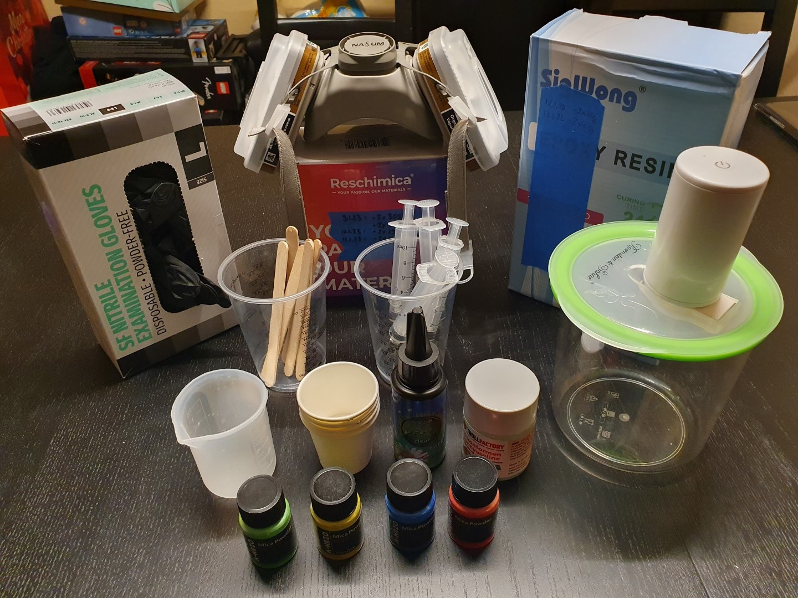

## Creating a two part silicone mold

Next step was to create my two part silicone mold and for that I first needed something to fix the buttons to, do the pour for the first
part of the mold, flip that over and create the second part of the mold. I did some more research and came across two 
interesting videos, ["How To Make Custom PS5 Controller Buttons"](https://www.youtube.com/watch?v=mjKAkul-VDQ) and 
["Upgrade Your PS5 Controller with DIY Resin Buttons - Better than the Original!"](https://www.youtube.com/watch?v=DfbIYH3xauc). 
In both, EJ uses a 3d printed box with custom bottom to hold the buttons in place and create a keyed two part mold. So, I did
create just that as well. My mold box consists of several parts: two halves forming the box, a bottom for the first part (creating the
keying), a smooth bottom and a top brace for the second part. The bottoms slot into the box halves, the top brace is just friction
fit. Why the top brace? To hold some toothpick halves in place that create channels for resin to go in and air to go out when the
mold is closed.

I designed all this in FreeCAD[^1] and this is how it looks:

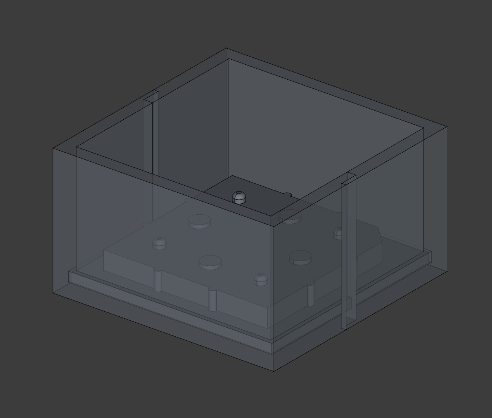

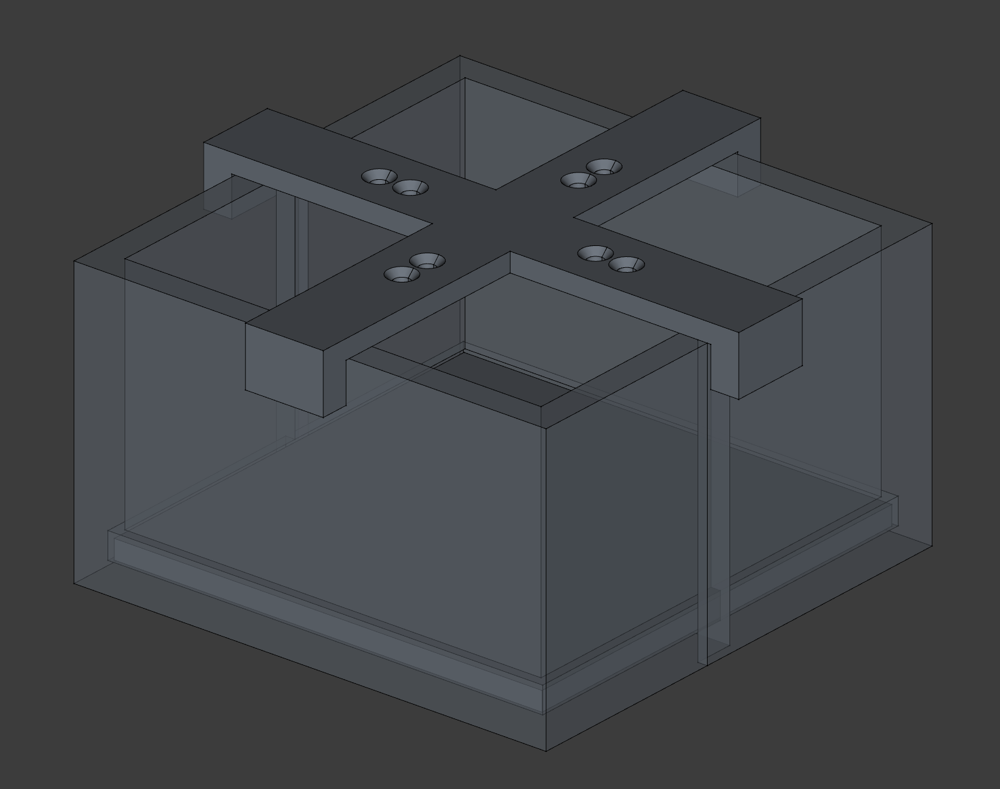

You can find the STLs [here](https://www.printables.com/model/374098-steamdeck-button-mold-case). All of the parts were printed 
on my heavily modified Prusa MK3 with a 0.6mm nozzle and a 0.3mm layer height in black extrudr PLA NX2 - you might have to adjust
the tolerances on other printers or with other filaments, which is why I also included the FreeCAD file (which could be cleaner, 
but it worked for me).

Once I had the mold box ready it was time to disassemble the deck and get the buttons in my hand. So I waited until my partner 
was out of the house and then got going.

First, I disassembled everything based on the [aforementioned iFixit guide](https://www.ifixit.com/Guide/Steam+Deck+Action+Buttons+(ABXY)+Replacement/148950). I attached the buttons to their spots on the keyed bottom plate of the mold box with some thin, rolled clay wormy 
dealies and then thoroughly cleaned them with some q-tips and isopropyl alcohol. It is important to be *very* thorough here - any
dirt or even just a fingerprint *will* show up in the silicone mold and thus in the resin casting as well. I actually found that 
the outlines of the letters molded into the original buttons left an impression. The level of details you can get from silicone 
molds is astonishing! 

Also make sure that you keep the lettering of the buttons oriented the same way, that way you will also
be able to re-use the mold later for buttons with inlayed lettering (which is my plan for version 2.0 of this project).

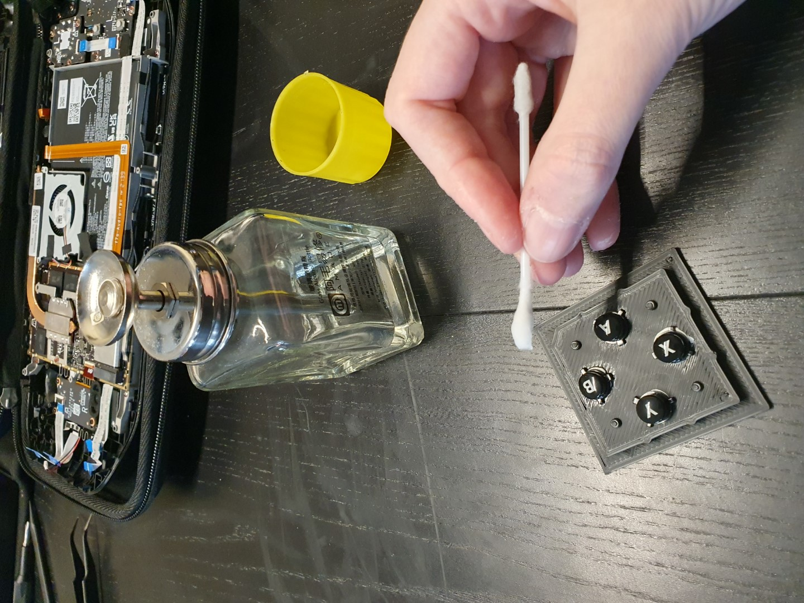

I then slid the bottom plate into the grooves of the mold box halves, sealed the seam with some blue painters tape and just to be
safe also wrapped two rubber bands around it.

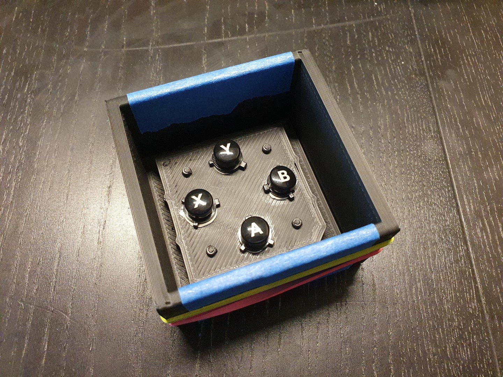

Now came the time for the first pour. I weighed out 35g each of part A and B into a plastic mixing cup (my silicone gave instructions for mixing 1:1 by weight, stick to your instructions!) and then thoroughly mixed
it with a stir stick. Then I poured that into a *second* cup, from high above, in a thin stream - this is first to get some of
the bubbles out but more importantly to prevent any unmixed silicone from getting into the mold. This cup I then degassed. For my
first pour I actually used a power sander to vibrate the bubbles out, but for the second pour I went with the above mentioned
food vacuumizer - it's easier, you get way less shaky hands out of it, and the results also look better. So, into the food container, 
lid on, pump on. I degassed until bubbles stop coming out. Then I slowly poured the silicone into a corner of the mold 
box, once again in a thin stream from up high. Take your time here, the slower, the less risk of errant bubbles making it into
the mold. Then I degassed the mold again for a couple minutes and let it cure based on the instructions. 

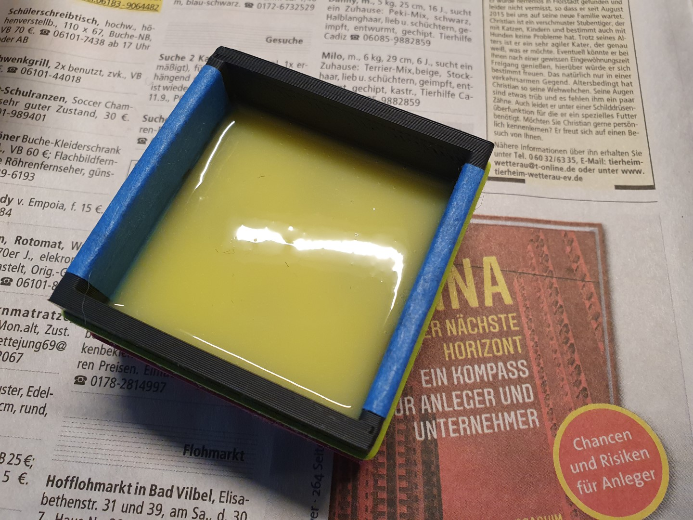

Next, I demolded the first part by removing rubber bands and the tape around the box and then carefully pulling the two halves 
apart. I then slowly removed the bottom plate from the silicone part as well, being careful to keep the buttons inside[^2]. 
I then cleaned them off of any leftover plastillina clay and any small bits of silicone.

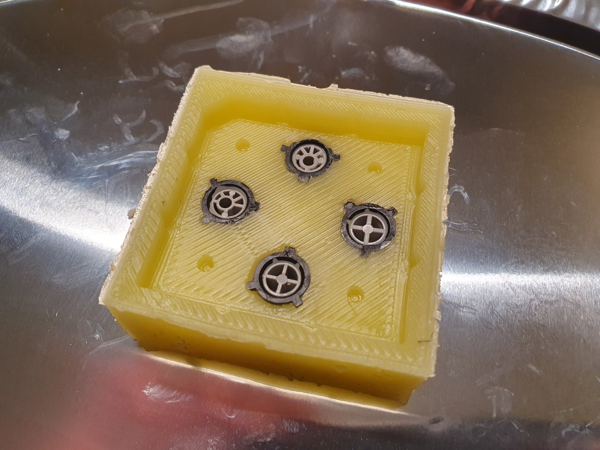

After that I placed the first part of the mold on the smooth bottom plate and slid that back into the mold box. I then applied a
generous coating of two part mold release. I used an old drybrush for that and liberately spread it all across the silicone and
box surfaces, making extra sure to get into all the corners and creases. I taped the box seams again and then put the top brace
in place. I broke four toothpicks in half, also broke off most of their tips, and then inserted one into each of the brace holds,
pushing into opposite ends of the buttons underneath. This was to create channels for the resin to flow into and air to push
out of the mold.

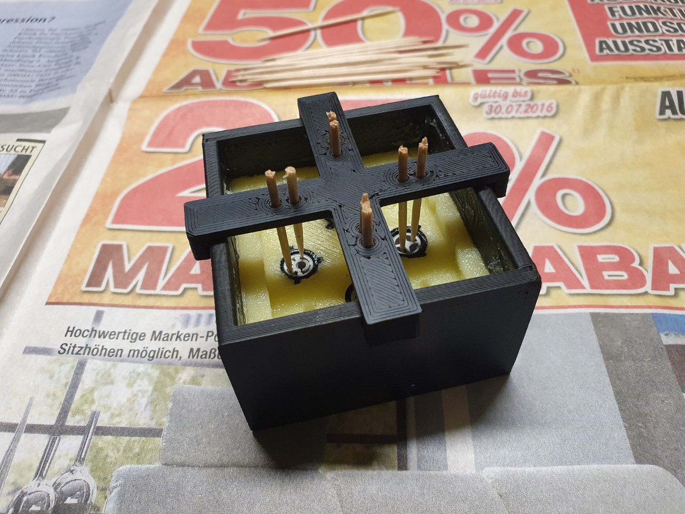

I once again mixed 70g of silicone from 35g of each part A and B, moved into a second cup, degassed it and slowly poured it into 
the mold. Then that was degassed as well and left to cure.

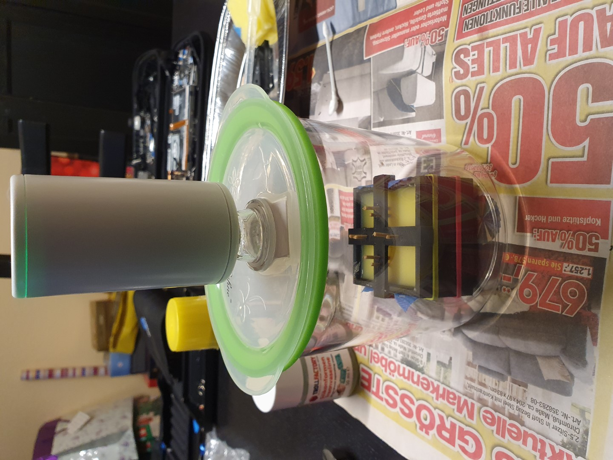

Another 5h later I carefully demolded my two part mold. I once again removed tape, rubber bands and the top brace, pulling out
the toothpick halves in the process. I then carefully pulled the two halves of the box apart again and equally carefully peeled
the two parts of the mold apart from each other.[^3] I could now remove the buttons, clean them, place them back into the deck and
reassemble it. Then I cut off some of the silicone bits that had been sucked into the internal hollow structure of the buttons
which I *did* not want to replicate. I was very diligent here to not cut away too much. And then I was the proud owner of a two 
part silicone mold for SteamDeck action buttons.

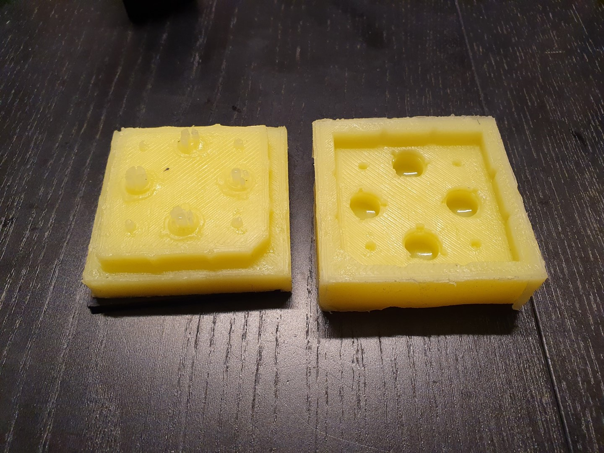

## Resin time, resin time, do do do do, resin time

*Wear gloves and a respirator during this!*

With the mold now ready for action, it was time to try my hand at resin casting. I first assembled the mold, securing the two 
halves with four rubber bands. I also attached the mold to a piece of cardboard in the process on which I noted down the location
of each of the buttons inside the mold. This is really important to keep track of which button goes where. With everything being 
mirrored thanks to the buttons basically lying on their faces in the mold you otherwise get terribly puzzled and end up with
buttons of the wrong color. Ask me how I know 😅 If you get confused on which button is which, take a close look at the 
spaces they left in the mold. The B button of the deck is slightly curved on its outer side due to following the deck's case
curving, and that has helped me a ton to keep track of it and everything else in relation to it.

Next, I mixed up 40ml of resin, so 20ml of each part A and B (my resin gave instructions for mixing 1:1 by volume, check your 
instructions!). I degassed it in the vacuum container and then spread it across
four small paper cups, roughly 10ml each. I then added red, greed, blue and yellow mica powder to each of the cups, mixing that
in thoroughly, before placing the cups into the vacuum container and degassing them again. Next, four syringes with blunt 14g
needles were filled with the four colors of resin and then the buttons were filled with the respective color. After getting 
confused with the colors on my first try, I double and triple checked each color before filling it in on the second. I carefully inserted
the needle into the inner channel and then slowly pressed the resin in until it came out of the outer channel. On my first
try I made the mistake to overfill, which caused some unintentional color mixing, so be sure to really stop right when the 
resin comes out of the air channel. 

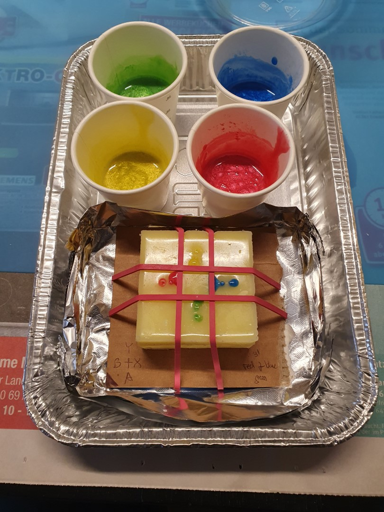

I then let the buttons cure for 24h before taking a first peek. 

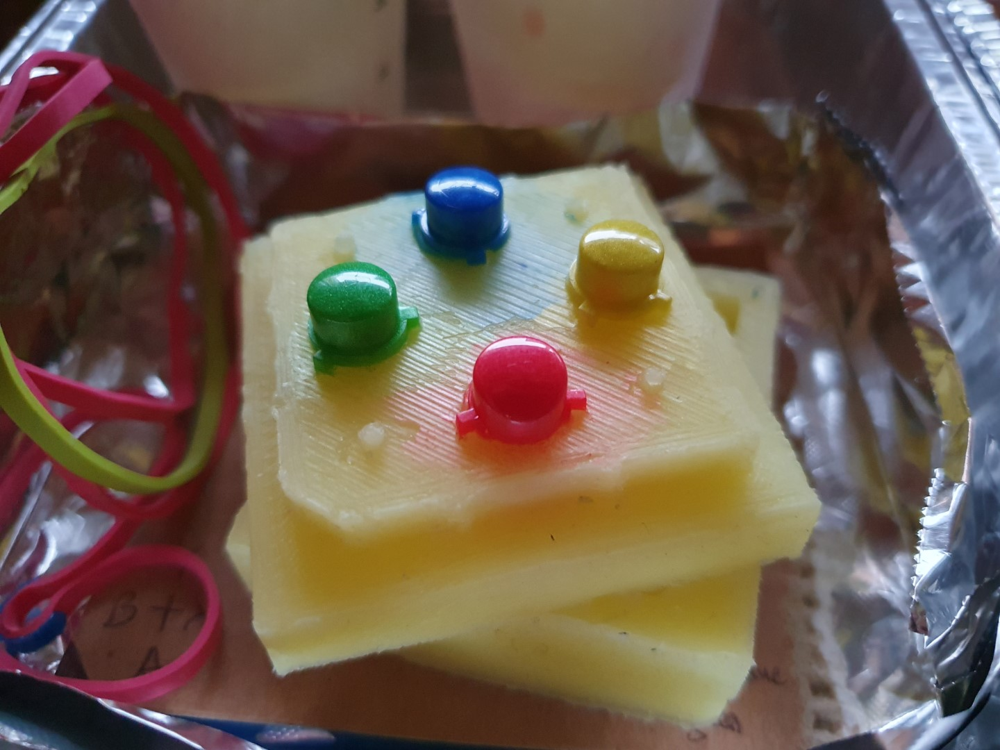

They looked great, but a quick fingernail test on one of the resin pots showed the stuff was not fully hardened yet. It turned 
out to take 72h until I could proceed with the finishing steps.

## Finishing the buttons

I kept the buttons attached to the mold for the final steps, as that helped a lot with keeping everything aligned and
less fiddly (it was fiddly enough as is). I carefully placed the sheet with rub on lettering I had bought over each button,
making sure to center the corresponding letter. Then I rubbed the letter on using the blunt tip of my letter opener. The stuff
didn't want to stick to the smooth top surface very well, which had the upside of allowing me to redo something if I messed up, but also
the downside of me having to be *very* careful to not mess things up that were already fine. In the end, it took me some tries
but I prevailed.

Then I got out the UV resin, put on the respirator and gloves, and with an old brush softly brushed on a thin layer of
resin on each button, careful not get any drops on the side or pooling, but sealing in the letter. I then cured that for several minutes
with the UV flashlight.

Once the resin was cured I carefully pulled out the buttons from the mold and then cut off the sprue with a flush cutter.

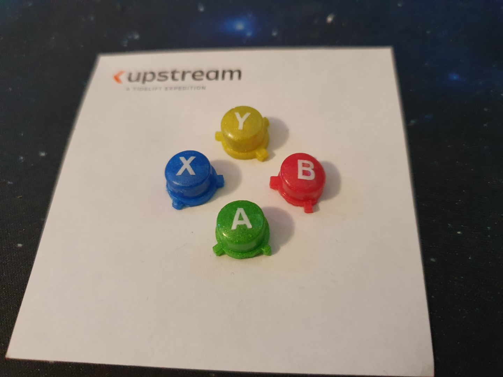

A quick test fit in my deck showed that I needed some light sanding on one side of X, but that was quickly taken care of and
then I had a working set of custom SteamDeck buttons 👍

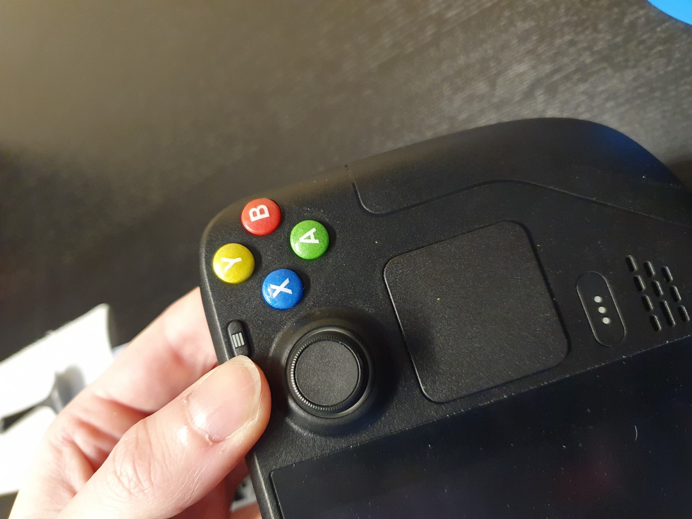

## Where do we go from here?

Considering that until Monday January 9th 2023 I had never before touched silicone or epoxy resin, and that by Monday January 16th 2023 I had four self-cast SteamDeck buttons in my hand that while far from perfect looked *great*, I'm *very*
happy with the result. And the same goes for my partner, who really had absolutely no idea of this until I presented him the
finished buttons on our anniversary. He was and is in awe 😊

However, single colored buttons with rubbed on letters sealed in with UV resin is not my end goal here. After seeing the amazing results one can
achieve with inlaying in EJ's videos, I'm really looking forward to trying that out. So the next step will be to cast some inlayed buttons
with the same mold. And I have already printed out the letters on my resin printer 😁

[^1]: To be more precise, FreeCAD Link Branch version 2022.09.07
[^2]: If one of the buttons slips out of the mold, you can just press it back in. Just make sure it really slots right back in
where it was, same orientation, full depth and everything. I actually had to do this a bunch of times due to the mold making 
stretching over several days due to some issues (see next footnote), and having to reassemble the deck in between to keep
the project a secret from my partner. As a consequence, I can now disassemble and reassemble the deck down to the buttons in
around 20min without the guide 😄
[^3]: I actually had to do the second pour thrice: The first time I didn't create the channels with toothpicks, thinking I could 
punch them out afterwards - I couldn't. That led to the creation of the top brace. I then made the mistake to further secure the 
toothpicks with superglue, which seems to have interacted with the curing process and caused the top layer of the silicone pour 
to stay soft, smeary and sticky. So I did it a third time, exactly as described above, just relying on the friction fit of the
toothpicks, and this time everything cured as expected and I had usable channels 😅
