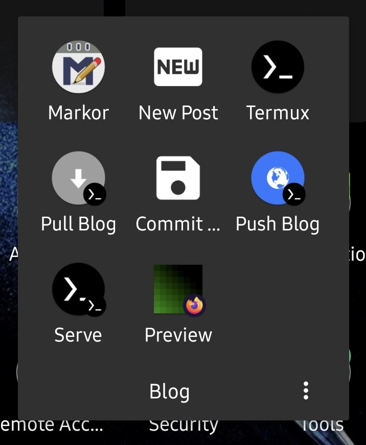

One thing that kept me from blogging more so far was the difficulty in working on posts on my phone. So after switching this blog over to Hugo I decided to see if I couldn't improve on this situation. 

I needed a solution that would allow me to 

1. Checkout my page's git repository from GitHub
2. Quickly create a new post, consisting of a new folder inside `content/blog` matching my chosen `<year>-<month>-<day>-<title slug>/index.md` folder structure, based on just a title
3. Allow me to edit the post, preferably in a text editor focused on Markdown (and ideally allow me to preview the post as well)
4. Optional: Run the Hugo build on my phone as well for final checks
5. Finally, commit the new post and push it so that my GitHub Action workflow can take care of the rest

I started hunting for options, and I'm happy to report that for now I seem to have found a - quite geeky - solution that involves the use of [Termux](https://termux.dev/en) (Linux terminal environment for Android), [Markor](https://gsantner.net/project/markor.html) (Markdown editor) and [Tasker](https://tasker.joaoapps.com/) (Automation tool)[^1].

I installed Termux, Termux:Tasker, Termux:Widget and Markor via [F-Droid](https://f-droid.org/) - the versions available on Google Play are outdated and no longer supported. I already had Tasker installed, but I made sure to give it the additional permission to send commands to Termux. For Termux, I also made sure to allow it to draw over other apps. 

I then fired up Termux and took care of storage access and some packages first:

```
termux-setup-storage
pkg upgrade
pkg install git gh hugo iconv vim
```

Markor's default folder is located at `Documents/markor` and so this is where I decided to checkout my page's repository to. I also made sure to set some config settings needed for stuff to work[^2]:

```
gh auth login
cd storage/shared/Documents/markor
git clone https://github.com/foosel/foosel.github.io
git config --global --add safe.directory /storage/emulated/0/Documents/markor/foosel.github.io
git config --global user.email "you@example.com"
git config --global user.name "Your Name"
```

Next I took care of some helper scripts for Termux:Widget and Tasker. I first created some folders:

```
mkdir -p ~/.shortcuts
chmod 700 -R ~/.shortcuts
mkdir -p ~/.termux/tasker
chmod 700 -R ~/.termux/tasker
```

Then I added some helper scripts to them:

`~/.shortcuts/pull_blog`
``` bash
#!/bin/sh

cd ~/storage/shared/Documents/markor/foosel.github.io
git pull
```

`~/.shortcuts/push_blog`
``` bash
#!/bin/sh

cd ~/storage/shared/Documents/markor/foosel.github.io
git push
```

`~/.termux/tasker/serve_blog`
``` bash
#!/bin/sh

cd ~/storage/shared/Documents/markor/foosel.github.io
hugo server -D -F --noBuildLock
```

`~/.termux/tasker/new_blog_post`
``` bash
#!/bin/bash

checkout=~/storage/shared/Documents/markor/foosel.github.io

slugify () {
     echo "$1" | iconv -t ascii//TRANSLIT | sed -r s/[~\^]+//g | sed -r s/[^a-zA-Z0-9]+/-/g | sed -r s/^-+\|-+$//g | tr A-Z a-z
}

title=$1
date=$(date +%Y-%m-%d)
slug=$(slugify "$title")

cd $checkout
mkdir -p content/blog/$date-$slug
cat > content/blog/$date-$slug/index.md <<EOF
---
title: "$title"
date: $date
draft: true
---

EOF

echo $date-$slug/index.md
```

`~/.termux/tasker/commit_blog`
``` bash
#!/bin/sh

message=$1

cd ~/storage/shared/Documents/markor/foosel.github.io
git add .
git commit -m "$message"
```

`pull_blog` and `push_blog` take care of git synchronization. 

`serve_blog` runs Hugo with draft and future posts visible. The page can be viewed in the browser on the phone at `http://localhost:1313`.

`new_blog_post` takes a post title as its first argument and from that creates the aforementioned folder structure within the `content/blog` folder, including a prefilled `index.md`.[^3]

And finally `commit_blog` takes a commit message as its first argument, stages all changes in the checkout and commits them with the supplied message.

Next, I created Termux:Widget widgets on my desktop for `pull_blog`, `push_blog` and `run_hugo`.

Then I opened Tasker and created two new tasks:

``` plain
    Task: New Post
    
    A1: Input Dialog [
         Title: New post
         Text: Enter title
         Close After (Seconds): 30
         Input Type: 540673 ]
    
    A2: Termux [
         Configuration: new_blog_post "%input"
         
         Working Directory ✕
         Stdin ✕
         Custom Log Level null
         Terminal Session ✕
         Wait For Result ✓
         Timeout (Seconds): 10
         Structure Output (JSON, etc): On ]
    
    A3: JavaScriptlet [
         Code: var uri = "content://net.dinglisch.android.taskerm.fileprovider/external_files/storage/emulated/0/Documents/markor/foosel.github.io/content/blog/" + stdout.trim();
         Auto Exit: On
         Timeout (Seconds): 45 ]
    
    A4: Send Intent [
         Action: android.intent.action.SEND
         Cat: None
         Mime Type: text/markdown
         Data: %uri
         Package: net.gsantner.markor
         Class: net.gsantner.markor.activity.DocumentActivity
         Target: Activity ]
```

``` plain
    Task: Commit Blog
    
    A1: Input Dialog [
         Title: Commit Blog
         Text: Enter commit message
         Close After (Seconds): 30 ]
    
    A2: Termux [
         Configuration: commit_blog "%input"
         
         Working Directory ✕
         Stdin ✕
         Custom Log Level null
         Terminal Session ✕
         Wait For Result ✓
         Timeout (Seconds): 10
         Structure Output (JSON, etc): On ]
```

"New Post" queries a post title from the user, calls `new_post` with that and then opens the new post in Markor.

"Commit Blog" queries a commit message from the user and calls `commit_blog` with that.

I created desktop shortcuts for these too and placed all of them, together with Markor, Termux and a browser shortcut, in a new folder "Blog".



So, my workflow now consists of pulling, creating a new post, editing it, optionally firing up Hugo to check on the whole thing locally, committing and pushing, all at least without *needing* to touch the terminal, but always *able* to if so desired.

It's not perfect, and some app that takes care of all of this from a nice UI would certainly be better (*hint hint*). But - as this post created entirely from my phone proves - it works for now 😁

[^1]: Quick shoutout to [this post by Emanuel Palm](https://pipe.how/write-androidblog/) who found himself in a similar situation (prior to boarding a plane to boot) and showed me the path on which I was then able to set up a neat workflow.

[^2]: You'll obviously have to adjust that and the following bits with your own repo, name and email.

[^3]: Note that I'm aware of the existence of `hugo new`, however it insisted on prefilling the title with the date included and otherwise also felt a bit too inflexible, hence I decided to implement what I wanted directly in bash.