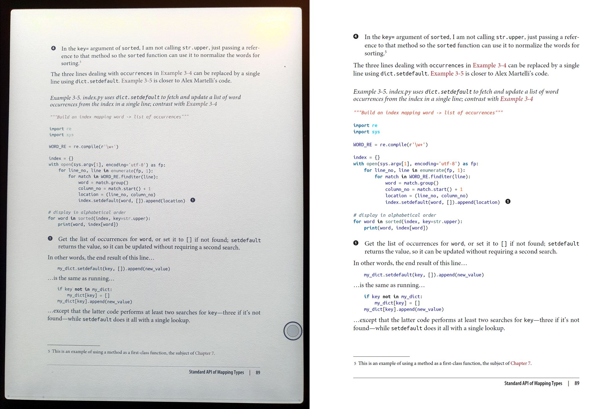
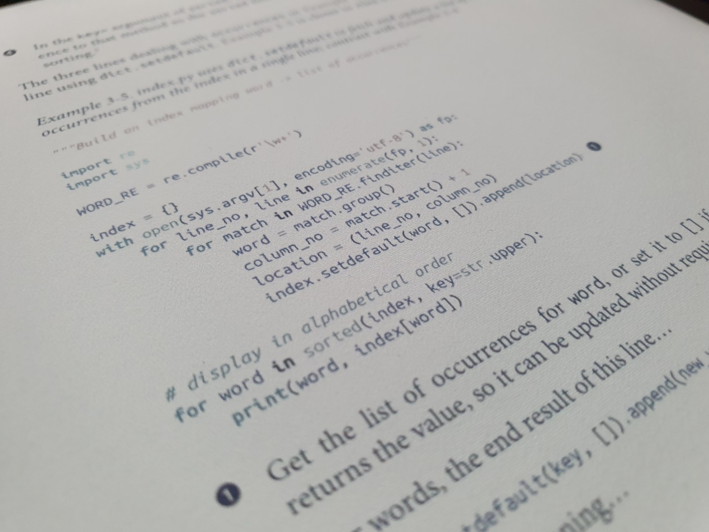
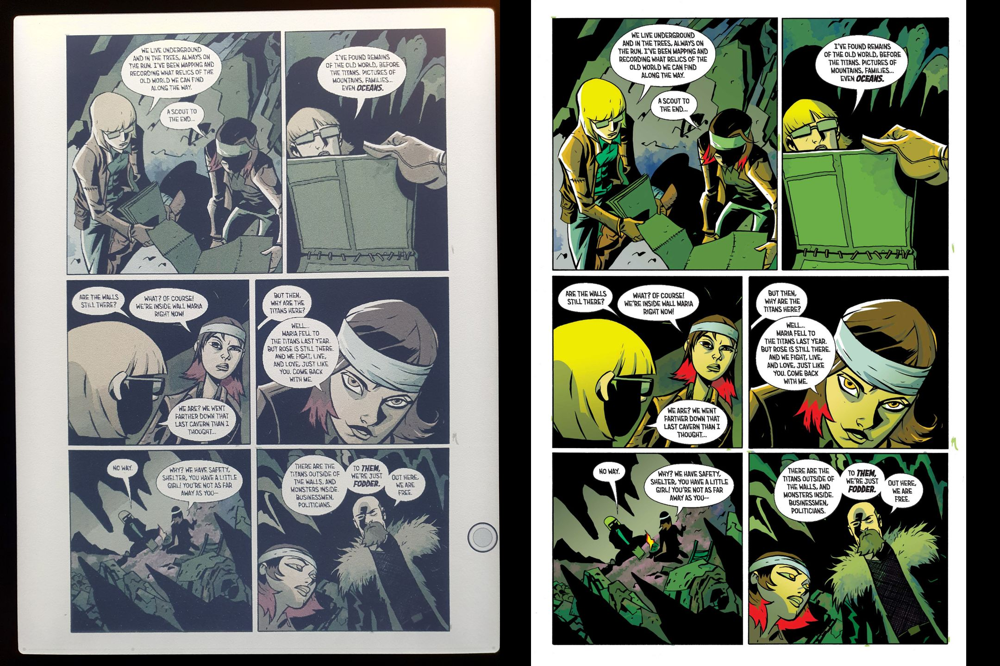
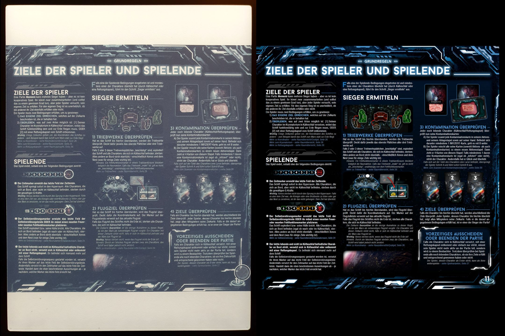
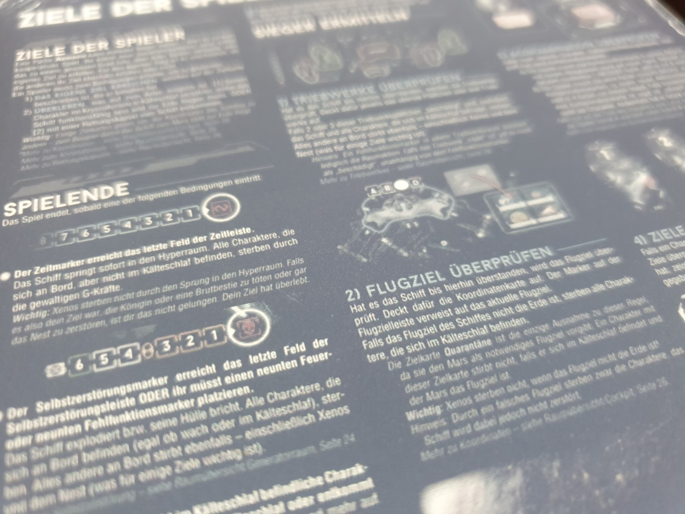
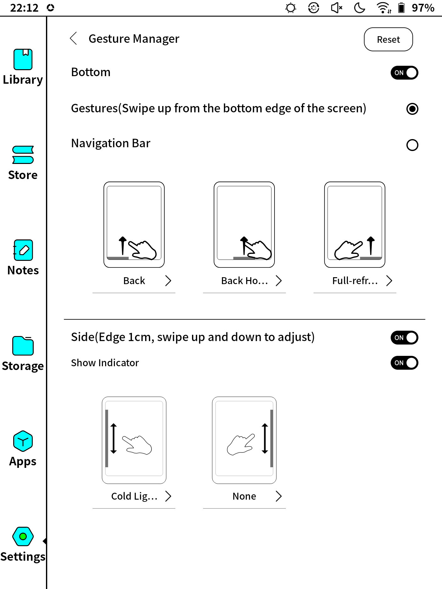
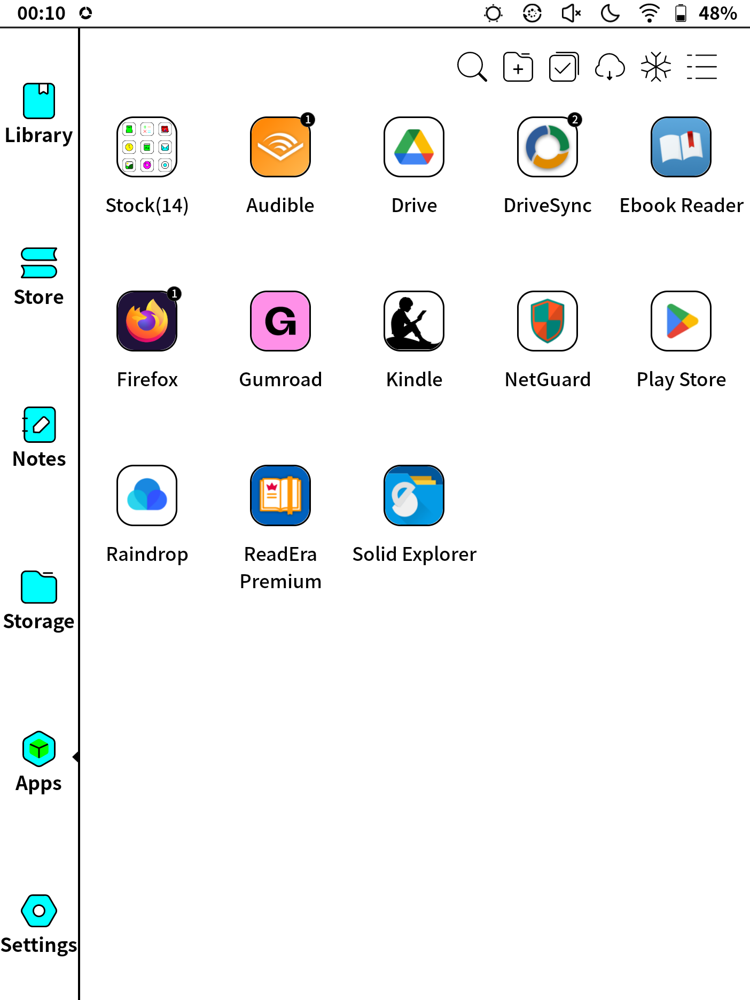
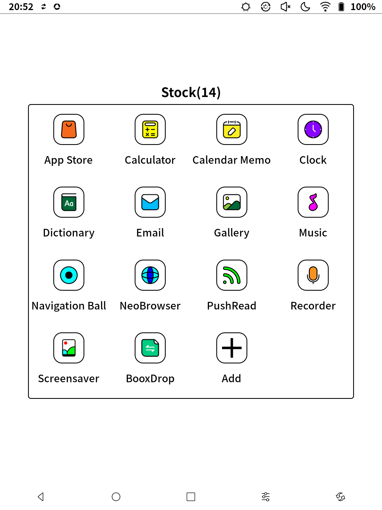
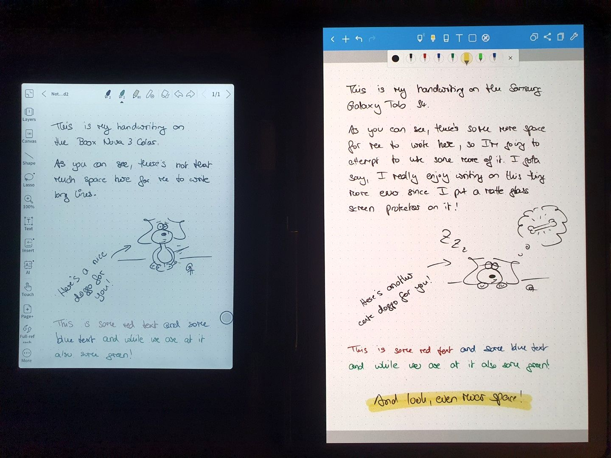
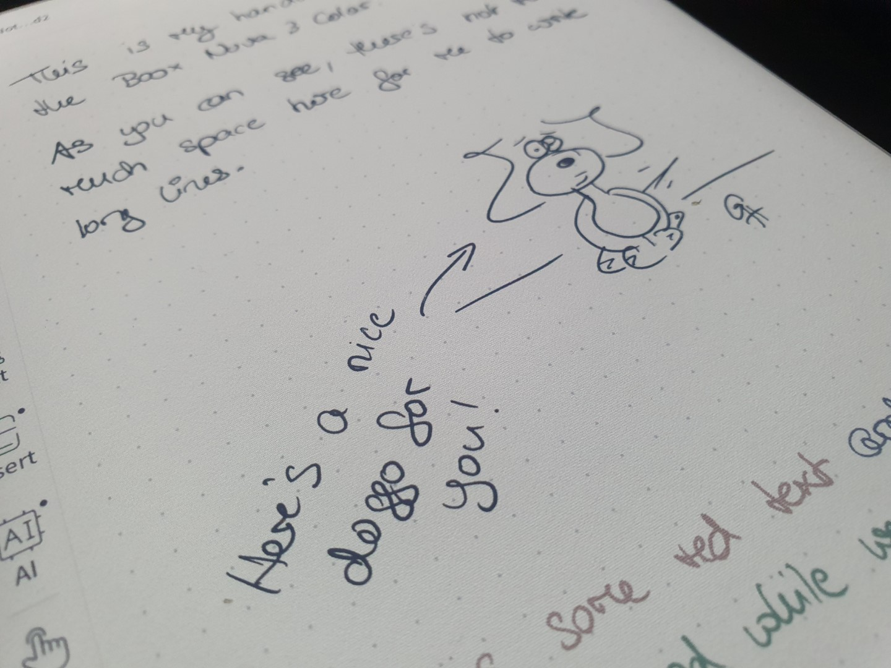

I've always been a bookworm. As a child, my favourite past time was reading. I usually dragged my current book with me *everywhere* and would read at any opportunity[^1]. So, when e-readers became a thing, I was very excited to save on a ton of shelf space in the future and got myself an Amazon Kindle at the first chance I got. Back then in 2010 I actually had to import my Kindle 3 Keyboard from the US since it wasn't available in Germany yet. And since then I've gone through a couple of e-readers, all of them Kindles. But all the time I was a bit annoyed at two things:

1. Vendor lock-in. Yes, you *can* send books from other sources than Amazon itself to your Kindle, can convert PDF and EPUB and whatnot, but in my experience it was always a bit of a hassle and especially in the case of PDFs a mess. Even with [Calibre](https://calibre-ebook.com/) in my toolbelt I didn't feel all too happy and most of the books I got through [Humble Bundle](https://www.humblebundle.com/) and the like - which tend to be EPUB or PDF - stayed unread in my collection while I kept throwing money at Amazon.
2. Black and white only. That's still an issue with pretty much all e-readers out there, as color displays are only now slowly becoming a thing. But the lack of color means that things that very much profit from color, like coding related books (syntax highlighting),  comics, RPG source books, etc. so far were something I had to read on my phone or tablet.

Then I came across [Scott Hanselman's post "The quiet rise of E Ink Tablets and Infinite Paper Note Takers - reMarkable 2 vs Onyx Boox Note Air
"](https://www.hanselman.com/blog/the-quiet-rise-of-e-ink-tablets-and-infinite-paper-note-takers-remarkable-2-vs-onyx-boox-note-air) back in June of 2021, and immediately was intrigued. I had heard of the Remarkable 2 before, 
but decided against it due to yet another case of vendor lock-in. But through Scott's post I learned about Onyx' e-reader line-up. The fact that they run Android, have Google Play store integration and you can just install your own stuff on them out of the box was very much intriguing, and the Wacom digitizer was an additional point for that model range[^2]. And after perusing the Onyx website for a while, I decided to pull the trigger on a 
[Nova 3 Color](https://onyxboox.com/boox_nova3color) - the color e-ink intrigued me and the 7.8" size was right on the sweet spot. I ordered it on June 14th 2021 directly from the Boox EU store, and it arrived on June 16th[^3]. All in all I paid 399€ for a bundle of the e-reader itself, a case, some screen protectors (that I don't use) and of course a stylus. Not too shabby.

So now, 1.5 years later, how do I like it? Let's find out!

## Visuals

To just address the elephant in the room right away: How does the color screen perform? Well, it's obviously not something you can compare to a tablet OLED. The colors are way more muted and the contrast is not as high. If you've ever seen a comic printed on newspaper paper, that's pretty much the same kind of color reproduction you can expect here. But for what I got it for, it's absolutely fine. 

Syntax highlighting in code snippets is now visible beyond grayscale, and for comics and similar it also works. Given, if I want to really enjoy the colors, I'm still getting a hold of my tablet, but for the use case of actually reading long form books with the occasional code snippet, illustration, map or even short comic strip, it's absolutely fine. And for highlighting text, it's also a great feature to have.

To give you an idea here are a couple of pictures of the screen, each with a shot of how the same thing looks like on a regular screen added to the right[^4]. First we have a code snippet in the PDF version of "Fluent Python 2nd edition":

Then a page from the "Attack on Titan Anthology":

The third one is a page from the "Tales from the Loop" RPG source book:

 

 
And the final one shows a page from the rules PDF of the boardgame "Nemesis":

So, if you expect vibrant colors like on OLED from a color e-ink, I have to disappoint you. At least with the current technology we aren't there yet. But it does add a needed touch of color to books like the above examples that I sorely missed before, and I think I wouldn't want to go back to a black-and-white only e-ink display at this point anymore.

Now, what makes the display a bit more hit and miss when it comes to things like the shown boardgame rules is its size. If this was a 10" screen, the rules PDF would be far easier on the eyes. As things are, the pixels wash a bit into each other. But truth be told, that particular PDF is something that even on my 10" tablet I only view zoomed in, and I have some other examples like this - mostly A4 sized RPG books - that simply become too small on the 7.8" display here.

When reading e-reader optimized formats like EPUB or MOBI, or in the Amazon Kindle app, and also with PDFs that are more suited for the form factor, the text is great to read. No eye strain, no blurry text. There is however always a bit of a grainy texture to the screen, and that is due to the lower resolution color layer that's on top of the grayscale one. It's not something I notice while reading however. Overall, I'm totally happy with the text quality!

**Update:** [Mihir Joshi asked me on Mastodon how fast  screen refreshes perform on the Nova](https://mastodon.social/@Mihir/109761667962680477), and I made a quick video to demonstrate:



Imho, the performance is on par with a classic e-ink reader, it certainly doesn't feel slower than my Kindle did.

## Touch & feel

So, we've covered how it looks, but how does it feel?

The reader's shell is all plastic, but it feels solid. No sharp edges, all just nice to the touch. It certainly feels cheaper than my tablet or phone, but honestly about the same as my various Kindles. The case that came with it snaps to it and has a magnetic cover, and the reader wakes up when I open it - just like I'm used to from my Kindles and the tablet. The stylus fits into a small loop on the cover flap; it feels a bit on the cheap side, but it works just fine and is pressure sentitive as expected.

The reader only has two hardware buttons, a power button on the top edge and a button centered beneath the display that acts as back button and backlight toggle (on long press). Everything else is done through configurable gestures and a little hover menu. The top edge has two drag zones, left opens the Android notification area, right the reader's quick settings menu.

The left and right side can be configured as touch sliders, and I've set mine to have brightness control on the left and nothing on the right.

The bottom edge supports three zones for dragging upwards from as gestures, and I had them mapped to the standard Android buttons back, home, recent.

However, while writing this post and verifying some things, I noticed the latest firmware update added an optional dedicated navigation bar at the bottom, so I'm going to test this out now for a while 😁

What about page turning? Well, there's nothing predefined here - it's app specific. But I've found that everything I've thrown at it in terms of reader software either supported "tap to turn" out of the box, or could be configured this way. You probably won't get happy with an app that demands "drag to turn" - with the refresh rate of an e-ink screen that is just too laggy.

## Software

The fact that the Nova 3 Color runs Android is a huge plus for me. I've been using Android for years now (funnily enough as long as I've been an e-reader owner: 2010), and therefore I felt right at home when it came to customizing my Nova.

Now, the first thing I actually installed after [enabling the Play Store](https://help.boox.com/hc/en-us/articles/8569260963732-Google-Play-Store) was [NetGuard](https://play.google.com/store/apps/details?id=eu.faircode.netguard). I had read online that Onyx devices tend to phone home to China a lot, and that is not something I like very much. So, I threw NetGuard on there, denied everything by default, and from then on only allowed the additional stuff I put on there through to the internet (and occasionally the whole device when I let it check for updates). Rooting it would probably have been even better, but frankly after some network traffic sniffing it looked like NetGuard was enough.

The second thing I installed was the official Kindle app, as that is where I have most of my fiction and also the one or other non fiction books. It's probably what I've used the most on the device, and it works great. Until a recent update it sometimes crashed and I had to restart it (sometimes twice or thrice before it worked) and scroll to the last page I was on, but with the last OS update I installed, 2022-11-24, this has so far not happened again. In any case it wasn't something that happened on a daily basis, more like once or twice per month, and while definitely annoying never became bad enough to make me start debugging this.

The third app was [ReadEra Premium](https://play.google.com/store/apps/details?id=org.readera.premium). I tested many PDF/EPUB readers throughout the years, and currently that is the one that works best for me. On top of PDF and EPUB it also supports CBR/CBZ, which is commonly used for comics, and a whole bunch of other formats. On the Nova, I had to fiddle around a bit with the settings to enable page switch by tap, optimize the display and such, but I sadly cannot remember what exactly I did. In any case, it works well with almost anything I throw at it now (large format PDFs being hit and miss).

I have my book collection stored in my Google Drive, and so I installed DriveSync to be able to keep it in sync with that and mirrored on the device. So far, every time that I've opened up the Nova to check out a new book I had just pushed into Drive earlier, it was usually already there, so that's a nice workflow.

In theory there's also a full featured e-reader app integrated and I briefly played around with it, but I was already used to ReadEra from my tablet and so stuck with it.

So far, pretty much everything that I threw at it worked, albeit with some visual glitches here and there (most apps really don't expect to be run on an e-ink display).

There are also a bunch of stock apps installed on the reader, apart from stock options for e-reading and note taking that have their own buttons in the navbar on the left.

Everything else is just pretty much the usual suspects, with two exceptions. The navball app that allows you to configure the menu behind the little button always hovering on your display (I have things in there like taking a screenshot, triggering a manual refresh and similar), and the screensaver app that allows you to configure the cover displayed whole the reader is sleeping. I've put a little fake book cover on there that always makes me laugh 😅

But apart from these two, the only stock app I actually *did* use for a while was the app for note taking.

## Note taking

The original idea when I got this device to use it as both my e-reader and my notebook. And that's what I tried for the first week or so. But there were two reasons why I stopped doing that and went back to first paper and now my tablet again.

One was that I could only use the stock app for note taking. While every other app did in fact get the stylus input, anything but the (probably heavily optimized) stock note taking app lagged severely, to the point of being not only frustrating but actually impossible to use. And I didn't find any way to sync my notes with any standardized format without Onyx' own cloud (and I'm unclear what would have been possible there) - I simply don't want to require yet another account on someone else's server farm for that, I have enough of these already. Also, the app felt very basic functionality wise.

The other issue was the display size - perfect for reading, definitely too small for my handwriting in combination with a Wacom digitiser. I had thought that it would be fine for me since I also used to be quite happy with A5 sized Moleskine notebooks, but I seem to write slightly bigger with a stylus than with the Uniball Signo 307 that is my usual go to pen, and so closer to A4 like 10" as found on my tablet definitely works way better.

So, I guess if note taking is your goal, go with something bigger than the Nova.

## Conclusion

Would I buy it again? Yes, as an e-reader, but not as a note taking device.

For reading, it has the right size, with even most PDFs working just fine. The color display adds just the right dusting of color to make some things previously quite annoying to read on grayscale e-ink fine, and having it run stock unlocked Android means I can use whatever app I want to do the reading in. It has fully replaced the Kindle Paperwhite I used before - I frankly don't even know where that is at the moment 😅 - and I've read many a book on it now.

For note taking however I found 7.8" to be just too small to be useful. And the fact that only the stock app works well and doesn't seem to have some well supported way to get the notes out of it makes it a bit of a suboptimal experience as well.

If note taking was my focus, I'd look at something larger, 10", and pay close attention to the sync options of the notebooks. Something like OCR enabled PDFs synced into the file system would already be nice (then DriveSync or Syncthing could take care of the rest). From what I've read online however, something like that doesn't seem to really be available yet.

For either though I think I'll really want color 🌈 from now on 😁

[^1]: Just not in the car thanks to this day suffering from severe motion 
sickness *sigh*. I very much envy people who can read in the car.
[^2]: My tablet - a Samsung Galaxy Tab S4 that I use for handwritten note taking - has a Wacom digitizer, as does my Wacom Intuous S writing tablet. I've found the
range of third party stylus options quite amazing, and as a Lamy AL-star fan am the proud owner of both a 
[Lamy AL-star EMR stylus](https://www.lamy.com/en/lamy-al-star/) and a [Staedtler Noris Digital Jumbo](https://www.staedtler.com/intl/en/discover/noris-digital/).
[^3]: This even includes a short delay due to a mail exchange on June 15th - it turns out they couldn't handle the umlauts in my name and needed something ASCII only for the shipping label 😬
[^4]: I adjusted the contrast slightly on the photos of the Nova's screen to better reflect how it looks in real life.
