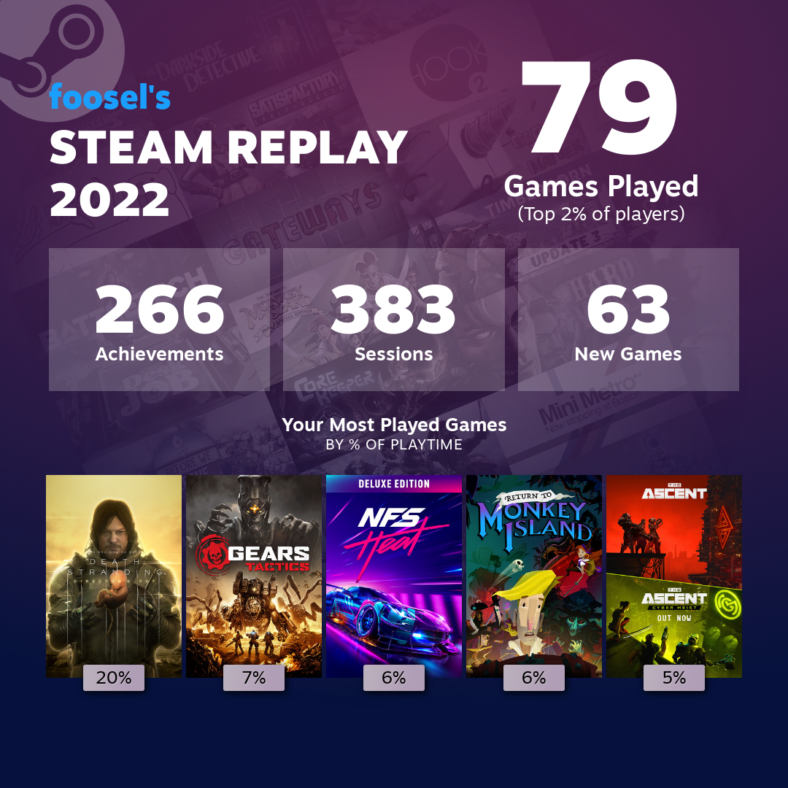
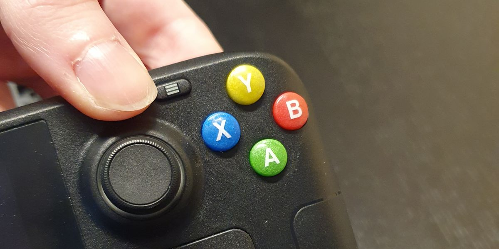
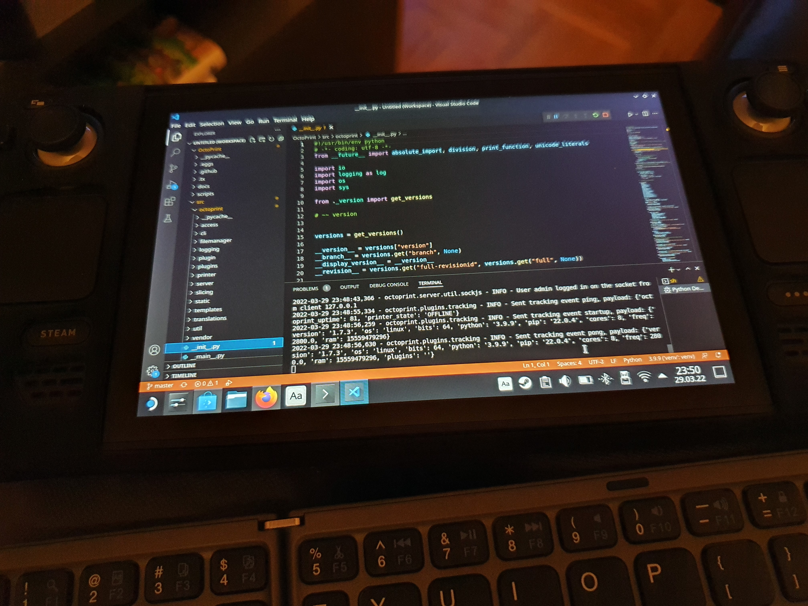

When Valve announced the Steamdeck back in summer of 2021, I was immediately sold. At that point my primary gaming device - despite owning a quite capable PC with enough computing and graphics power to run even the latest AAA games at a decent enough quality - was my Nintendo Switch, simply because I was not particularly happy about spending my after hours in front of the same PC that I already spend my working hours on. Sitting on the couch and playing something in handheld mode while my partner was playing something on his gaming laptop or the PS4 turned out to be an "alone time together" scenario we both enjoy very much, and was an additional reason I didn't want to spend hours alone in front of my PC. So, when the reservations opened on July 16th 2021 at 19:00 CEST, I was prepared and spent the next 22min frantically trying and finally succeeding to reserve my spot in the EU 256GB queue. And then the waiting began.

As late February of 2022 rolled around, Valve finally started to work through the queue in weekly batches, and I was eyeing my inbox quite nervously in constant fear of missing my order window. I finally got my mail as part of the third batch on March 14th at 17:36 and ordered the deck minutes later. Then the second phase of waiting started, first for the shipment notification which came on March 16th, and then for the actual delivery. Some delays in shipping made my deck just miss a Friday delivery window and instead I got it into my hands only on the coming Monday, which happened to be March 21st - my birthday. And thus the Steamdeck turned into an unintended birthday present to myself 😅

Now almost one year later I can confirm what I hoped when I reserved mine and what I suspected when the first reviews came in: **Yes, this was one of my best acquisitions of 2022!**[^1]

I may not use it daily, there are still days and sometimes weeks during which I don't play due to the one or other reason, but when I play something it's been pretty much exclusively on my deck for the past year. Pretty much anything I have so far thrown at it has worked just fine and I've spent some wonderful hours on it, playing things like Death Stranding, In Other Waters, Need for Speed: Heat, Gears: Tactics, Return to Monkey Island and much more, and also the one or other multiplayer session of the The Ascent with my partner.

Not only did I game on it however, it also fuelled my tinkering and making hobby. Right at the start of this year on January 1st I swapped its noisy Delta with a much more silent Huaying fan that I bought from iFixit, and also replaced the 256GB SSD with a 1TB one. The [iFixit guides](https://www.ifixit.com/Device/Steam_Deck) where spot on and the deck turned out to be even more self repair compatible than the iFixit repairability score of 7/10 suggested. Only a few days later I opened up my deck again on my quest to create [custom action buttons](/blog/2023-01-19-custom-steamdeck-buttons/) for my partner's deck[^2] for our anniversary, which were a huge success not only with him - I made it on [Hackaday](https://hackaday.com/2023/01/26/casting-custom-resin-buttons-for-the-steam-deck/) for the second time in my life [^3] 🤭 And now I already have two third party hall effect joysticks lying around here that I plan to swap in ASAP, and of course I still have plans for even more custom buttons.

Recently I also set up [Emudeck](https://www.emudeck.com/) on it and immediately played through Simon the Sorcerer on ScummVM. Of course there's now also some Zelda ROMs on there that are just waiting for me to give Hyrule another visit. And a gift of [Cleo](http://cleogame.com/) on GOG also made me set up [Heroic Launcher](https://heroicgameslauncher.com/) and [itch.io](/til/how-to-add-itchio-games-to-the-steamdeck/) for more store options. Of course at some point I also ensured I can use the deck as a development system and installed VS Code on it plus a full OctoPrint dev environment. I installed [Decky](https://deckbrew.xyz/) and am very much enjoying plugins like [HLTB](https://github.com/hulkrelax/hltb-for-deck) and [SteamGridDB](https://github.com/SteamGridDB/decky-steamgriddb). I've made sure [my screenshots get synced to a special album in Google Photos](/til/how-to-automatically-sync-screenshots-from-the-steamdeck-to-google-photos/) so sharing stuff is ridiculously easy. And I printed the one or other accessory for myself, my partner and friends.

Finally, I should also say that it has changed my perspective on PC gaming. Before I got the deck, there were regular investments in a faster GPU, more RAM, a faster CPU, a better power supply, to keep a capable gaming system on hand and not lock myself out from the wonderful world that is PC games. But now? I rarely power up my PC these days, after also switching to working from my laptop in late 2022, for energy saving reasons. I'm still happy to have it available, for streaming, video cutting, Blender and the one or other Tabletop Simulator session, but overall I'm going to save a ton of money in the long-term now I think. The 1080Ti I have in there is still good for all the above for a long time to come, and with the deck being able to play what I tend to play so far, and in a way better way for me - handheld on the couch - I see myself rather invest in a Steamdeck 2.0 than regularly throwing money at more and more ridiculous GPUs.

So, all in all, even one year later I'm absolutely happy with my deck as you can see. It turned out to be the *perfect* device for me and has finally made me tackle my gaming backlog[^4]. I'm a happy gamer 😊

[^1]: The other was my Ebike.
[^2]: He ordered his a day after I received mine and got it half a year later in mid September. Shortly after that the queue was done and since then it's been way faster to get your hands on a deck in EU, US or UK.
[^3]: The first time was OctoPrint 😊
[^4]: Admittedly it has also contributed to its growth at the same time due to me now buying more stuff on sales and even having subscribed to Humble Choice ([referral link](https://www.humblebundle.com/membership?refc=WhoXKx)) 😅