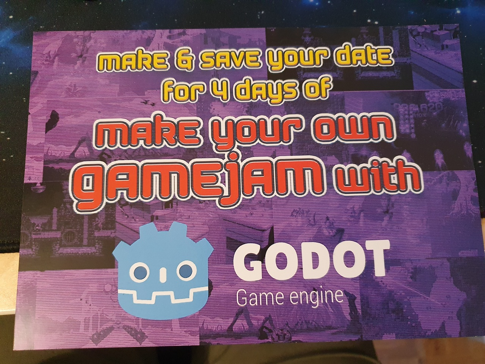
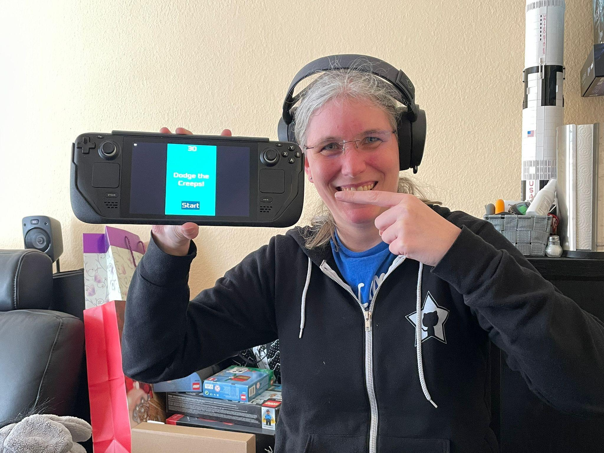
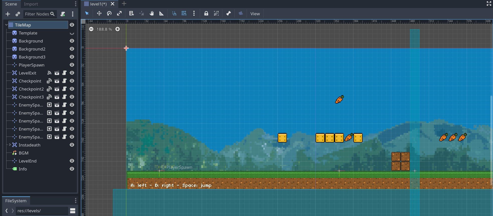
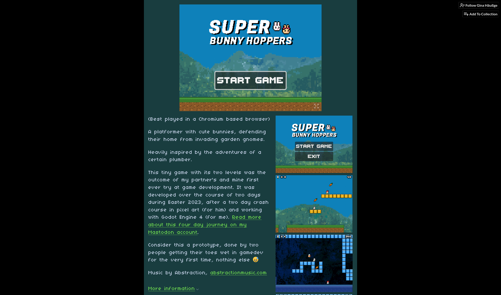

For my 40th birthday a few weeks ago, I got a pretty amazing gift from my partner: a coupon for a personal 4-day Gamejam/Gamedev experience, just the two of us. 

I've been a gamer pretty much my whole life, I've been a coder pretty much my whole life, but I never so far managed to combine these things. Apart from copying some Star Trek game code in BASIC from a book in my teens, the probably quite common tinkering around with the parameters in [`gorilla.bas`](https://en.wikipedia.org/wiki/Gorillas_(video_game)), and a Snake clone in [GLUT](https://www.opengl.org/resources/libraries/glut/glut_downloads.php) in preparation for a 3d graphics course in university, I never so far got into game development. It has been something high on my bucket list however, and I've been fascinated by the concept of gamejams like [Ludum Dare](https://ldjam.com/), [GMTK Jam](https://gmtk.itch.io/) etc., where you build a game matching a provided topic within a set time limit (usually between two to ten days) and within a set of rules (e.g. do you need to do everything yourself, including graphics and music, or are you allowed to use certain existing assets, do you need to use a specific game engine etc). Add to that the fact that these days I'm way more into playing indie game than the AAA stuff from the big players[^1], a love for learning new stuff and the release of the latest major version 4 of the fully open source [Godot Engine](https://godotengine.org/) that has made me curious for a while now, and you might see why this really WAS an absolutely amazing gift by my partner.

We did this event from April 5th to 8th (and I kept a [Mastodon thread](https://chaos.social/@foosel/110145537112426679) going throughout it). The first two days were a crash course in Godot Engine for me and in pixel art creation for him. The last two days were spent on creating a full (albeit short) platformer game from scratch.

## Day 1

The first day was dedicated to getting to know the Godot IDE, going through the [2d game tutorial](https://docs.godotengine.org/en/stable/getting_started/first_2d_game/index.html) and then further experimenting with whatever trickled our fancy.

I quickly went through the tutorial and soon had some first results to show for it. In the end, I even managed to get a "Dodge the Creeps" build exported for Linux and up and running on my Steamdeck, which was a very rewarding outcome indeed! I can't say that I ever found it THAT easy to get Homebrew to run on any of my consoles as it was with the Steamdeck - `scp` the binary over, add to Steam as external game, done 😊

Still, as you can see, I was quite happy about that!

I also added some very basic sound effects the game, which was not very tricky to achieve but had a great effect on the overall polish of that simple first try.



Next - while my partner was making a deep dive into some pixel art courses - I decided to play around a bit with the physics engine, particle system, sound effects etc by building a small Asteroid-like playground thingy that consisted of just one screen with a little player controlled space ship, two small planets that the spaceship could shoot at (doubtlessly a morally highly questionable mechanic) and some wrap-around behaviour.

At some point, my bullet spawning code was broken, making my ship lay eggs, which nicely fit the fact that we were doing this event over the Easter holidays 😉



Originally I also wanted to have the planets excert gravity on the ship and the bullets, and initially that did work, but at some point it stopped working. I still haven't figured out why 😅 I ended the first day with pew-pew-pew.



## Day 2

For the second day, we had planned creating two simple prototypes, one Pong like game and one basic platformer.

We started with the Pong like game and agreed on a slightly futuristic but pixel based graphics style and the name "Neon Pong". As my partner was still working through some more pixel art courses I started with some basic placeholder graphics (white rectangles ftw). My idea was to use [Godot's physics engine](https://docs.godotengine.org/en/stable/tutorials/physics/index.html), and my first implementation attempt led to yet another hilarious bug:



After ironing that out, I got some simple two player controls implemented, as well as a slightly randomised spawning angle for the ball, scoring and win and lose detection. That involved figuring out how to detect when the ball goes out of bounds (which I already had learned during the tutorial: [`VisibleOnScreenNotifier2D`](https://docs.godotengine.org/en/4.0/classes/class_visibleonscreennotifier2d.html)) and some other stuff. I also added some sound effects for the ball bouncing off of obstacles, courtesy of [sfxr](https://www.drpetter.se/project_sfxr.html) and some light effects that turned out to be less visible than I had hoped for.

At some point my partner sent me some assets to use for the paddles, the ball, the walls and the background and I also picked out [a nice CC0 synthwave song called "Flux Capacitor" by "Frenchyboy"](https://opengameart.org/content/flux-capacitor-no-marty), combined everything, and we had our basic Pong prototype:



At that point my partner communicated that he'd be quite busy for yet a while to come with the pixel art course, so we decided on me just grabbing some more ready-made assets for the platformer prototype to experiment a bit with the mechanics we'd need for the coming days. So I got [a neat 8x8px dungeon tileset](https://egordorichev.itch.io/adve) and also treated myself to some [8x8 animated characters by the same author](https://egordorichev.itch.io/chare) and started building. First of all I learned how to use Godot's [tileset feature](https://docs.godotengine.org/en/stable/tutorials/2d/using_tilesets.html), so I wouldn't have to manually place each individual tile but rather got just draw full rectangles and such. After that was done I created a very basic single-screen dungeon and a player character. I once again turned to the physics engine to do the heavy lifting, set up collisions, jumping, and also - since the tiles I used came with some wooden platforms - figured out how to make the character fall through those on a press on the down key (hint: manually increasing the y position by 1, negating the collision). Then I added some basic light to the torches I had placed and created some basic enemies and their pathing. For that I had to figure out how to keep them from falling off of platforms but instead switching directions on collisions with walls or cliffs (for the walls, the physics engine already helped, but for the cliff detection I had to learn how to use [`Raycast2D` nodes](https://docs.godotengine.org/en/stable/classes/class_raycast2d.html)). 

I didn't manage to implement a proper jump-on-top-the-enemy-to-kill-them mechanic as it was growing quite late already (and we had set ourselves fixed hours to not overdo it), but that led to yet another fun little bug with my character riding on top of a pathing enemy which gave me a good laugh at the end of day 2:



## Day 3

The third day started at the climbing gym, but right after that we got started on our opus magnum for this event: our little platformer. The idea was to build something heavily inspired by Super Mario, but with cute little bunnies hunting carrots and easter eggs - a wish by one of my partner's colleagues. For enemies, I had the idea to add some invading garden gnomes into the mix. We settled on a tilesize (16x16px), some basic mechanics (two selectable characters, jump on enemies, progress through level from left to right, have some predefined checkpoints that act as respawn points upon death, two hit points, ...). While my partner was still working through the final parts of his pixel art course[^2], so after getting my hands on some [placeholder assets](https://v3x3d.itch.io/retro-lines) I started coding.

This time I started with the player. In order to be able to make the code a bit cleaner and more modular, I decided on implementing a state machine for it, and defined states for "idle", "walking", "jumping" and "falling", and later also added "spawned" and "hit". The states took care of parsing the possible inputs, triggering animations and sound effects and so on, and having that nicely packaged up into each individual state turned out to make the logic WAY easier to implement. I also added a configurable Sprite slot, in order to support multiple player skins and thus characters.

For the enemies, I implemented a parent scene with physics and pathing (once again the wall and cliff detection with direction change), configurable sprites and score. I learned how to scene inheritence and created two enemy types.

Next came the biggest challenge. Since we wanted to have at least two levels (spoiler alert: we only made two levels), I needed a way to dynamically load a level, spawn enemies etc. I didn't want to hard code everything per level and have code repetition, so instead I build a modular level loader. Levels are individual scenes with a tilemap node as the root node that defines the level tiles. Below that node, a specially named [`Marker2D`](https://docs.godotengine.org/en/stable/classes/class_marker2d.html) node defines the player spawn, a flexible number of `Marker2D` nodes assigned to the `enemies` group act as enemy spawns. A special checkpoint scene was implemented with an [`Area2D`](https://docs.godotengine.org/en/stable/tutorials/physics/using_area_2d.html) and a custom `checkpoint_reached` signal, and some code was added to make sure the last reached checkpoint per level would act as spawnpoint. Instances of this checkpoint scene can then be placed in the level.finally, a special level exit scene listens for collisions with the players and signals level completion, and another `Marker2D` level end marker sets the limits of the camera. 

To load a level now, the loader would get the name of the level scene to load, instantiate it and insert it into the tree, then fetch the player and enemy spawns and populate them, and also wire up all the required signals. That worked so well that I quickly created two basic test scenes, threw them into an array and wired up the level exit to unloading the current level and loading the next from the array.

The rest of the day was spent further refining the gameplay and fixing bugs in a quickly threwn together dummy level and then starting on the main menu and the character selection screen, and getting some glimpses here and there at the amazing assets my partner was busy working on 😊

## Day 4

The fourth and final day started with me continuing on the menu and getting it to work 🥳 I then also implemented a pause menu, credits (that would load and roll after reaching the final level exit, and loop back to the main menu), a game over screen and while doing all of that also got back again and again to the gameplay itself, ironing out bugs as I went.

Some time before noon, I started getting the first asset dumps from my partner and the integration started. The first assets I got where the character and enemy assets, and I created spritesets from all of them and wired them up correctly. At that point I also slightly changed the player character's animation behaviours, so that when the player would switch to falling after jumping, the animation would also switch from a jumping to a falling bunny. Ridiculously small effect, but it somehow tied everything a bit together in my humble opinion. 

The game was still completely silent, so I sat down with sfxr again and created sound effects for jumping, the player getting hurt & dying, an enemy getting killed, collecting a carrot and collecting an egg. That kept me busy until my partner dropped the tilesets into our shared folder.

I then figured out [how to animate tilemap items](https://foosel.net/til/how-to-create-an-animated-tile-in-godot-4s-tilemaps/) for the collectable carrots and easter eggs, and then drew up and populated the actual levels from two templates my partner had created, heavily based on the first two levels of Super Mario Bros. Thanks to day 3's work on the dynamic level loading that was a *breeze* and my partner seemed quite amazed at how fast I got this done ^^.

We decided that there definitely was not enough time left to create music from scratch as well (it was already getting dark and our personal cut off time was drawing close), so instead I went hunting for some nice chiptunes and with ["Three Red Hearts"](https://tallbeard.itch.io/three-red-hearts-prepare-to-dev) found some amazing ones courtesy of [Abstraction](https://abstractionmusic.com). We decided on four tracks (main menu, level 1, level 2, credits), I threw everything together and some final testing and debugging later we had our first game 😊

And this is it, **Super Bunny Hoppers**:



## The days after

We had to take a break the next day since these four days were quite intense, but two days later after some pleas on Mastodon to put up the game somewhere, I polished things up slightly (by e.g. making the game be controller and fully keyboard playable) and - thanks to Godot's HTML5 export - quite quickly threw it up on [foosel.itch.io](https://foosel.itch.io/super-bunny-hoppers) where you can now play it yourself in all its glory!

All in all, I had an absolute blast during these four days (which I've also told my partner repeatedly), and so did my partner. I see the one or other actual gamejam participation in mine and his future now - I'm currently planning to attend the upcoming [Go Godot Jam](https://gogodotjam.com/), though he probably won't be able to thanks to a colliding work event - and am currently spending way too much time soaking up gamedev content on YouTube, am making my way through Scott Rogers' "Level Up! The Guide to great video game design" (another amazing birthday gift by my partner), have started a backlog of game ideas and experiments I want to look into implementing and overall feel quite confident now that I *can* in fact create games - I just have to do it 😊

[^1]: I prefer creative game mechanics and new ideas over the 24th installation of "shoot the bad guys with ultra realistic graphics and a licensed soundtrack" or any such franchise - especially since said graphics often give me severe motion sickness.
[^2]: It was a long one, but it definitely paid off in my opinion 😊