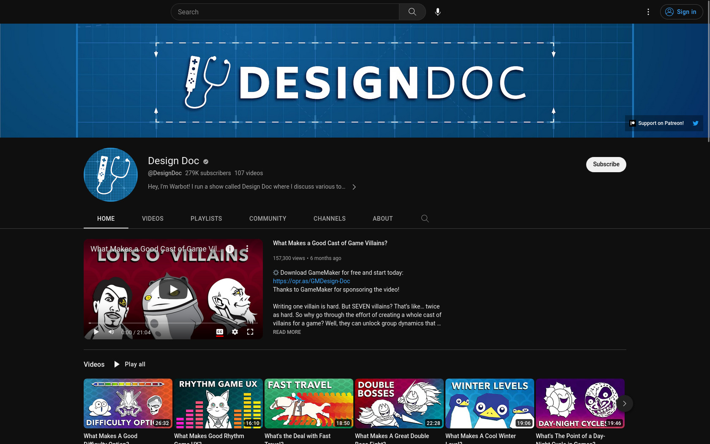
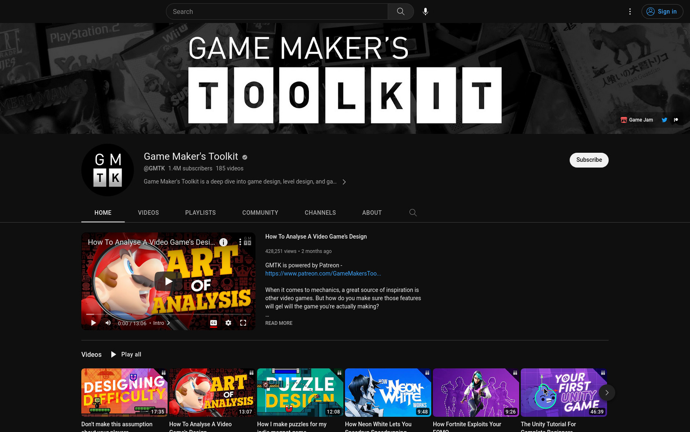
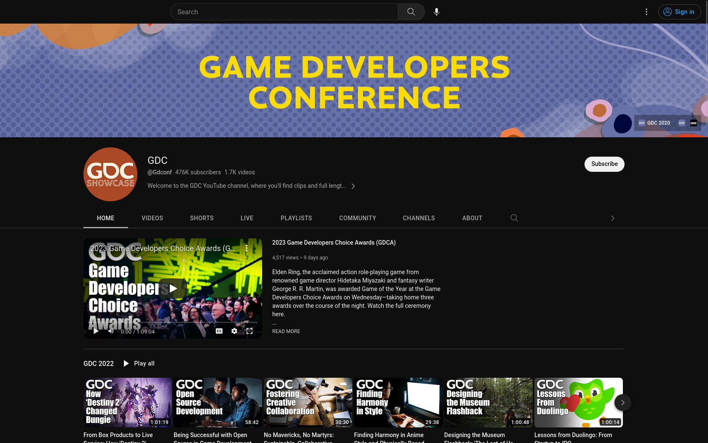

[In my last post](../2023-04-16-the-path-to-super-bunny-hoppers/) I told you that I've been very much interested into video game development for a while now, and just never got around it until the personal Gamejam gift from my partner. Due to this interest I've also been subscribed to a bunch of game design and documentary specific YouTube channels for a few years now, and since I consider their content pretty interesting -- even if you are not interested in game development and just games in general! -- I thought I might just share my list here. So let's go!

## Adam Millard - The Architect of Games

Link: https://www.youtube.com/@ArchitectofGames

Video length: usually 20-30min

I stumbled over Adam Millard's channel thanks to his amazing video ["How Subnautica Uses TERROR"](https://www.youtube.com/watch?v=Sz80210ipGc). Each video usually centers on one specific topic of game design (recent examples include video game economies, metagaming and why some games that shouldn't be fun are in fact fun) and then discusses it with examples taken from well known and less well known games. Not only have I found the one or other gem this way, I've learned a TON about what makes games fun, what makes them tick, and hopefully that will also allow me to make fun games myself, in the long run.

## Design Doc

Link: https://www.youtube.com/@DesignDoc

Video length: usually 15-25min

Design Doc follows a similar approach: a dedicated topic (recent examples: scaling difficulty, winter levels, rhythm game UX), discussed by means of examples from a multitude of games.

## Game Maker's Toolkit

Link: https://www.youtube.com/@GMTK

Video length: usually 10-20min

Whenever there's a new GMTK video, I'm sure to watch it ASAP. Mark Brown does an amazing job in disecting game design topics, and his recent reporting on his own gamedev experience with his "Untitled Magnet Game" has also been quite interesting to follow. Who knows, maybe I'll have the courage soon to participate in a [GMTK Jam](https://itch.io/jam/gmtk-jam-2022), too? 😅

## GDC

Link: https://www.youtube.com/@Gdconf

Video length: usually 30 or 60min

The yearly Game Developer's Conference (short: GDC) happens to have a quite interesting channel indeed, with tons of conference talks spanning across a multitude of topics, such as postmortems, programming, marketing, UX etc. I recently watched an amazing talk about [Celeste's level design](https://www.youtube.com/watch?v=4RlpMhBKNr0) on there, and that was fascinating and certainly a video I'll have to come back to. Same goes for the one on ["Building a Better Jump"](https://www.youtube.com/watch?v=hG9SzQxaCm8). At the top of my "Watch Later" I also still have some talks sitting on creativity, map generation and open source in gamedev. 

## Noclip - Video Game Documentaries

Link: https://www.youtube.com/@NoclipDocs

Video length: 30min and way more, but also some shorter ones in the 10min range

Noclip might not entirely fit the general game design focus of this list, but the gaming documentaries they put out are done amazingly well and offer an interesting look behind the scenes of a ton of AAA and indie games and how they came to be. That's less valuable in terms of game design and more in gaming history, but there's definitely something to learn from it as well.

## Razbuten

Link: https://www.youtube.com/@razbuten/

Video length: usually around 20min

Raz has a great series on what video games are like for people who don't usually play them (["Gaming For A Non-Gamer"](https://www.youtube.com/playlist?list=PLordXx8iNEyStcX_WzqM0JCpiJYgqhinc)), which in and of itself is a pretty great eye-opener. Apart from that they do what I'd call opinion pieces on certain game mechanics and other aspects of game design, and why I don't always agree with their opinion, the topics always make me think.

---

If you have any further tips along those lines, I'd *love* to get some more recommendations! Feel free to ping me on Mastodon at [@foosel@chaos.social](https://chaos.social/@foosel) 😊
