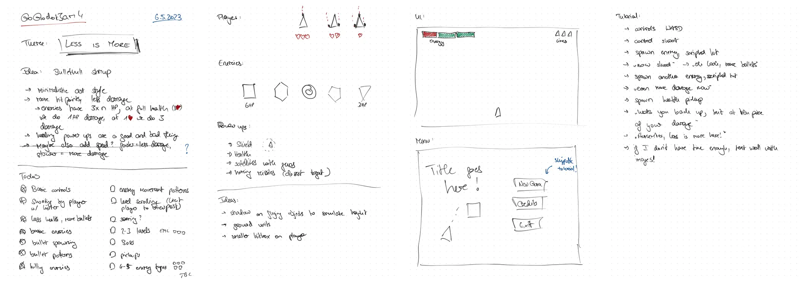
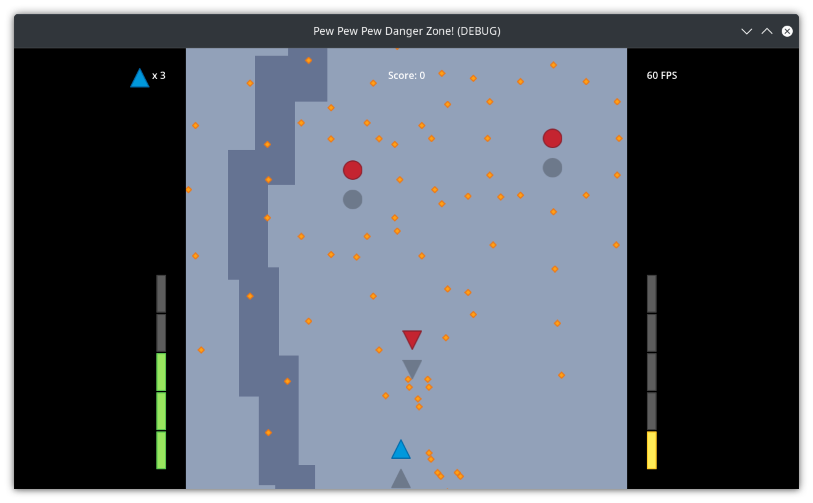

As hinted at to be my plan in [one of my last posts](/blog/2023-04-16-the-path-to-super-bunny-hoppers/), I recently took part in my first
ever gamejam, [Go Godot Jam 4](https://itch.io/jam/go-godot-jam-4), and during that built a game called "Pew Pew Pew: Danger Zone!". In this post I want to share a bit of a devlog and post mortem of that experience and will make heavy use of the [Mastodon thread I maintained throughout](https://chaos.social/@foosel/110321340611941751).

## Development

The submission phase (so the time I had for developing and submitting a game fitting the theme) was 9 days, from Friday, May 5th at 22:00 UTC to Sunday, May 14th at 22:00 UTC. Since the start wasn't until midnight in my timezone and after yet another intense work week I was quite exhausted on that Friday evening, I didn't stay up for the theme announcement. So it wasn't before the morning of Satuday May 6th for me to learn about the theme **LESS IS MORE**, right after waking up.

### Saturday, May 6th: Let's go!

During my morning routine I got an idea on what game to create[^1]: A little shoot-em-up (shmup) with minimalistic graphics, slightly bullet hell-ish, where the only way to upgrade your weapon and shoot more bullets was to lose health. The challenge would be balancing health vs damage output, possibly even dodging health pickups to stay at a higher bullet output with the risk of dying.

After breakfast I sat down to sketch out this idea a bit further.

The originally plan was to have the player be a triangle pointing upwards, and several enemy types also based on geometric shapes. The player would have three hit points and thus three difference bullet emitter configurations. I jotted down some ideas for collectable power-ups (a shield, health, little shooting satellites, homing missiles), did some initial UI sketches and also laid out a rough plan for the interactive tutorial I wanted to include, by already leaving myself a plan B in case I wouldn't have enough time to implement it. Not written down in my notes but already quite clear in my head was the plan to have the game have 2-3 levels and a final boss to defeat, which felt like a good scope for the time I had available.



Then I sat down and got to work.

My first task was getting a player scene created and basic 2d movement controls implemented. After that I quickly created a player asset, two enemy assets and some bullets in inkscape and started looking into automatic bullet emitters and bullet patterns for the enemies, and straight shooting for the player. I also implemented the logic for the player to lose health when colliding with the enemies' bullets and consequently shooting more bullets, and for the enemies to lose health and dying when colliding with the player's bullets.

All of that took me the better part of Saturday, but by the time evening got around I had a very basic prototype with bullet emitters and patterns on the (still static) enemies and some basic shooting logic on the player. There was no sound yet, no game juice, nothing like that, but it was a start!



### Sunday, May 7th: Let's add some game juice!

Sunday began with a trip to a doc to get my sixth COVID shot[^2]. After that I sat down again in front of the laptop to implement as much as I could before the by now customary post-vaccination-headache would start haunting me.

It turned out to be a quite busy day, as I implemented:

- screen scrolling and movement limits for the player to always stay on screen
- player death and respawning at the bottom of the screen, with a short period of invincibility right after respawning indicated by some fading in and out
- screenshake and an explosion particle effect when destroying an enemy or the player
- some basic sound effects for shooting and the explosions, whipped up in [gdfxr](https://github.com/timothyqiu/gdfxr)
- a simple shadow effect for the player and enemies to simulate height (really just the same sprite with a modulate color applied and offset by a few pixels)



I was quite happy with that kind of progress and went to sleep with a good feeling, despite dreading the next day a bit due to the expected side effects of the vaccination.

### Monday, May 8th: It's got a name!

But when I woke up on Monday morning, I happily realized that this time I had gotten away with just a bit of a headache and some tiredness, but nothing more. Alas, that still didn't allow me to continue to work on the game - it was a regular work day after all! And so I had to wait until the evening to continue and was able to implement some pluggable enemy behaviour (for now only following the player at an offset, but with an underlying code structure that would allow to quickly implement other behaviours as well) and also a first version of the HUD with health bar, damage output bar, life counter and score display. Also, I whipped up a background graphic in Inkscape and put that in as well. But most importantly I came up with a name for my creation: **Pew Pew Pew: Danger Zone!**



### Tuesday, May 9th: Pickups!

Just as Monday, Tuesday would also be a slower day with regards to progress on the game - working on OctoPrint all day didn't leave much time and energy in the evenings to make huge steps forward, but I got some more stuff done nevertheless and was able to add various pickups to the game: 

- a health pickup that would recover one hit point for the player (which of course would reduce the damage output), 
- a shield pickup that would protect the player from bullet damage for a few seconds, 
- point pickups and 
- a pickup that would add a little drone circling around the player which for now did nothing but in the future I wanted to have shoot homing missiles at the closest enemy

Almost all of that would of course see further fine tuning during the next few days, but it was a good start on the pickups.



### Wednesday, May 10th: Refactoring & doubting myself!

Wednesday was the worse day of the jam for me. Work was tough, I was really out of energy in the evening, and the time that I did have after work was spent on refactoring the bullet emitters on the enemies so that I could also use them for the player and setting up some more bullet patterns, during which I managed to introduce a hilarious bug that double all of the emitted bullets, making the game incredibly hard.

That was also the day I spent a lot of time on trying to get the drone to work and failing miserably - the homing missiles just didn't feel right, a circular pattern I tried as an alternative felt even worse, and all in all it simply was not coming together. I knew I still didn't have a single level, the drone idea was failing and I was starting to think I'd have to pull it, and things just still didn't feel very fun. All in all, I was starting to seriously doubt whether I'd be able to submit something to the jam that I could be proud of. I went to bed quite frustrated and in doubt with myself.

### Thursday, May 11th: Menus, bombs, game over!

Thursday was a way better day however! I woke up very early, and when I realized I could no longer sleep got up and went through my morning routine. I was still thinking a lot about the drone and how to fix it, when suddenly a shower thought struck. I'd implement another pickup, a little bomb that you'd be able to trigger with a button press and which would then damage all enemies in its radius for a large amount of points and eradicate all bullets and pickups. 

I finished my routine, sat down in front of the computer and started working on that - even before work! It was around 7am and I figured I should be able to get that implemented before I had to start working on OctoPrint, and it turns out I indeed managed to pull that off! I created a small effect to indicate the damage radius of the bomb that would get attached to the player when the bomb was picked up, and a small animation that would make this light up and vanish when the bomb was set off via the `Shift` key, together with a new sound effect. And doing that was fun! I was starting to feel optimistic again and started on my work day.

I finished that a bit earlier than usual because I had accumulated some overtime the past few weeks and got back into working on PPP:DZ. I fixed the homing missiles on the drone - they were not perfect, but they were finally homing! I also created a title graphic, the game's menu, a pause menu, a game over and a winning screen, some pickup indicators for the HUD, and made level switching work. I think this was also the day I had the idea to give the player a bit of gravity for pulling in pickups, and that also made things finally feel way nicer!

It was an incredibly productive day, and I knew I'd be able to fully concentrate on the game for Friday, Saturday and Friday. I set myself the goal to finish a first level by the end of the next day, add two more levels and a boss fight on Saturday, and do nothing but testing and bug fixing for all of Sunday.

I went to bed feeling like I might actually be able to pull this off after all!











### Friday, May 12th: We've got a first level!





### Saturday, May 13th: Content done!





### Sunday, May 14th: Day of the Deadline!





## Feedback & lessons learned

## Final results & the future of PPP:DZ

[^1]: Yes, indeed, it was an actual shower thought.
[^2]: I plan to attend [GPN21](https://entropia.de/GPN21) next week and wanted to get another booster shot before that just in case - as much as everyone seems to pretend it is, no, COVID is not over, and the last thing that I need in my extremely stressful and busy life is to get sick, possibly even long term. 