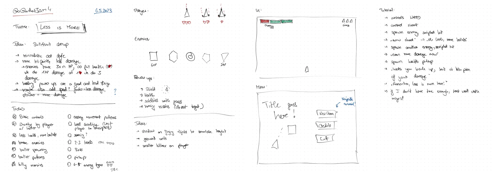
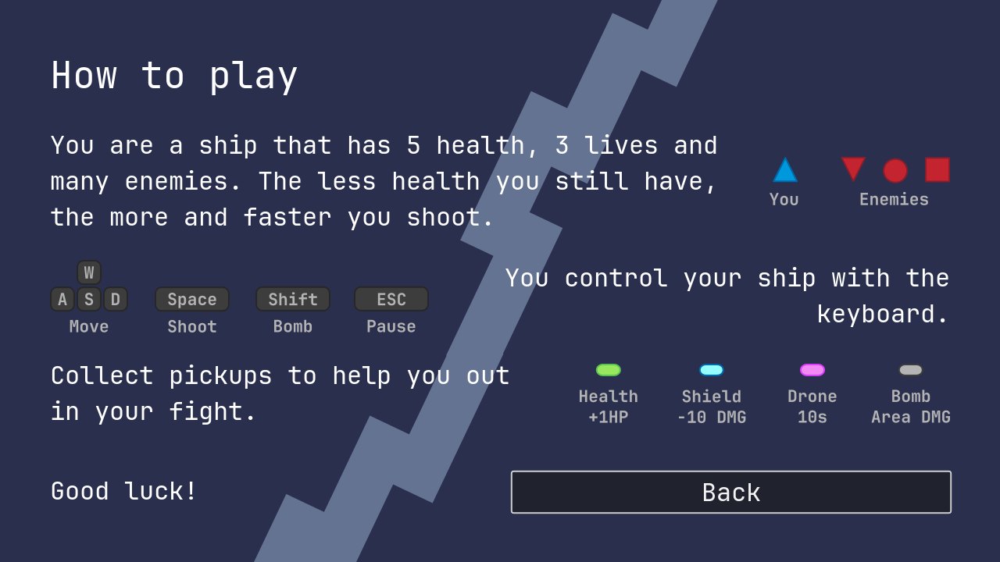

As hinted at to be my plan in [my post about my first proper gamedev experience back in April](/blog/2023-04-16-the-path-to-super-bunny-hoppers/), I recently took part in my first
ever gamejam, [Go Godot Jam 4](https://itch.io/jam/go-godot-jam-4), and during that built a game called ["Pew Pew Pew: Danger Zone!"](https://foosel.itch.io/pew-pew-pew-danger-zone). The jam required all submissions to be built in [Godot Engine](https://godotengine.org), which was one of the reasons I chose it - I just recently got my feet wet in game development with Godot 4 and wanted to get some more practice in. Since my partner was otherwise committed, I entered as a solo dev. 

In this post I want to share a bit of a devlog and some insights into that experience, to add more background to [the Mastodon thread I maintained throughout](https://chaos.social/@foosel/110321340611941751).

Apologies in advance, this is going to be a long one, but there are also a ton of pictures and videos to break up the text a bit 😉

## Development

The submission phase (so the time I had for developing and submitting a game fitting the theme) was 9 days long, from Friday, May 5th at 22:00 UTC to Sunday, May 14th at 22:00 UTC. Since the start wasn't until midnight in my timezone and after yet another intense work week I was quite exhausted on that Friday evening, I didn't stay up for the theme announcement. So it wasn't before the morning of Satuday May 6th for me to learn about the theme **LESS IS MORE**, right after waking up.

### Saturday, May 6th: Let's go!

During my morning routine I got an idea on what game to create[^1]: A little shoot-em-up (shmup) with minimalistic graphics, slightly bullet hell-ish, where the only way to upgrade your weapon and shoot more bullets was to lose health. The challenge would be balancing health vs damage output, possibly even dodging health pickups to stay at a higher bullet output with the risk of dying.

After breakfast I sat down to sketch out this idea a bit further.

The originally plan was to have the player be a triangle pointing upwards, and several enemy types also based on geometric shapes. The player would have three hit points and thus three different bullet emitter configurations. I jotted down some ideas for collectable power-ups (a shield, health, little shooting satellites, homing missiles), did some initial UI sketches and also laid out a rough plan for the interactive tutorial I wanted to include, by already leaving myself a plan B in case I wouldn't have enough time to implement it. Not written down in my notes but already quite clear in my head was the plan to have the game have 2-3 levels and a final boss to defeat, which felt like a good scope for the time I had available. 

The plan was to spend most of the time until maybe Wednesday implementing controls, enemies, bullets and the basic game loop, and then spending the rest of the time on the tutorial, levels and boss, plus of course testing and publishing on `itch.io`.



Then I sat down and got to work.

My first task was getting a player scene created and basic 2d movement controls implemented. After that I quickly created a player asset, two enemy assets and some bullets in Inkscape, basing my color choices on the [ENDESGA 64 color palette](https://lospec.com/palette-list/endesga-64), and started looking into automatic bullet emitters and bullet patterns for the enemies, and straight shooting for the player. I also implemented the logic for the player to lose health when colliding with the enemies' bullets and consequently shooting more bullets, and for the enemies to lose health and dying when colliding with the player's bullets.

All of that took me the better part of Saturday, but by the time evening got around I had a very basic prototype with bullet emitters and patterns on the (still static) enemies and some basic shooting logic on the player. There was no sound yet, no game juice, nothing like that, but it was a start!



### Sunday, May 7th: Let's add some game juice!

Sunday began with a trip to a doc to get my sixth COVID shot[^2]. After that I sat down again in front of the laptop to implement as much as I could before the by now customary post-vaccination-headache would start haunting me.

It turned out to be a quite busy day, as I implemented:

- screen scrolling and movement limits for the player to always stay on screen
- player death and respawning at the bottom of the screen, with a short period of invincibility right after respawning indicated by some fading in and out
- screenshake and an explosion particle effect when destroying an enemy or the player
- some basic sound effects for shooting and the explosions, whipped up in [gdfxr](https://github.com/timothyqiu/gdfxr)
- a simple shadow effect for the player and enemies to simulate height (really just the same sprite with a modulate color applied and offset by a few pixels)



I also did some research on what music to put in and came across some amazing tracks by [David KBD](https://davidkbd.itch.io/). I was not yet fully set on which tracks to use precisely, but I was sure I had found a match (and was right!).

I was quite happy with that kind of progress and went to sleep with a good feeling, despite dreading the next day a bit due to the expected side effects of the vaccination.

### Monday, May 8th: It's got a name!

But when I woke up on Monday morning, I happily realized that this time I had gotten away with just a bit of a headache and some tiredness, but nothing more. Alas, that still didn't allow me to continue to work on the game - it was a regular work day after all! And so I had to wait until the evening to continue. I was able to implement some pluggable enemy behaviour (for now only following the player at an offset, but with an underlying code structure that would allow to quickly implement other behaviours as well) and also a first version of the HUD with health bar, damage output bar, life counter and score display. Also, I whipped up a background graphic in Inkscape and put that in as well. But most importantly I came up with a name for my creation: **Pew Pew Pew: Danger Zone!**



### Tuesday, May 9th: Pickups!

Just as Monday, Tuesday would also be a slower day with regards to progress on the game - working on OctoPrint all day didn't leave much time and energy in the evenings to make huge steps forward[^3], but I got some more stuff done nevertheless and was able to add various pickups to the game: 

- a health pickup that would recover one hit point for the player (which of course would reduce the damage output), 
- a shield pickup that would protect the player from bullet damage for a few seconds, 
- point pickups and 
- a pickup that would add a little drone circling around the player which for now did nothing but in the future I wanted to have shoot homing missiles at the closest enemy

Almost all of that would of course see further fine tuning during the next few days, but it was a good start on the pickups.



### Wednesday, May 10th: Refactoring & doubting myself!

Wednesday was the worse day of the jam for me. Work was tough, I was really out of energy in the evening, and the time that I did have after work was spent on refactoring the bullet emitters on the enemies so that I could also use them for the player and setting up some more bullet patterns, during which I also managed to introduce a hilarious bug that doubled all of the emitted bullets, making the game incredibly hard.

That was also the day I spent a lot of time on trying to get the drone to work and failing miserably - the homing missiles just didn't feel right, a circular pattern I tried as an alternative felt even worse, and all in all it simply was not coming together. I knew I still didn't have a single level, the drone idea was failing and I was thinking I'd have to pull it, and things just still didn't feel very fun. All in all, I was starting to seriously doubt whether I'd be able to submit something to the jam that I could be proud of. I went to bed quite frustrated and in doubt with myself.

### Thursday, May 11th: Menus, bombs, game over!

Thursday was a way better day however! I woke up very early, and when I realized I could no longer sleep got up and went through my morning routine. I was still thinking a lot about the drone and how to fix it, when suddenly a shower thought struck. I'd implement another pickup, a little bomb that you'd be able to trigger with a button press and which would then damage all enemies in its radius for a large amount of points and eradicate all bullets and pickups. 

I finished my routine, sat down in front of the computer and started working on that - even before work! It was around 7am and I figured I should be able to get that implemented in the 2-2.5h before I had to start working on OctoPrint, and it turns out I indeed managed to pull that off! I created a small effect to indicate the damage radius of the bomb that would get attached to the player when the bomb was picked up, and a small animation that would make this light up and vanish when the bomb was set off via the `Shift` key, together with a new sound effect. And doing that was fun! I was starting to feel optimistic again and started on my work day.

I finished that a bit earlier than usual because I had accumulated some overtime the past few weeks and got back into working on PPP:DZ. I fixed the homing missiles on the drone - they were not perfect, but they were finally homing! I also created a title graphic, the game's menu, a pause menu, a game over and a winning screen, some pickup indicators for the HUD, made level switching work, and changed some things about the pickups - the drone would now time out, the shield would track damage and be able to protect from 10 damage points. I think this was also the day I had the idea to give the player a bit of gravity for pulling in pickups, and that also made things finally feel way nicer!



It was an incredibly productive day, and I knew I'd be able to fully concentrate on the game for all of Friday, Saturday and Sunday. I set myself the goal to finish a first level by the end of the next day, add two more levels and a boss fight on Saturday, and do nothing but testing and bug fixing for all of Sunday.

I went to bed feeling like I might actually be able to pull this off after all!

### Friday, May 12th: We've got a first level!

After starting the day with a climbing session at the bouldering gym and some chatting with my buddies, I returned home, jumped into the shower and immediately got another idea for the game[^4]: Modulating the bullet speed based on health, increasing their speed the less health you still have, leading to a more frantic feeling and also even more damage output.

As soon as I was done with the morning routine I sat back down in front of the laptop and looked into implementing that. It turned out to be surprisingly easy to do, and when I fired up the game for the first time and took some damage on purpose I actually loudly shouted "F*CK YEAH!" because it made the game feel so much better!

I spent the rest of the day implementing the first level - creating a bunch of enemies and made them follow the player, move in a pattern across the screen or just stay statically in place and shoot away, fine tuning placement and playing through it again and again and again until I was happy with the feeling of things. In the process, I also found and fixed a sheer ton of bugs and minor or major annoyances, including a couple of game breaking race conditions 😬

Somewhere during that day, [I also set up the game on itch.io](https://foosel.itch.io/pew-pew-pew-danger-zone), wrote a little description, created some preview images and made sure the web export was running fine. At this point the page was still set to private, but thanks to the shareable secret link I was already able to send it to a few friends for testing, which is what I did.

I think around this time I must also have added the highscore mechanism, incl. persistence, which to my happy surprise also worked without any issues in the web export.

By the end of the day, I was exhausted, but happy with the progress, right on time, and looking forward to the next day!



### Saturday, May 13th: Content done!

I woke up to some amazing feedback from a buddy and implemented that right away: 

- the pickup gravity was a bit too aggressive and constantly yeeted things out of the screen, so I toned that down a bit and that help a lot
- the drone was feeling too weak, so I increased its shot frequency
- there was still an issue that the level end screen would not stop you from continuing to move around and shoot behind it - that required a bit more work, but was on the TODO list already anyhow 

Next task on the plan for the day was implementing two more levels and a boss! Since the boss definitely was the higher risk and higher impact, I tackled that one first, and created a big circle enemy chock full of hit points and with a shield powered by satellites rotating around it that would also shoot at the player. Admittedly that the shield was powered by these satellites was a bit of a hidden feature - shooting one down would temporarily remove the shield, only for it to return, until all satellites were taken out. It seems not many players might have caught on to that though 😅

I threw it into its dedicated level and added a boss health bar to the HUD.

Around afternoon I posted a sneak peak of the boss on Mastodon:



I then went on to create two more levels, which turned out to be surprisingly fast - I was able to reuse some of the enemy movement patterns and also could quickly implement some more ideas I had, thanks to the pluggable behaviours and Godot's animations.

The music selection was finalized as well: "Screams in the Distance" (as loop) from [DavidKBD's Eternity Pack](https://davidkbd.itch.io/eternity-metal-scfi-music-pack) for the title screen, "Spiral of Plasma" for the levels and "Synth Kobra" for the boss fight, both from [DavidKBD's Interstellar Pack](https://davidkbd.itch.io/interstellar-edm-metal-music-pack).[^5]

Doing test play after test play while developing I came to the conclusion that the boss encounter still needed a certain "oompf!" and added a warning animation with an alert sound, which together with the music choice imho really helped to set the right tone for a boss fight.



After some more testing and fine tuning I decided to go public with the game, in the hopes to get some more feedback from a wider audience before the final day, [published the itch.io page](https://foosel.itch.io/pew-pew-pew-danger-zone) and posted a link to it on Mastodon:



At this point I also submitted it to the jam, knowing full well that it was not yet done, but also that I'd still be able to upload new builds and update the page itself until the deadline. I figured I'd rather have an old build submitted than miss the deadline altogether due to some unforeseen circumstances.

Then I continued testing and fixing stuff until I was too tired to do go on and went to bed.

### Sunday, May 14th: Day of the Deadline!

I woke up to some more feedback, one point of which would turn out to be the most common one during the rating phase as well: the enemy bullets were too hard to see. I tried changing their color to red like the enemies themselves, and that helped, but made the game look a bit too monochrome. So I decided to see if switching to a darker background would help, and it did indeed. 

Things were still not perfect, but it was the final day, I still had to implement a tutorial screen, do some more testing, fine tune some sound effects and finally do several more testing runs - I really didn't have time for big experiments anymore to make the bullets more visible. And to be honest, I didn't consider trying to completely avoid the enemy bullets the goal of the game anyhow, given getting hit was the only way to improve your damage output and there was some short period of invincibility after taking a hit, so sudden death scenarios shouldn't be that big of a concern either. 

Thus, I put "further research how to increase visibility of enemy bullets" on the "post jam" task list and after redoing all the screenshots and going over all game items to make sure they still were visible too (the shield pickup needed some changes here), I tackled the tutorial. I had said goodbye to the idea of a tutorial level a long time ago already, and almost scratched the tutorial screen as well, but figured it would be better to have some hints in game. I created some key graphics to visualize the controls and put together a basic "how to play" one-pager that could be selected in the main menu. I also added a very basic keyboard control summary to the bottom of the screen right at the start of the first level, that would slowly fade out.

What then followed were a couple more hours of final testing, and once I could no longer find anything crucial that needed to be fixed, I decided to call it done, did a final upload and announced on Mastodon that I was done:



And if you want to see what the game looked like at the time of submission, here's a playthrough of the first level:



and another one of the boss fight:



## Feedback & lessons learned

After the submission phase ended, what came next was the rating phase. Everyone who had submitted a game during the jam and of course the organizers themselves could now rate the submissions in five categories. Quoting from the jam page:

> 1. **Technical** - Does the game work? Does the game show off the engine? Does it do anything particularly impressive? Is it feature rich?
> 2. **Artistic** - Is it pretty? Are the sound and visuals effective and fitting? Is the style coherent to the gameplay? Are the text boxes legible?
> 3. **Design** - Does the game teach you how to play it? Do the mechanics make sense?
> 4. **Gameplay** - Is it fun? Does the difficulty scale? Are there accessibility options? Have I played the same game before or is it innovative?
> 5. **Theme** - Does the game fit the theme? Is it surface level or is the theme at the core of the game? 

It took me a while to wrap my head around these categories and get a good feeling for how to rate games in them, but after a couple games played and rated I got into a good groove. Meanwhile I started receiving comments and feedback from other participants and a recurring theme there was: "the enemy bullets are hard to see" 😅

Lesson learned: I should at least have given myself a timebox on that last day, to try out some more things to make the bullets more visible. I'm still not sure if I would have found a solution that would have worked well, but some more timeboxed experimenting might have helped. But then, it was the final day of my first ever jam, and I was a bit anxious to get everything done in time, so I guess I can forgive myself for not having done that.

Other than that the feedback was very positive, and when [it even got streamed by one of the judges](https://youtu.be/fp_1nU3fvwA?t=4185) I was happy to see that they seemed to really enjoy it and gave me some great ratings as well! Many people said it was fun, enjoyed the intensity, and gave amazing suggestions on how to improve it further. 

I also got into some nice discussions about gamedev in general with other participants (and made at least one new friend 👋😊).

So, while horribly anxiety inducing whenever I saw a new notification pop up on itch.io, the rating phase was also a lot of fun, I learned a lot from it and got a ton of helpful feedback!

And I hope I did my part in making it a similarily positive experience for the others as well, by giving them constructive feedback on their games too. I tried to play and rate as many games as possible, and while I didn't manage to play all of them (there were almost 200 submissions!), I did play and rate 42 games in the end, which was almost double of the ratings that I received. Next time I'll try to do more!

## Final results & the future of PPP:DZ

Rating ended late on May 25th, but the results would not be announced until a final event stream that got scheduled for late on May 27th. 

In the end, I made 21st place overall in the jam, and even #9 in gameplay, which was an outcome that I absolutely did not expect on my first ever gamejame participation and only my second gamedev experience! When I saw the results, I was absolutely floored! Based on what I had seen from others during the jam, I was hoping I'd made it in the Top 100 (out of almost 200 submissions), and would have already been happy with a placement in the Top 50. That I almost made it into the Top 20 and even managed to secure a place in the Top 10 of the Gameplay category was beyond my wildest dreams!

But even before this amazing outcome I had already decided that I wanted to continue working on the game. I found myself playing it again and again on my Steamdeck, trying to improve on my highscore, and that made me think that I had indeed something fun here that I could build on. 



So - I won't let myself get nailed down on "when" here (day job, balance, etc), but my plan is to take this concept and develop it further into a full game. I already have a couple of ideas on how to do that, and I'm looking forward to working on them. 

And what about future gamejam participations? I'm hooked now and plan to participate next in the [GMTK Game Jam 2023](https://itch.io/jam/gmtk-2023) in July. That will be probably be a solo effort again, and way more intense given that I'll have to take a game from idea to finished product in 48 hours, but I'm looking forward to the challenge!

## Play the game!

If you want to play the game, you can find it on itch.io here:



And I've also thrown up the sources on GitHub: [foosel/pew-pew-pew-danger-zone](https://github.com/foosel/pew-pew-pew-danger-zone)[^6]. Just a word of warning on those: I'm by no means an expert in Godot Engine, and a gamedev newbiew, and I was developing under heavy time constraints. I might have done some horrible things, please don't hold them against me 😅

[^1]: Yes, indeed, it was an actual shower thought.
[^2]: I plan to attend [GPN21](https://entropia.de/GPN21) next week and wanted to get another booster shot before that just in case - as much as everyone seems to pretend it is, no, COVID is not over, and the last thing that I need in my extremely stressful and busy life is to get sick, possibly even long term. 
[^3]: Admittedly, getting up really early to get an hour in at the bouldering gym before work like every Tuesday didn't help either 😬
[^4]: I you see a pattern emerging here that involves me getting great ideas in the shower, you are not wrong. OctoPrint might also have been one, but ten years later I frankly can't remember for sure. At this point however I keep a stack of waterproof post-its and a pencil in the shower, in case something good pop ups in my head.
[^5]: If you are looking for some metal riffs for your game, take a look at [David's work](https://davidkbd.itch.io), it's really good!
[^6]: You are welcome to dig around in the code and also of course to send in PRs, but I'm currently still debating with myself if I want to merge anything from others, so please don't get offended if any PRs stay open and also uncommented for now 😅