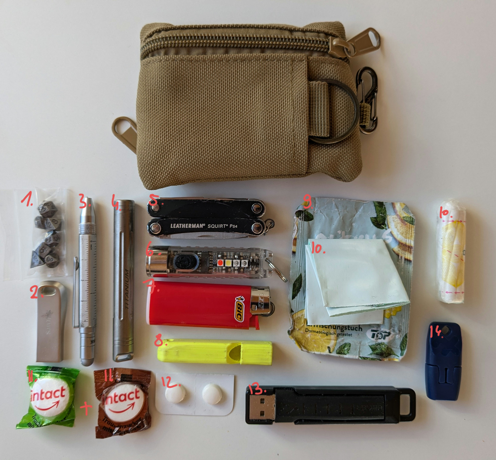

The other day I was taking care of a fresh mosquito bite with the heat-it that's part of my EDC ("everyday carry"), and that reminded me that I'd been meaning to do a quick write-up about my EDC for ages. 

On top of my keys (with some meds and my second factor tokens) and my phone (currently a Pixel 6a) I usually carry a little pouch with me as pictured above.

Unpacking it fully, it looks like this: 

So what is all this stuff? Here we go:

1. a full miniature RPG dice set (you never know when you need to roll on something) 
2. 64GB USB stick (mostly empty for impromptu file transfers, but also something to watch in case I have to entertain myself in a hotel or something)
3. Troika Liliput pen (ballpoint pen, ruler, stylus, screwdriver)
4. small pill tube with painkillers (I tend to get weather related headaches)
5. Leatherman Squirt PS4
6. small rechargeable LED flashlight (white light, red light & UV, plus emergency flashing)
7. small lighter (I don't smoke, I just prefer to have a fire and emergency light source on me)
8. 3d printed emergency whistle
9. small refreshment towel (in case I need to wash my hands but can't)
10. hygiene baggy & tampon (in case I misjudge my cycle or need to help someone else who misjudged theirs) 
11. two glucose sweets (always good to have something on hand for myself or others)
12. meds against motion sickness (which I sadly suffer from greatly, especially in cars I'm not driving myself)
13. short USB-C to USB-A cable for charging my phone, plus a SIM tool
14. USB-C heat-it (little gadget I can plug into my phone and control from an app that helps with mosquito bites through heat - consider it a really portable form of the popular bite-away wand)
15. (not pictured) a key for a safe

And that's it with regards to my EDC! I'm currently thinking about sewing a custom pouch, as the store bought one I currently use could really use better zippers and a slightly different internal organisation, but that's a future project.

I'll do my best to also add a post about my portable solder kit soon 😁 In the meantime, feel free to get in touch [on Mastodon](https://chaos.social/@foosel) for questions or comments!

*edit* I forgot to label the USB stick earlier, this has now been fixed.