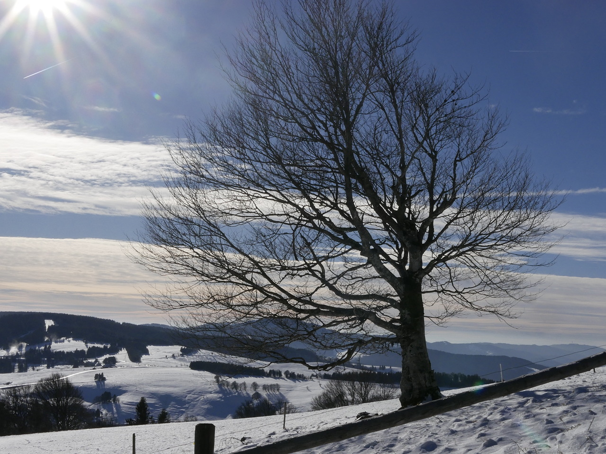
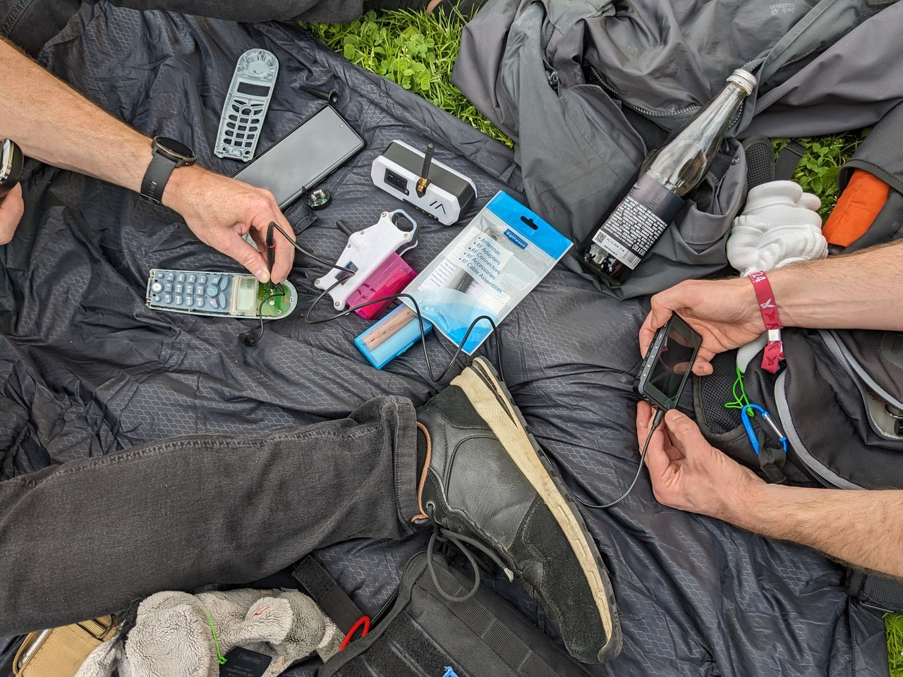
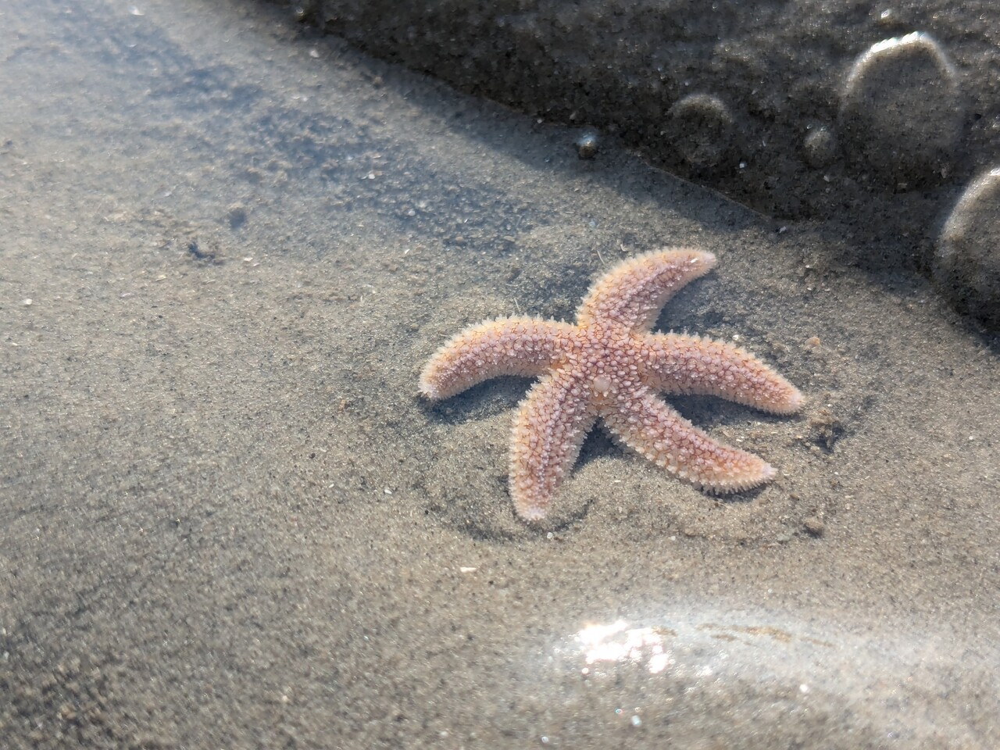
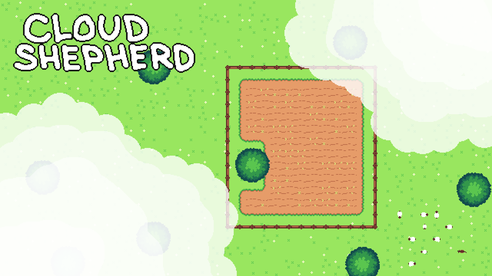
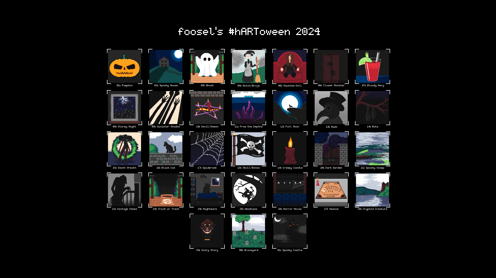

I decided to try my hand at my very own 2024 retrospective to give myself a chance to see more of the good things I managed to get done or that I experienced. And as the news continue to be all doom and gloom I figured why not do this in the shape of a blog post so that a) it's more easy for myself to revisit that again in the future whenever I get dragged down and b) y'all maybe also get some positive vibes. 

So here we go...

1. I got myself a Silhouette Portrait 3 vinyl cutter (that i can fully operate with open source tooling based on an Inkscape plugin, fsck proprietary cloud sh*t!) and immediately gave it a face. Technically that still happened in 2023, but on December 30th, so I'll let it count ;)
   

2. I did a deep clean and reorganization of my office, and I'm happy to report that this has mostly held up!
   

3. I got a new label printer (Brother QL-820NWB) and [created scripts to easily print out Deutsche Post stamps with that](https://foosel.net/til/how-to-print-deutsche-post-stamps-via-the-command-line-on-a-brother-ql-label-printer/).

4. I spent some beautiful calm days with my partner in the southern black forest - plenty of snow and walks and games!

   

5. With the help of the vinyl cutter and the laser cutter I gave our [Datenzwerge](https://datagnome.de) some stylish travel cases!

   

6. I also did a deep clean and reorganization of my wardrobe, and that's also still holding up! No more dreading of sorting the laundry into the wardrobe!

   

7. I learned book binding and got into solo RPGs!

   

8. I also got into crafting print-and-play games!

   

9. As a result of that I also built a little tool (running 100% in the browser!) to convert the usual PNP card PDFs into ready to print gutterfold PDFs for easier alignment of the card backs and fronts: [CardFoldr](https://foosel.github.io/cardfoldr/)!

10. I missed the probably biggest Aurora event of the past decade in Germany, but managed to still get some shots a few days later.

    

11. I did some minor leather crafting to build myself a big roll-up dice tray for my solo RPG sessions. It has since also come in handy during the one or other board game session.

    

12. I went to [GPN22](https://entropia.de/GPN22) with my buddy Romses and five Datenzwerge. We had a great time there chatting with old and new friends, and getting more grey hair due to WiFi issues with the gnomes and DECT issues 😂

    

13. My book binding experiments escalated and I bound a 400 page book 😬

    

14. I went to EuroPython to Prague, had some amazing chats with people there, enjoyed a bunch of very tasty non-alcoholic cocktails, had a lovely time at the social event, and also experienced my first flight-cancellation and rebooking on my return trip 😅

    

15. After a **very** stressful time at work thanks to [some stats manipulation](https://octoprint.org/blog/2024/06/28/stats-manipulation/) by [some bad players](https://octoprint.org/blog/2024/07/04/more-stats-manipulation/) (that btw still has me get very angry whenever I think about it) I had a very relaxing and resetting two week vacation with my partner at the north sea, filled with e-bike rides, walks through the wadden sea, our very first stint at a "Hochseilgarten" (climbing garden) and also playing through Fort Solis, Little Hope and House of Ashes together during the evenings 😄 I also treated myself to a new camera body for this occasion, a Lumix G91, allowing the G70 to stay in webcam mode for good now.

    

16. While there I also blogged about my [EDC 2024](https://foosel.net/blog/2024-08-08-edc-2024/). For which I then promptly sewed a new custom pouch once I was back at home.

    

17. During September I participated in FediJam and created [Cloud Shepherd](https://foosel.itch.io/cloud-shepherd), a cozy puzzle game in which you herd clouds over fields to make it rain. I did all the programming, graphics and sound effects (yes, also the dog and the sheep) myself - and **I won the gamejam**! And as this was my first time doing pixelart, it gave me some courage...

    

18. ... so throughout October [I partook in the #hartoween art challenge](https://chaos.social/@foosel/113233763230193057) and did a pixelart painting for every day - albeit admittedly some of them a few days later due to other committments and illness, but all 31 of them in October!

    

19. For that I also figured out how to [make transparent GIFs more easily shareable on social media](https://foosel.net/til/how-to-make-transparent-gifs-easier-shareable-by-adding-a-checkerboard-background/) as I also was creating timelapses of my drawings and wanted to share them with a proper checkerboard background.

20. Also in October, I went to [MRMCD24](https://2024.mrmcd.net/de/) together with my partner and my buddy Romses, and of course a whole army of Datenzwerge. We deployed 8 of them this time and it was a huge success.

21. During that time I also played through my personal Game of the Year 2024, Animal Well!

    

22. In November the 2024 edition of our hotsauce got finished. As every year we planted the chillies around February and then took care of them throughout most of the year. Sadly, the yield this time around wasn't as great and we had to add some store bought chillies into the mix. I think the sauce still came out great though after five weeks of fermentation. Alas, I can't taste it myself - no heat tolerance 😅

    

23. After one too many quality issues with my Blue Yeti, I upgraded my office audio setup and got myself a Shure MV7+ and a Vocaster Two audio interface. And since then I'm finally *happy* when hearing my own voice in a recording 😄

24. As my final work project of the year, I did some - successful! - refactoring experiments on OctoPrint that unlocked some things I'll work on in early 2025, and I'm really looking forward to that 😊

And there you have it. My personal list of good stuff that I did or experienced in 2024! Probably missing plenty of things, but that's all that I could think of now off the top of my head and with the help of my [Mastodon account](https://chaos.social/@foosel) and my picture gallery 😄 Let's see what cool stuff I'll manage to list for 2025!
