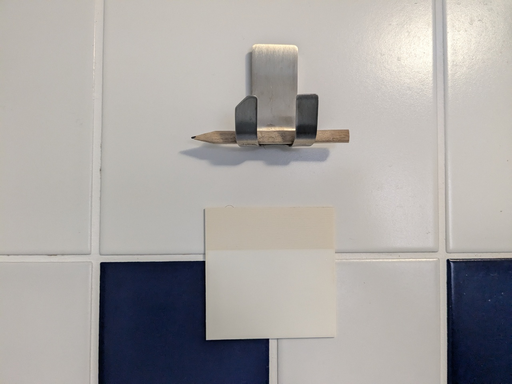
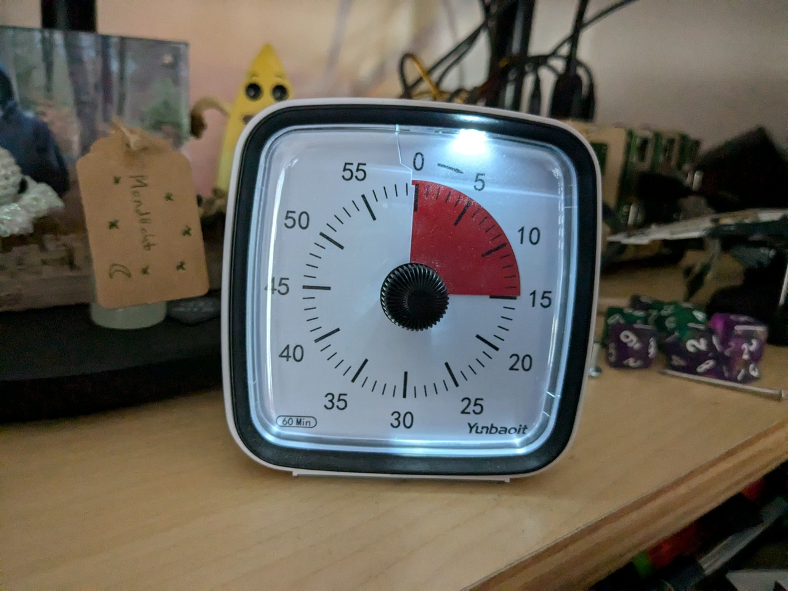
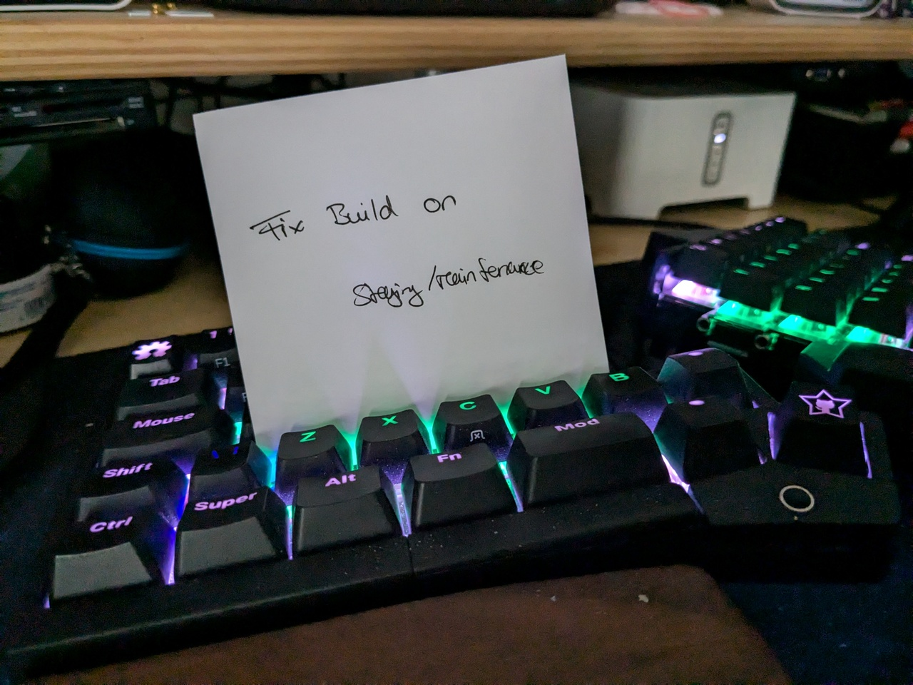
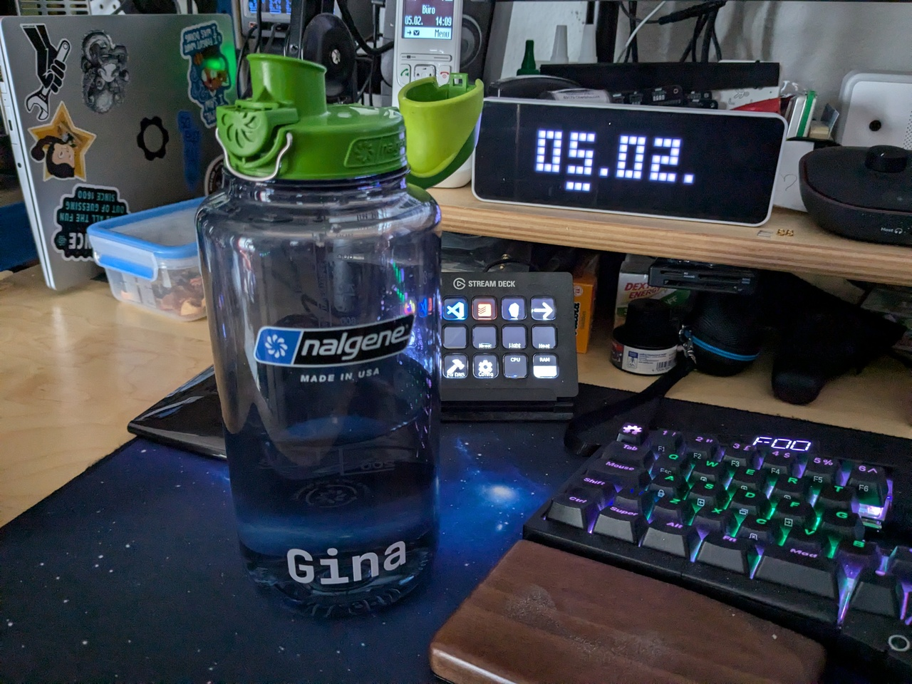
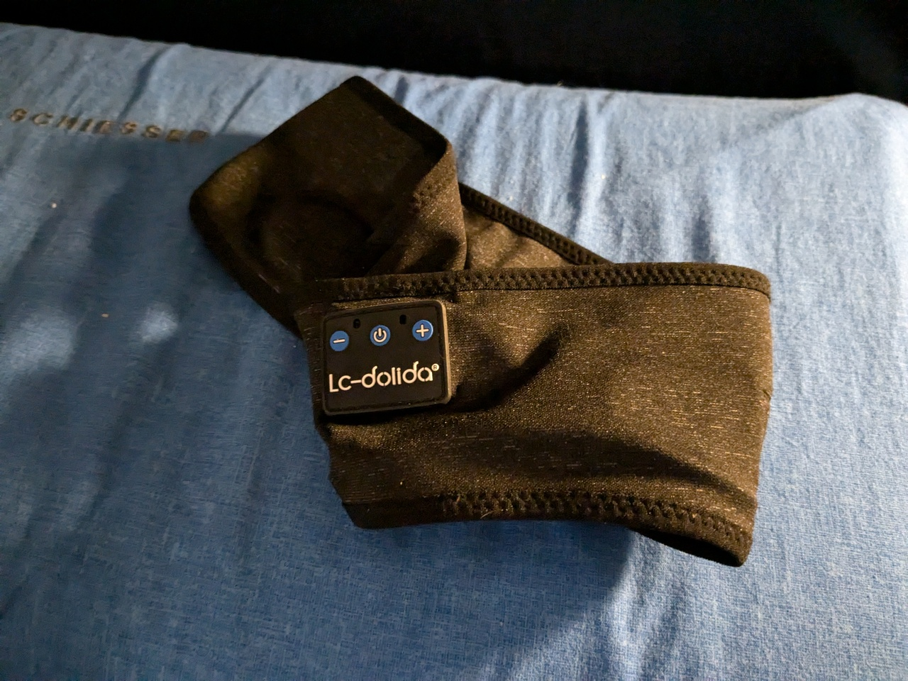

For a couple of years now I've had the sneaking suspicion that I'm neurodivergent. And while I still don't have a diagnosis, there are several things
I use to cope with my brain constantly going *BRRRRRR*, thinking (and worrying) about everything while forgetting important things, and I thought some of those
might also be helpful to others.

Thus, here are five of my favourite lifehacks that I've been using to cope with the weirdness that is my brain. Some of them I've used for years before I ever suspected
something, some of them I only discovered after reading up on neurodiversity. Maybe you find something interesting for yourself!

## Waterproof post-its in the shower

My daily morning shower is a time I really do enjoy. It's also a time where I seem to get quite creative from time to time, getting great ideas on how to solve
existing problems in my life, or just remembering stuff I need to take care of. Of course, after getting out of the shower, once I've toweled off, most
of that stuff is forgotten again.

A solution that has worked amazingly well for me here are waterproof post-its and a pencil that I just have stored high up in my shower! So when I get an idea or remember
something important, I now just note it down on a post-it and immediately glue that post-it to the shower door. That last step is very important, because that
way I have it basically right in my face while toweling myself off, and don't forget to take it with me when I'm done with my morning routine to take care of it or
note it down somewhere else (either my [Obsidian](https://obsidian.md/) knowledge base for ideas, or [Todoist](https://www.todoist.com/) for TODOs).

That approach has been working well for me now for quite some years! Before I came across the waterproof post-its though, I tried the same approach with a diver writing panel.
But with that I had the problem that I then either forgot that I had written something on it (as it hung inside the shower, not immediately visible while toweling off), or I 
forgot to clear it again (as I didn't have an eraser right on hand) and so found it already full with notes when I needed to write something new on it. The post-it approach 
solves both points, as the notes are way more mobile that way, and taking one off the stack immediately gives me a fresh one.

Something that doesn't get a post-it though is when my shower gel runs out - in that case I just throw the empty bottle out of the shower right away so I will stumble
over it when I get out and remember to put it on the grocery list 😆

## Visual timers

I have a problem with timers (e.g. for the laundry) going off when I'm right in the middle of something at work, not immediately able to react to it, and then 
promptly forgetting about it. And I have a problem with noticing time run by in general when I'm in the flow.

For the longest time this was causing me a ton of stress and cases of "Oh no, not again", but these days I have that pretty well under control after putting a 
visual timer on my work desk and one in the living room. And that's a trick I only discovered after reading up on neurodiversity and learning about 
[time blindness](https://www.psychologytoday.com/intl/basics/time-blindness).

Laundry timer just went off but I'm deep in some code, hunting a bug? My hand now automatically just reaches to the visual timer and sets up something like 30min on it.
I only want to work on this work item for an hour (time box, follow-up appointment, it's already 5pm and I really should call it a day soon, ...)? Hand out, timer on 60min.
I have to wait 10min to check my COVID test? Hand out, timer on 10min.

All of that would of course also work with a timer on my phone, but this works better for me: There's a physical timer right in front of me, with a physical wheel I can turn
to set a time, and I don't have to parse the numbers on the front either, the amount of time is clearly visible by how much red I see.

Where my phone *does* come in though is when I know I have an appointment sometime in the day. This causes me a ton of stress for the whole day until the appointment because
I know there's something coming up that I must not miss, and then I'm scared of forgetting all about time again and missing it, causing me to not be able to concentrate on 
anything else very well. What has helped me here is putting one to several alarms on my phone before the actual appointment, giving me an early warning that the time is coming 
close, and allowing me to relax until that happens.

## Physical callbacks

Another problem I often encounter is having to remember to do something at some point in the near future. My forgetfulness is becoming a bit of a pattern here I guess 😅

Some examples: 

- I have a bunch of envelopes I need to bring to the next mailbox the next time I'm out. (Hello [OctoPrint Patreons](https://www.patreon.com/foosel) at $10+ 👋)
- We just had a BBQ on the balcony and now the grill has to cool down before I can close and cover it again. 
- There are dinner left-overs that need to go into the fridge or freezer, but currently they are still too warm for that.
- I need to remember to do something come monday when I'm back at my desk, which I can only do at my desk, e.g. ordering a new prescription.

For things like that I usually use a quick physical callback. 

Something I still have to do before going to sleep, e.g. take care of the grill or the left-overs? I put something 
in the hallway that doesn't belong there. Usually that's my rolled up yoga mat, as that's a quick and easy thing to do given its usual place. I have to remember to take care
of something while out? I put it on top of my shoes or throw it into a bag I hang from the apartment door's handle. Something I need to take care off at my desk? A note stuck
into my keyboard or the empty prescription thrown on my desk work wonders.

## Large water bottle at my desk

I tend to not drink enough when I don't have water immediately in reach. So now I always keep a large refillable water bottle on my desk that I can drink from directly and that can
stay open without a big risk of spilling. Currently that's a 1l or 1.5l Nalgene wide mouth with an OTF cap.

Bottle + glass never worked well for me - constantly having to refill the glass is something that annoys me greatly, plus I tend to forget it (of course...). Smaller bottle also
doesn't work, constantly empty. And a larger bottle than 1.5l poses the issue that I have to take it to the kitchen to refill from the tap, vs just being able to take care of that
during the regular bathroom break (which is WAY faster). 

The goal here is to make it as easy as possible for me to - often absentmindedly - drink water, and that's achieved with that approach, allowing me to reach my daily 2-3l of fluid 
intake. 

## Sleep headphones & audio books

My brain doesn't shut up fscking *ever*, and it interferes with my nightly rest. Imagine trying to fall asleep when your brain is constantly thinking about the latest bug in your code,
code architecture, what groceries you need to buy, upcoming elections, that discussion in that issue you had this morning, that email you still have to write tomorrow, ...

It's only when I'm completely and utterly exhausted that I can fall asleep right away, otherwise it's a long struggle of trying to ignore my brain and coming down from the day before
it works.

Thankfully, I discovered sleep headphones for myself a long time ago, so headphones in the shape of a headband with some really flat speakers inside and a bluetooth module or wired connection
to your phone or mp3 player. 

Those allow me to listen to things without disturbing my partner. And those things for me usually are audio versions of books I already happen to know. The latter
is extremely important, as with books I don't know yet, my curiousity into how the story continues might keep me from falling asleep. I have the same issue I with most podcasts. But
audio books of books I've already read work amazingly well. I set the sleep timer in my audio player to something like 30min and then just close my eyes and listen. My brain shuts up 
as I'm keeping it busy with listening and imagining what's going on in the book, and I often manage to drift off in less than 10min.

So there you are, five lifehacks that make my daily life easier for me!
