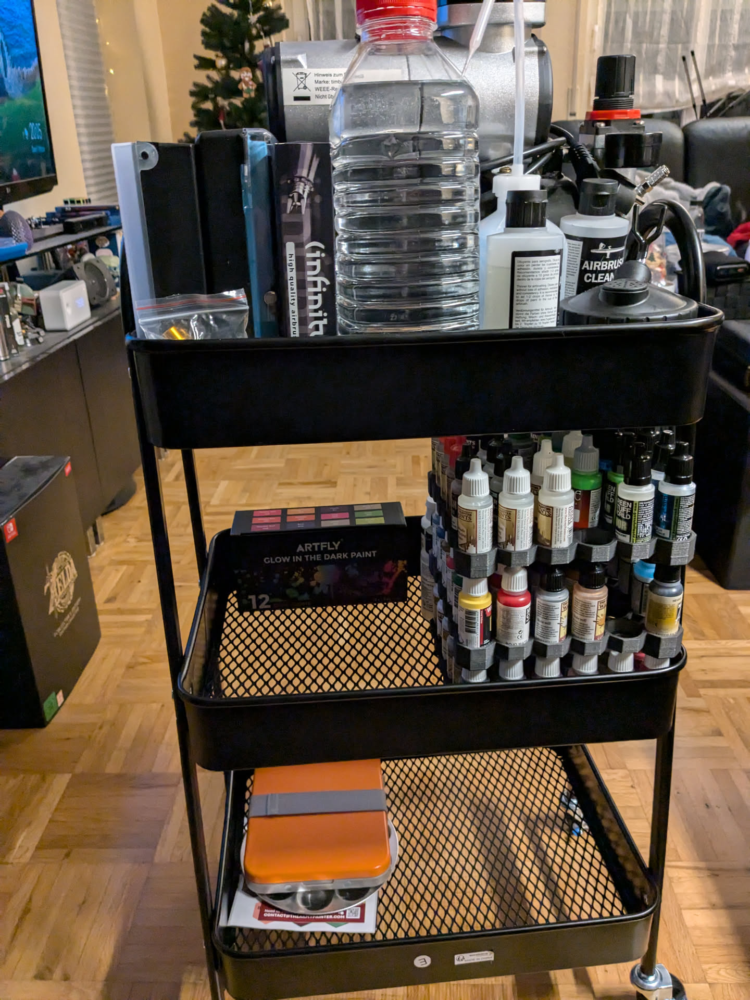
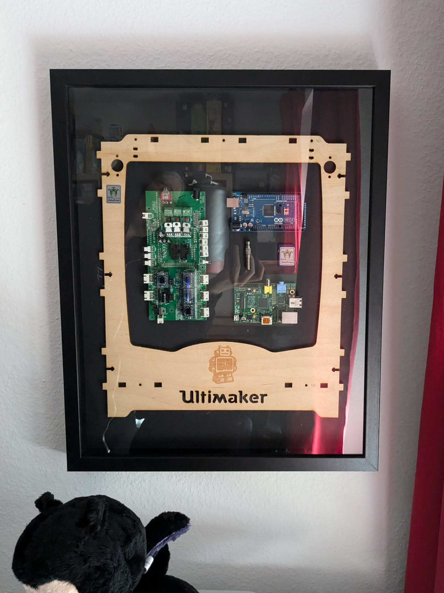
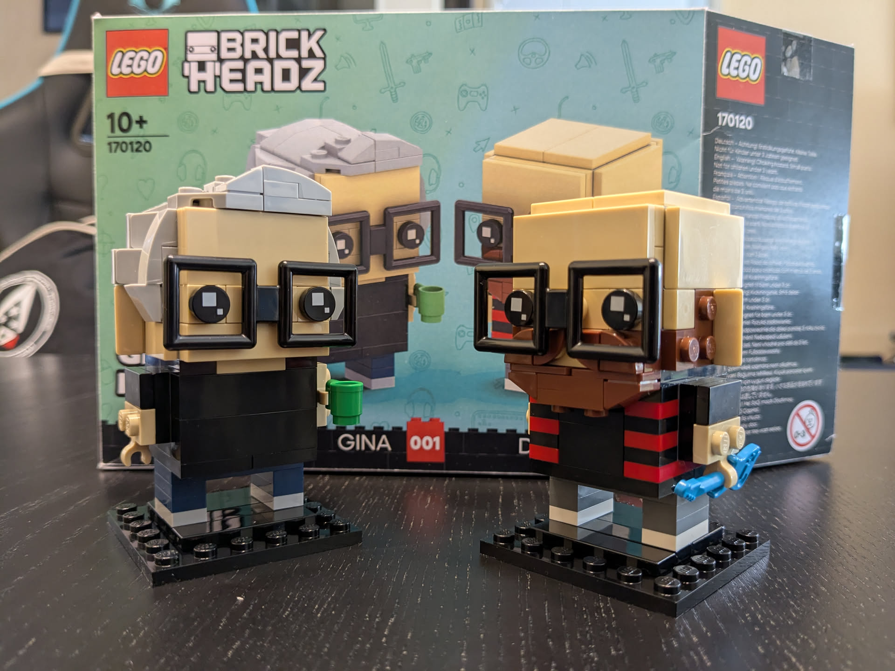
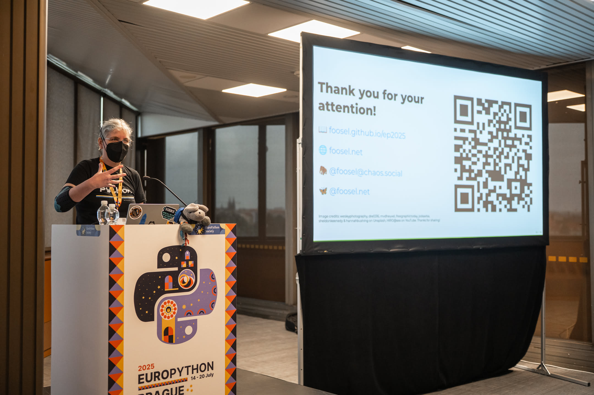
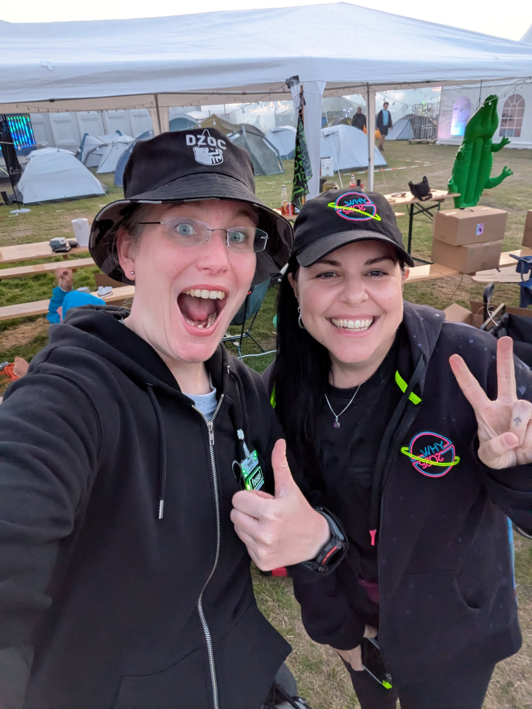
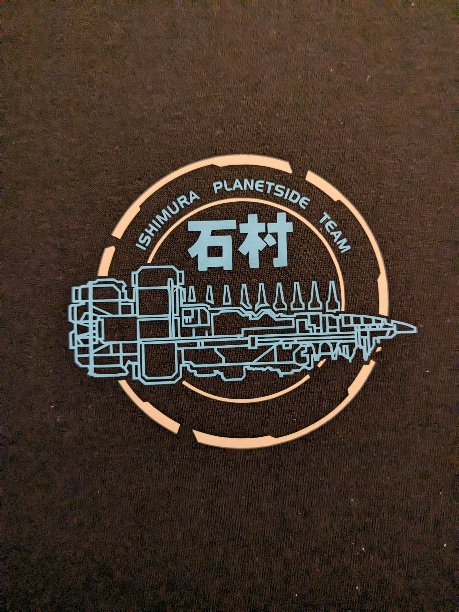

Just like [last year](https://foosel.net/blog/2024-12-30-2024-retrospective/) I've decided to sit down today and write my very own retrospective. The year has been difficult in several ways, but whenever I took another look at last year's post it put a smile on my face, remembering the good things about life in general.

In the hope that this will continue to work, here we go with the same look at cool stuff that I did or experienced in 2025...

1. I started the year with my by now traditional deep clean project, this time taking care of my hallway and the built-in closet. That also included recycling my first ever 3d printer with which everything OctoPrint started - a step I had to do for space reasons, but which still felt weird.

   

2. I painted all of the (core) miniatures of my copy of ["Sub Terra"](https://boardgamegeek.com/boardgame/204472/sub-terra), making sure to also use a bit of UV colors for some special effects under black light.

   
   

3. That also prompted me to finally kit up my painting stuff on a small cart that fits into the freshly cleaned up built-in closet.

   

4. As it is also becoming traditional by now, I spent some wonderfully calm days with my partner in the southern Black Forest again. We spent the days taking long walks/hikes through the snowy landscape, and the evenings playing through ["Rise of the Golden Idol"](https://store.steampowered.com/app/2716400/The_Rise_of_the_Golden_Idol/) - quality time! 😊

   

5. Back from that, I finally found the time to frame the bits of my first 3d printer that I kept and hung them in my office - that way it's not fully gone but taking up way less space than it did before.

   

6. At the end of January, I gave my first talk in front of a live audience since the start of the pandemic, at a local Women in Tech meetup. To say that I was incredibly nervous about this would be an understatement, but everything went smoothly once I got started 😊

   

7. Using my vinyl cutter I created some custom Mass Effect merch! Happy to say that the design indeed held up through several washes now - this thing has become my favourite hoodie and I'm actually wearing it as I'm typing these lines.

   

   I also created two more shirts, and another hoodie for my partner:

   

8. I finally played through ["Dredge"](https://store.steampowered.com/app/1562430/DREDGE/) and had a blast doing so!

9. I bought a new vacuum and immediately fell into love with it, so much so that I printed a whole bunch of holders for its adapters 😂 Peak adulting ^^

   

10. I started on my journey to reduce my footprint on US clouds:

    - I switched from Google Drive to a NextCloud instance hosted at Hetzner in a german data center
    - After adding some more storage to my NAS I migrated all my pictures from Google Photos to a self-hosted [immich](https://immich.app/) server
    - I switched my homelab's backup approach from Synology's proprietary stuff to [Borg](https://www.borgbackup.org/)/[borgmatic](https://torsion.org/borgmatic/)

11. I started playing ["Starforged"](https://tomkinpress.com/pages/ironsworn-starforged) and for journaling my adventures built myself a traveler's notebook.

    

    This in turn led to me starting a Bullet Journal in an A6 sized self crafted traveler's notebook, and that's been used daily since. I've been meaning to write a post about that, I really need to do this asap...

    

12. On Easter my partner surprised me with a self-designed Lego Brickheads kit of us, which I had a blast building together with him.

    

13. I finally bound a book again, creating my first ever paperback!

    

14. I upgraded my Framework 13 Intel 11th gen to a new AMD Ryzen AI 300 mainboard. It's my daily driver that I use for basically everything, and so I also put all the RAM in there that it supported: 96GB, which back then cost me 180€. Given the RAM prices now (the same kit now is getting sold for 900€), I am incredibly happy about this foresight 😬

    

15. During an evening walk through my partner's home town with him I made an incredible find in a "book closet": A book about home computers from the mid 1980s.

    

    The rest of the evening was spent reading through it quite excited, and hunting down some other ones from the series on ebay 😂

16. I went to PyCon Italia - my first conference since the start of the pandemic - and not only went climbing with some fellow Pythonistas but also met Jacopo, who's been helping me a lot with OctoPrint's security!

    

    I've already got my ticket for PyCon Italia 2026 😊

17. The refactoring work on OctoPrint since late 2024 finally paid out and I was able to print from the in progress Moonraker Connector Plugin for the first time.

    

18. I went to EuroPython in Prague again, and this time even gave a talk! Of course, support plushy Timothy was there too 😊

    

19. In August I went to [WHY2025]() - my first camp in the Netherlands since 2009. We took the [Datenzwerge](https://datagnome.de) with us of course and deployed all 10 of them across the camp grounds. It was some very intense but awesome days!

    

20. While at WHY I met [Erika Heidi](https://eheidi.dev/) whom I so far only had known virtually through GitHub Stars. We nerded out SO MUCH about tech, bouldering and 3d printing, it was a ton of fun :D

    

21. For my partner's birthday, I created yet another custom shirt utilizing the vinyl cutter and some HTV, this time with a logo from Dead Space. The design was based on in-game graphics, and weeding it was a bit of a nightmare 😂

    

22. I also got my partner an OLED Steamdeck for his birthday, and therefore also had to create [new custom buttons](https://foosel.net/blog/2023-01-19-custom-steamdeck-buttons/). While at that, I also finally created some green ones for myself, and also created a whole new mold for the digi pad. Now my Steamdeck is also nicely customized 😊

    

23. During this time, I also played through my personal Game of the Year, ["The Drifter"](https://store.steampowered.com/app/1170570/The_Drifter/). That also spawned a whole Point-and-Click-Adventure phase for me again 😂

24. Over the course of October I took part in another month long daily art challenge, "Cosytober". I once again painted 31 pixelart pictures, this time limiting myself to 64x64px and the ENDESGA77 palette.

    

    I also started taking part in the [Pixelart Dailies](https://mastodon.art/@pixel_dailies) during October and kept that going well into November, when I ran out of energy.

25. During Cosytober I also got myself a used Surface Go 2 tablet off of ebay and turned it into a pen enabled Linux based tablet, perfect for working on pixelart from the couch 😁

    

    And yes, I know, I still owe this blog post 🙈

26. In early December this year's hotsauce finally got finished and labeled. The chillies were planted in February and the fruits harvested in early October. As always, it was a project that was in progress throughout most of the year!

    

27. Also in early December, I fell completely in love with the game ["Mars First Logistics"](https://store.steampowered.com/app/1532200/Mars_First_Logistics/), which I can only recommend if you are into Lego Technic.

    

28. And finally, shortly before Christmas I tried my hand at making Vanillekipferl for the first time, and greatly succeeded!

    

And that's a wrap on 2025 I think! I probably once more missed some fun stuff or awesome stuff I did or experienced, but reading through all of that written down here it feels like less of a crappy year already 😬

Like last year, this list was compiled with the help of my [Mastodon account](https://chaos.social/@foosel) and my picture gallery 😄 I'll see that I do one of these again in a year's time. For now I wish you a happy and safe 2026!
