For several months now I've been meaning to write about my notebook journey. Today the stars finally aligned and I just sat down to tell you about how I've been managing my TODOs for almost a year now.

It all started when I created myself a little leather cover for my A5 sized solo RPG journal:



I quickly realized that I quite liked writing down things by hand on the 100gsm dot grid paper of the notebook I got, and that I also liked the look and functionality of what I had created there. 

That lead to an idea. At this point I was still managing my TODOs in [Todoist](https://todoist.com), but also often ended up writing down the weekly tasks on the whiteboard in my office as I had learned that checking them off physically with an actual pen gave me way more dopamine than clicking a checkbox in an app. And the whiteboard approach quickly fell apart when I was not at my desk - I often ended up taking a picture of my whiteboard before having to work from somewhere else, or putting things into Todoist that felt a bit like they didn't belong there (small chores).

So I thought that maybe I should just try to go fully analogue with my tasks, in a portable form factor. The A5 size I had used for the RPG journal didn't fit that portability requirement fully, but A6 would be something that I could easily fit into my cargo pockets. I thus ordered a stack of A6 notebooks[^1] and built another leather cover for that size.



Once more I went with a [Midori style "Traveler's Notebook" approach](https://www.instructables.com/DIY-Midori-Style-Travelers-Notebook/) - a simple leather cover with a bungie cord in the middle, acting as both a place where to hang in one notebook from its spine, and a loop on the outside to keep the journal closed. To hang more than one book, additional bungie cord loops can be used to attach two or more books together.

Just like with my RPG journal, I also built myself an insert out of craft cardboard, to hold some of my cards and a slim tracker module, allow storing flat things on the front and back (receipts, tickets, my x-ray passport & dentist bonus log...) and attach a pen loop and some bookmark ribbons to as well.

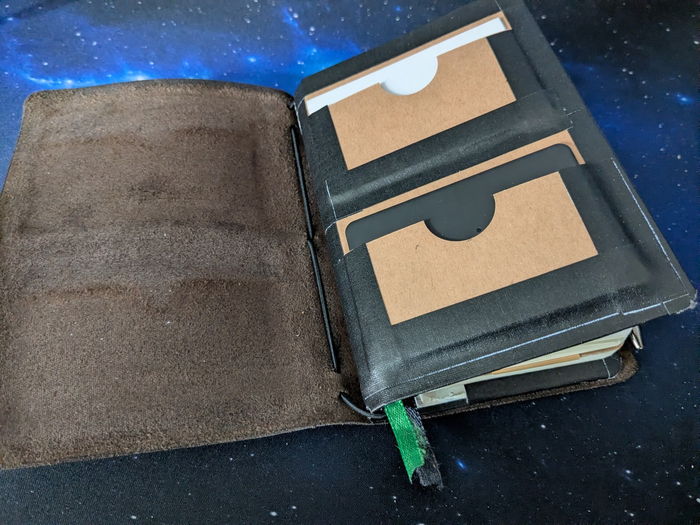

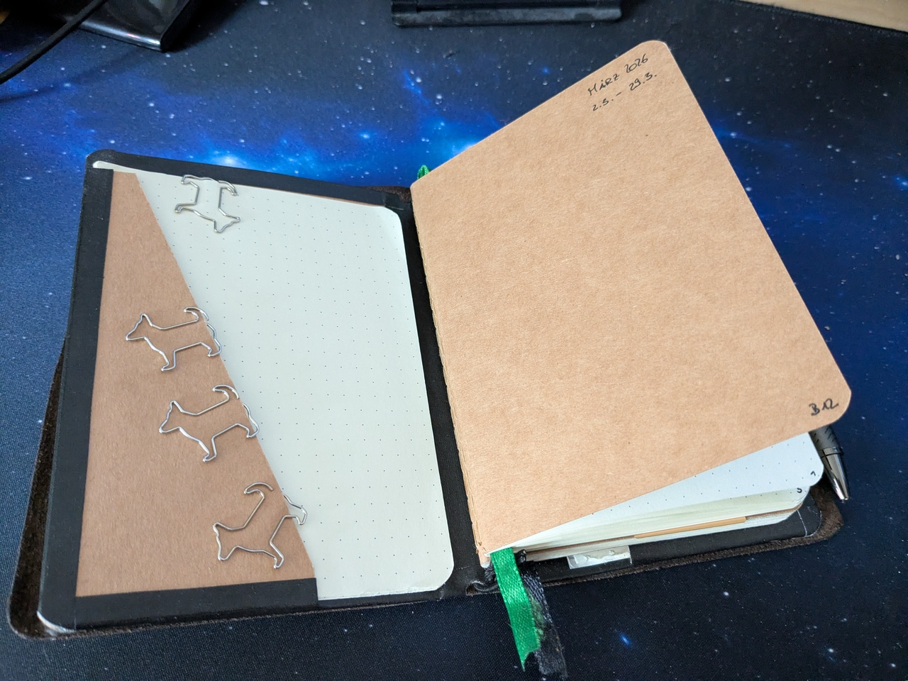

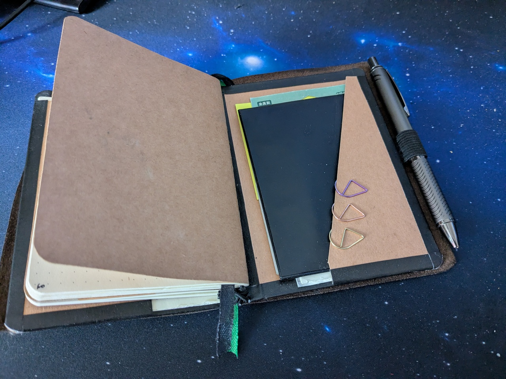

Then I sat down and thought a lot on how to best go about organising things. I of course had heard about the [Bullet Journal](https://bulletjournal.com/) method, so I looked up details on that. I quickly learned two things: 1) contrary to what images I found online and what I saw my mom doing made me believe, at its core bullet journalling is way less about fancy hand lettering and page designs but rather about rapidly logging down stuff and b) it's not actually about TODO lists but rather an approach for helping with self reflection and reaching your goals.

What I got from a) actually helped me a lot, but b) didn't work for me at all. I do call my little notebook my Bullet Journal, but it is in fact mostly a TODO list combined with some personal tracking, and of course note taking. 

I did adopt the symbols however: Tasks that are planned but not yet started get a `•` in front of them. I can cross that off with an `X` to turn it into "done". If a task takes longer or spans across multiple days, I can cross it off halfway `/` to mark it as started or in progress. With `<` or `>` I can signify that a task was rescheduled (forwards or backwards). All of these symbols can just be drawn over the initial `•` and I find that an amazing way to keep track of more than two possible task states. 

Additionally I also use `°` for events, `-` to mark notes, `=` for mental and physical health related things and `»` for quotes. 

So, how do I use all of this to organise my life now?

My journal contains two 30 sheet/60 page A5 books. 

The first one is focused on the current month. I use it to keep track of my running tasks, logging my days, monitoring my [vertigo symptoms](https://foosel.net/blog/2025-09-15-about-my-chronic-vertigo/) and mood. It helps me a ton  each day to see that I actually did get stuff done (even if it often doesn't feel like it). 

Each month I create an overview of tasks I should get done sometime this month in my *Monthly Log*, and an overview of the next month and anything later than that in my *Future Log*.

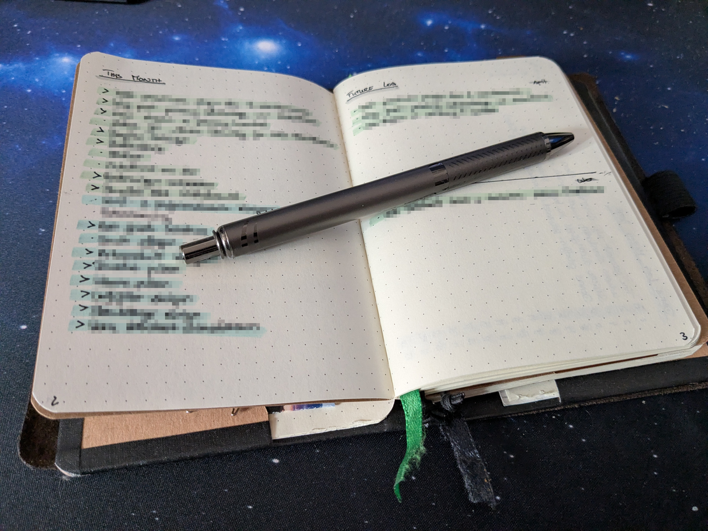

My *Daily Log* is combined with my mood tracker. I jot down one **positive** thing about each day (to combat the constant doom and gloom caused by living in this reality - it helps reading through what I write here at the end of each month). Even if it is just about taking an amazing nap that day, it counts.

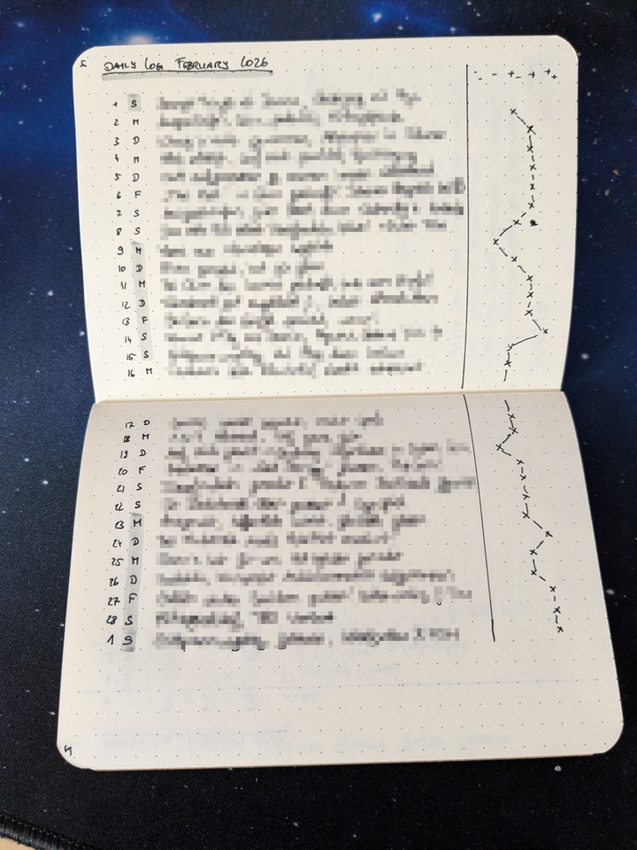

Then follows a spread with my *Vertigo Log*. It's a monthly log again with columns for the various symptoms and possible triggers I'm tracking, with some space for daily notes as well. Sorry, but I'm not including a picture here as all of that is a bit too personal to share publicly.

The rest of the notebook is organised by week. Each week I start with an overview of my repeating *chores* in the shape of an [Alastair matrix](https://alastairjohnston.com/projects-the-alastair-method/). I have columns for all days of the week. Each task gets its own line, with a `•` in the column(s) of the day(s) where I need or want to take care of it, and another `•` right in front of the task that I get to cross off when it's done.

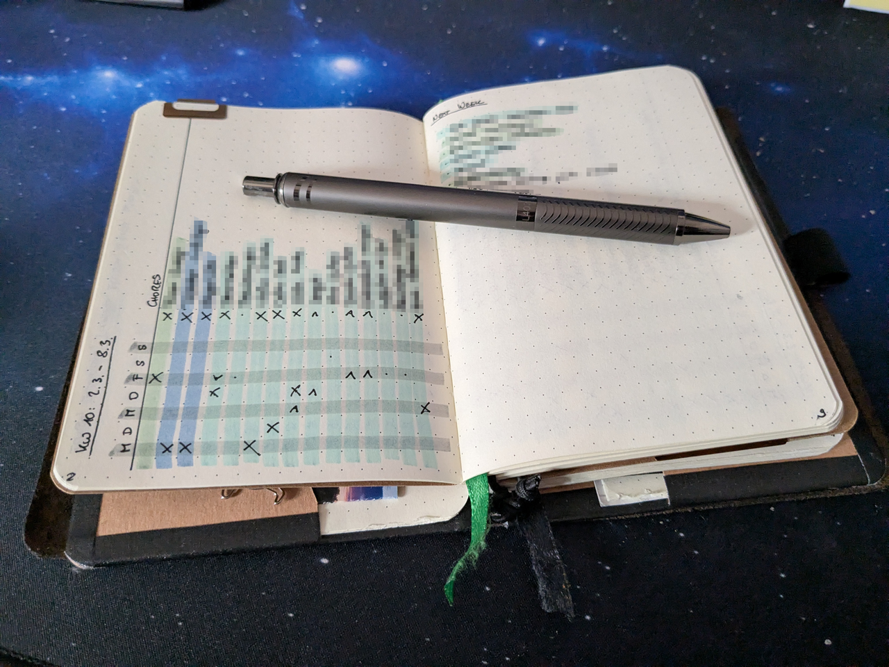

On the second page of the spread I have my running list of things I need to take care of *next week*.

The next spread is my running *tasks* list for the week. I put everything here as it comes up. Like the chores list it's a matrix allowing me to schedule each task for one or more specific days.

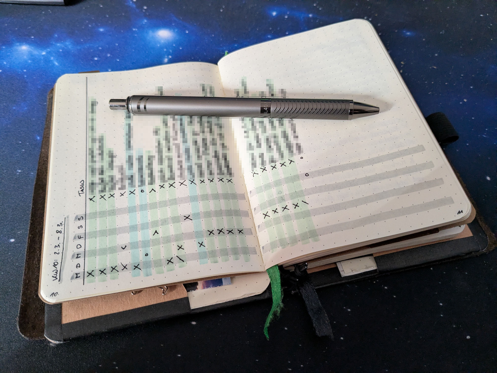

As you can see, I also color code tasks with markers, which allows me to easily filter the list at a glance. Green is work related, light blue are household chores, dark blue are health related tasks and pink are event related things.

I pre-fill the chores and tasks list based on the things I scheduled for this week over the course of last week, the monthly log & the weekly repeated chores.

On the next pages then follows my running log of the week. Each morning I jot down the current date and weekday, take note of the weather (and also keep that updated throughout the day - it's a vertigo trigger) and then copy over all tasks scheduled for the day from the list of chores or tasks. Whatever comes up during the day gets added too, and also put on the running task list (I want that as a full overview of the week). If something comes up that doesn't need to get done this week, I throw it on the list for next week, or next month or later, whatever fits.

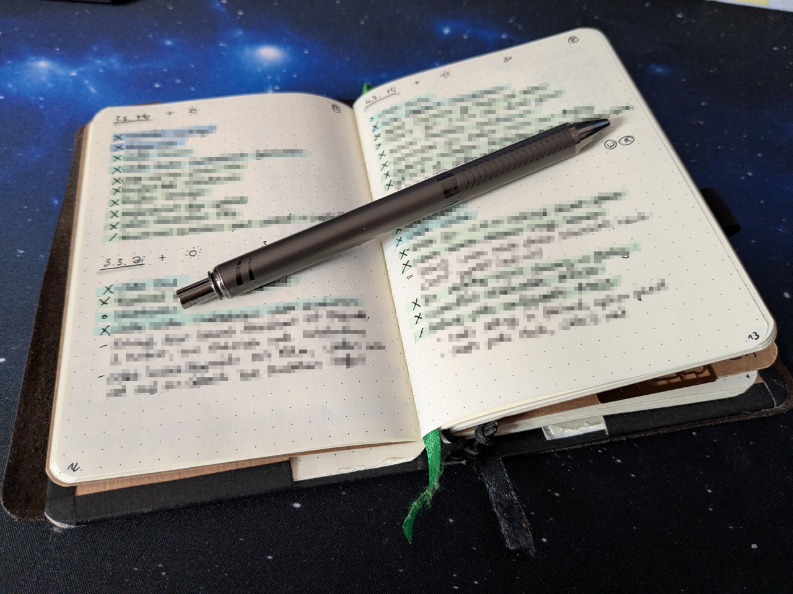

What I also log into each day's header are various symbols for habit tracking, and an overall mood indicator - I use that for the mood graph in the daily log.

That's basically the day to day with the notebook: Jot down tasks as they come, get an overview each day, get sweet sweet dopamine every time I cross something off.

But what about the second book? That is for longer term tracking.

I have an overview of (recurring) tasks throughout the year here that I need to take care of. I use that at the start of each month to prefill the monthly log.

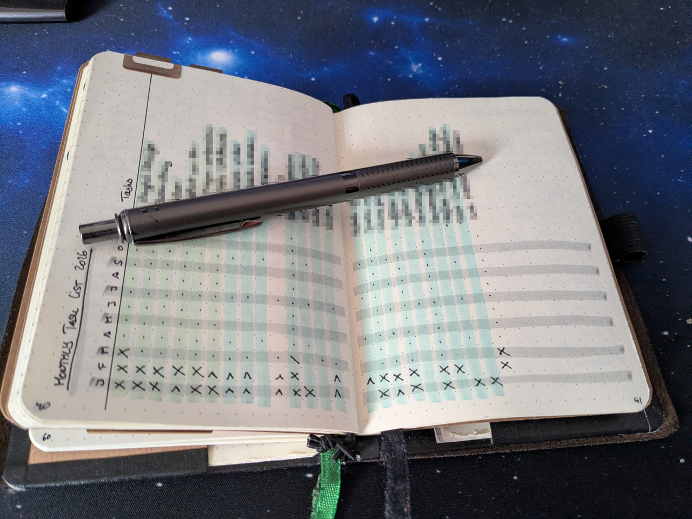

I also use the second notebook for long term work stuff, e.g. here is how I keep track of what I needed to take care of for each bugfix release for OctoPrint 1.11.x that wasn't already logged in the shape of public issues, PRs or commits, e.g. things I need to mention in the changelog, or not yet published security advisories.

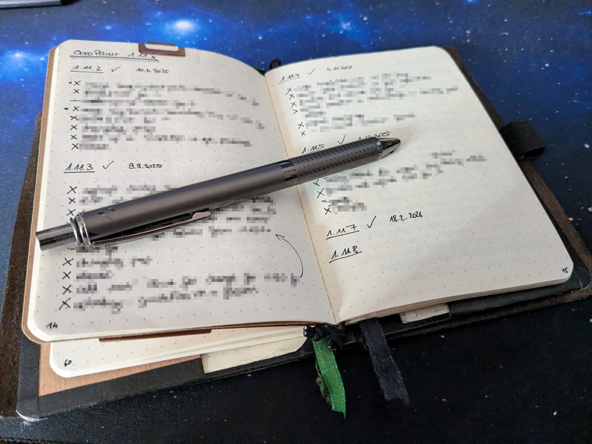

What else goes in there are ideas for various projects, what things I have borrowed to or from friends (and when and whether it was returned yet), what books I read, vacation plans, quick notes, notes about talks I've seen ... In short, basically everything else. I have a ton of lists (the Bullet Journal Method calls those "collections"), some of which are getting constantly updated, some of which only act as reference.

Some things from the second book get copied over to my personal knowledge base that I keep in [Obsidian](https://obsidian.md) (synced to my own NextCloud). As an example, I used the notebook last year during two PyCon Italia and EuroPython to take notes during the talks I attended, and those have now gone into my knowledge base (or turned into tasks long taken care of).

Really long term tasks - e.g. future vaccinations, check-ups and such - I still keep digitally in [tasks.org](https://tasks.org) (also synced to my own NextCloud). At some point they'll trigger a reminder on my phone, and then they'll get schedule in my regular task list.

At this point I can say that basically everything gets managed with the help of this tiny self built journal for almost a year now and that works amazingly well for me. 

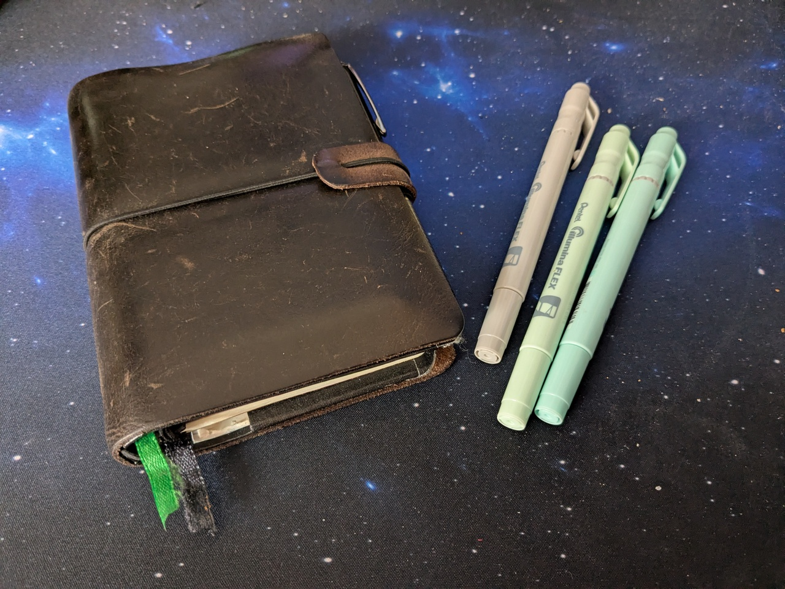

Needless to say I've cancelled my Todoist subscription. 😉 [#iDIDit](https://di.day).

[^1]: I got [these](https://www.amazon.de/dp/B0D3YTV4GZ) but I'm sure you can find something similar elsewhere too.