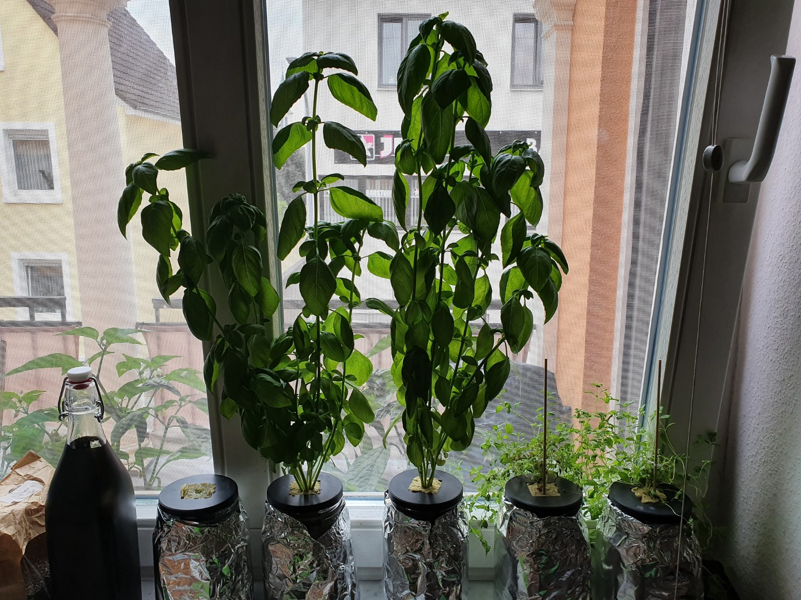

Since my partner loves spicy food, earlier this year I got us a chili growing kit. What was meant as an experiment has since become a full blown pepper growing operation that has taken over my livingroom window sills and half the balcony and already yielded its first fruits. And because whenever I try something new I also tend to do way too much research on it, while getting the plants started the normal way in soil (and then promptly running into the first issues with fungus gnats) I started to look deeper into [hydroponics](https://en.wikipedia.org/wiki/Hydroponics). 

I had heard of this approach before: growing plants in an inert grow medium instead of soil and feeding them with controlled nutrient solutions pumped around the roots. It's a fascinating rabbit hole to go down and it always tickled my interest (especially given the automation and sensitive evaluation possibilities), however it also felt way too involved to get started with unless I had some more actual space and some actual need to grow plants, what with all the lights and pumps and pipe systems that I saw associated with it. That is, until I came across the [Kratky method](https://en.wikipedia.org/wiki/Kratky_method).

The Kratky method is a pretty much passive approach to hydroponics. The idea is simple: you take an opaque container for your nutrient solution, cut a bunch of holes in the lid and then place your plants into netpots or similar in those holes so their roots reach into the solution. So far, so similar to the [Deep Water Culture](https://en.wikipedia.org/wiki/Deep_water_culture) approach. But instead of now aerating the solution with an aquarium air stone or similar to give your roots the oxygen they need, you instead simply allow the level of your nutrient solution to drop, creating an air gap and leaving parts of the roots hanging in the air. That way the roots can get nutrients but can also breathe (which is important so they don't rot). You'll have to fill up the solution a bit if needed (always leaving an airgap), but apart from that the whole setup is completely self managed. No power needed, no moving parts. And easily set up in something as small as a mason jar.

This was intriguing to me, and I had wanted to try my luck with growing some basil and oregano for pizza and such anyhow, so I decided to give this approach a shot. I ordered a kitchen herb seed kit, some 1l mason jars, some rock wool cubes (as growing substrate) and some hydroponic fertilizer. Then I fired up FreeCAD and designed a small lid with integrated rock wool cube holder (STL [here](https://foosel.net/files/kratky/quattro_stagioni_kratky_1l_36mm.v2.stl), FreeCAD file [here](https://foosel.net/files/kratky/quattro_stagioni_kratky_1l.FCStd)), printed a bunch of them and then went to work.

The seeds were planted in the rock wool cubes, watered and then I waited. The first green soon showed up and thus I transferred the cubes into their holders, filled the jars with 1l water plus the recommended fertilizer amount (thus creating a nutrient solution) and then put the lids on. The cubes sat right in the solution and thus were kept watered. To keep light out of the container (to prevent algae growth and also to not have everything heat up so much) I simply wrapped some aluminium foil around the jars. If I'm honest this was just meant as a temporary solution until I got around to sewing a little cover out of some light blocking fabric I have on hand, but I still haven't gotten around to do that and the foil works just fine 🤷‍♀️

That was on July 18th and since then I've been able to witness some astonishing growth, especially on the Basil. Have a look at the progress: 

As of today, both Basil plants had reached a plant height of around 50cm. The Oregano also looks healthy, but sadly I accidentally got hold of a hanging variant, making everything a bit tricky in this setup 😅

Sadly, I had to emergency-harvest one of the Basil's today. While topping up the nutrient solution the other day I noticed the roots to be way darker than they should be. They didn't look particularly healthy. Some of the leaves also started to look a tad unhappy. I came to the conclusion that I might have caught myself some root rot on this plant. Doing some research I learned that with the Kratky method, if you grow for longer than 4-6 weeks you really should occasionally replace the nutrient solution completely and clean the container to keep bacteria from taking root in your roots (pun not intended). I guess this is what happened here. I tried to save the plant with a 2:1 water and 3% hydrogen peroxide bath yesterday, but either it was already too late or that was too much stress. This morning the leaves were hanging and the whole plant looked quite sorry so I decided it was time to harvest and now I have a jar of fresh pesto verde. 

Further reading revealed that it's apparently an option to add a teeny time amount of 3% hydrogen peroxide to the nutrient solution itself to help keep any unwelcome guests away (and also help with aeration), so I've now added 0.5ml to my freshly topped off jar of the other Basil and hope that won't do harm but rather good. Wish me luck 😉

All in all, I call this whole first dabbling with hydroponics a great success. The Kratky method allowed me to get up and running quickly without huge investments and space requirements, and the results were amazing. I've also now planted some peppermint seeds and they are already sprouting, so my hopes are high for some amazing fresh trees later this fall! If you've always wanted to experiment with hydroponics but it always felt way too involved, maybe take a look at the Kratky method 😊
