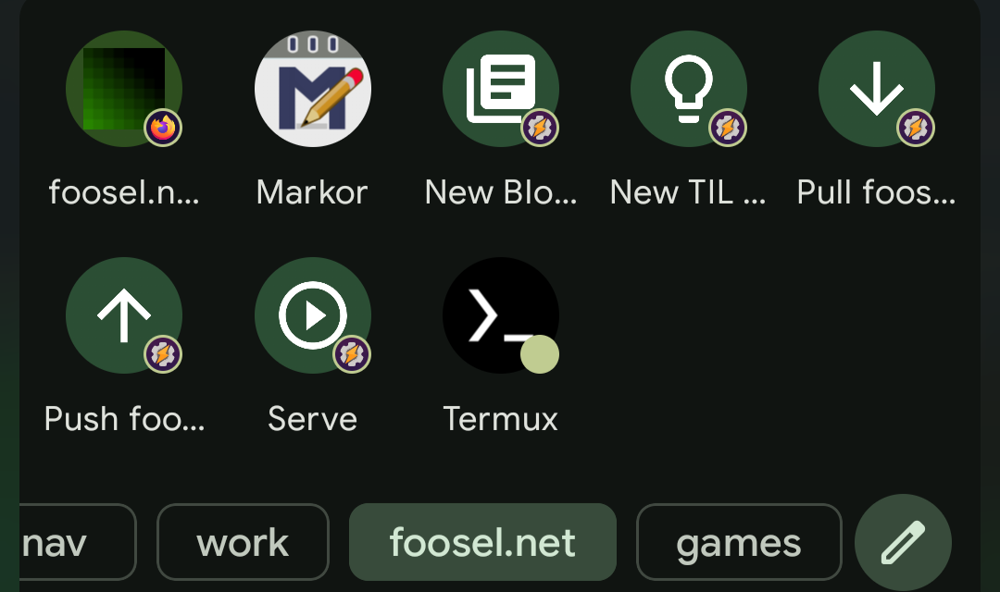

This TIL post is basically an update to my three year old post ["Hugo, meet Android"](/blog/2023-01-21-hugo-meet-android/).

I recently got a new phone and thus had to re-do the setup of my mobile blogging pipeline. So, basically, allow me to checkout, modify, test, commit and push the sources of this [Hugo based](https://gohugo.io/) static page under Android. While doing so I noticed some necessary changes and improvements, and also wanted to make use of my [Taskfile](https://github.com/foosel/foosel.github.io/blob/master/Taskfile.yml) which does most of the heavy lifting now, so here are my updated steps.

## Apps & permissions

1. Install Tasker
2. From **F-Droid** install
   - Termux
   - Termux:Tasker
   - Markor
3. Grant permissions
   - Tasker: Run commands via Termux
   - Termux: Draw over apps

## Termux setup

``` bash
# setup access to storage
termux-setup-storage

# install packages
pkg upgrade
pkg install git gh hugo iconv vim

# log into github
gh auth login

# navigate to Markor's document folder & checkout sources
cd storage/shared/Documents/markor
git clone --recurse-submodules https://github.com/foosel/foosel.github.io

# create symlink in home
ln -s foosel.github.io ~/foosel.net

# mark checkout as safe
git config --global --add safe.directory /storage/emulated/0/Documents/markor/foosel.github.io

# set git user metadata
git config --global user.email "you@example.com"
git config --global user.name "Your Name"

# we want to use our Taskfile...
pkg install golang
go install github.com/go-task/task/v3/cmd/task@latest
```

As Tasker will stay the *only* app on my system allowed to send commands to Termux, and I write all my tasks myself, I also added `allow-external-apps=true`  to `.termux/termux.properties` as described [here](https://github.com/termux/termux-tasker#allow-external-apps-property-optional). That allows me to directly execute stuff from Tasker by absolute path vs having to add a bunch of wrapper scripts to `~/.termux/shortcuts`

To quickly test if everything works so far:

``` bash
cd ~/foosel.net
task serve
```

This should build the page and serve it on `http://127.0.0.1:1313` (with auto reload).

## Tasker setup

I created a bunch of tasks, gave all of them an icon and added them to my launcher.

### Serve foosel.net

```
    Task: Serve foosel.net
    
    A1: Termux [
         Configuration: ~/go/bin/task serve
         
         Working Directory ✓
         Terminal Session ✓
         Wait For Result ✕
         Timeout (Seconds): 10
         Structure Output (JSON, etc): On ]
    
```

### Pull foosel.net

```
    Task: Pull foosel.net
    
    A1: Termux [
         Configuration: /data/data/com.termux/files/usr/bin/git pull
         
         Working Directory ✓
         Stdin ✕
         Custom Log Level null
         Terminal Session ✕
         Wait 
         Timeout (Seconds): 10
         Structure Output (JSON, etc): On ]
    
    A2: Flash [
         Text: Pulled foosel.net sources
         Continue Task Immediately: On
         Dismiss On Click: On ]
    
```

### Push foosel.net

```
    Task: Push foosel.net
    
    A1: Termux [
         Configuration: /data/data/com.termux/files/usr/bin/git push
         
         Working Directory ✓
         Stdin ✕
         Custom Log Level null
         Terminal Session ✕
         Wait 
         Timeout (Seconds): 10
         Structure Output (JSON, etc): On ]
    
    A2: Flash [
         Text: Pushed foosel.net sources
         Continue Task Immediately: On
         Dismiss On Click: On ]
    
```

### New Blog Post

```
    Task: New Blog Post
    
    A1: Input Dialog [
         Title: New post
         Text: Enter title
         Close After (Seconds): 120
         Input Type: 540673 ]
    
    A2: Termux [
         Configuration: ~/.local/bin/task new-blog -- "%input"
         
         Working Directory ✓
         Stdin ✕
         Custom Log Level null
         Terminal Session ✕
         Wait For Re
         Timeout (Seconds): 10
         Structure Output (JSON, etc): On ]
    
    A3: JavaScriptlet [
         Code: var uri = "content://net.dinglisch.android.taskerm.fileprovider/storage/emulated/0/Documents/markor/foosel.github.io/" + stdout.trim();
         Auto Exit: On
         Timeout (Seconds): 45 ]
    
    A4: Send Intent [
         Cat: None
         Mime Type: text/markdown
         Data: %uri
         Package: net.gsantner.markor
         Class: net.gsantner.markor.activity.DocumentActivity
         Target: Activity ]
```

### New TIL Post

```
    Task: New TIL Post
    
    A1: Input Dialog [
         Title: New TIL
         Text: Enter title
         Close After (Seconds): 120
         Input Type: 540673 ]
    
    A2: Termux [
         Configuration: ~/.local/bin/task new-til -- "%input"
         
         Working Directory ✓
         Stdin ✕
         Custom Log Level null
         Terminal Session ✕
         Wait For Res
         Timeout (Seconds): 10
         Structure Output (JSON, etc): On ]
    
    A3: JavaScriptlet [
         Code: var uri = "content://net.dinglisch.android.taskerm.fileprovider/storage/emulated/0/Documents/markor/foosel.github.io/" + stdout.trim();
         Auto Exit: On
         Timeout (Seconds): 45 ]
    
    A4: Send Intent [
         Cat: None
         Mime Type: text/markdown
         Data: %uri
         Package: net.gsantner.markor
         Class: net.gsantner.markor.activity.DocumentActivity
         Target: Activity ]
```

### Result

I now have all these tasks available under a tag in my launcher ([Kvaesitso](https://kvaesitso.mm20.de/)) and can easily work on posts from my phone once more. In fact, this post was entirely written on it.



The whole pipeline is a bit slimmer than last time as well and required less bash wrappers, which I like a lot better 👍

I also decided to go a bit more commandline-centric in this iteration - `git add` and `git commit` I'll actually run manually in Termux this time around (I rarely used the corresponding shortcuts I created last time).

Once I'm satisfied with the local preview and have committed, a `git push` is all that I need for publishing - the CI does the rest.
