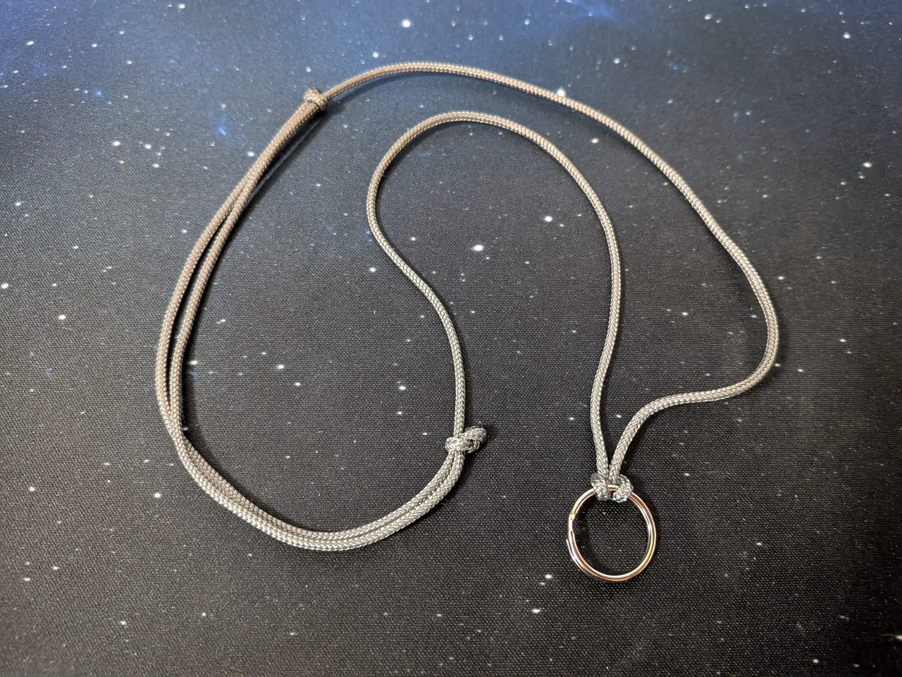
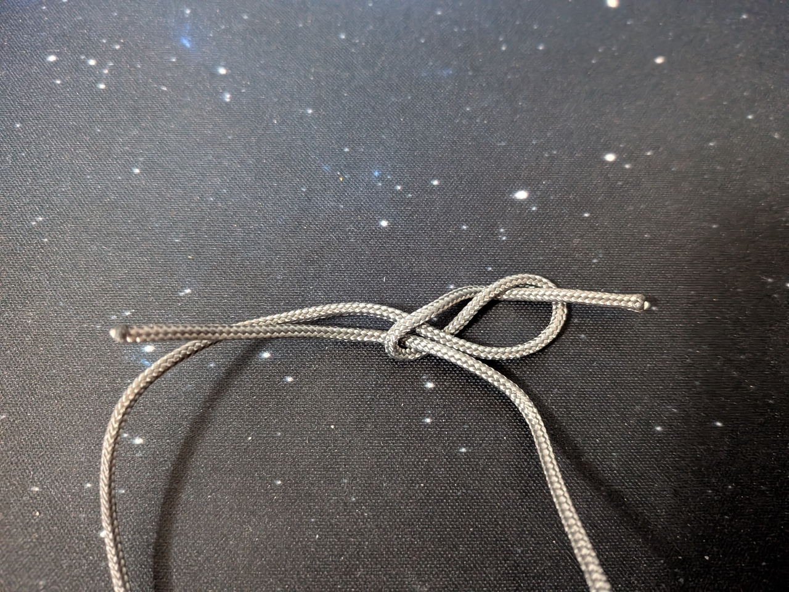
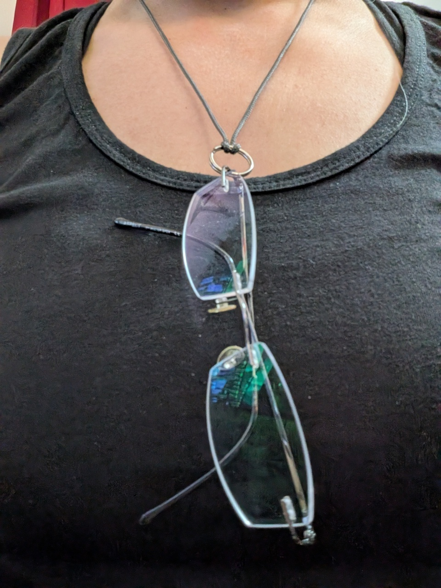
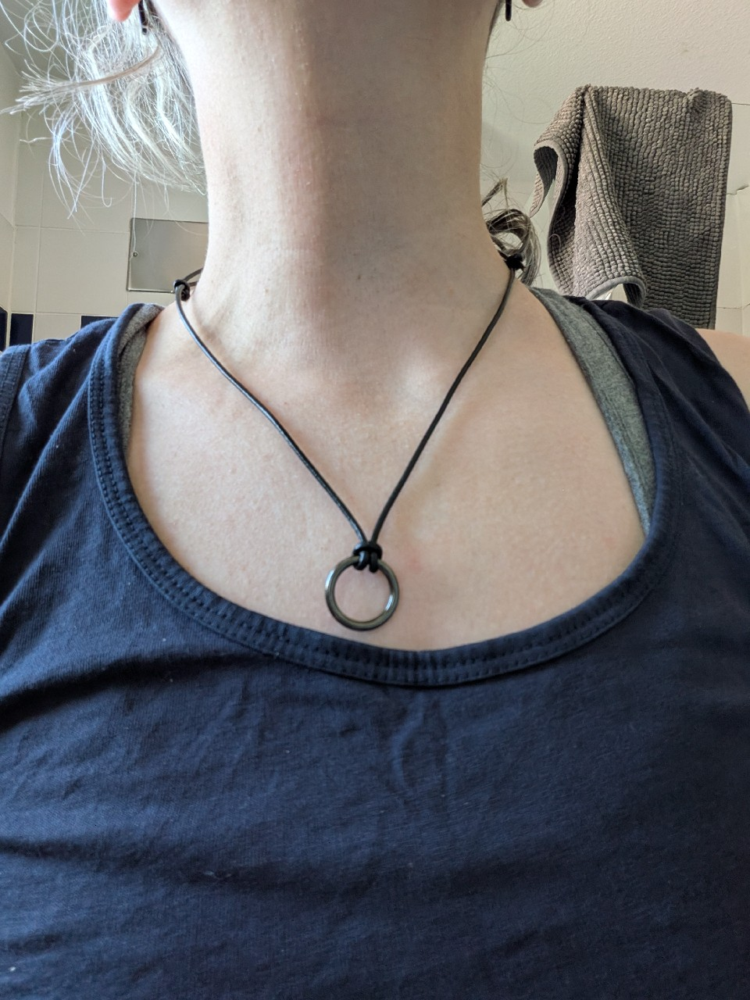

Thanks to the current heat wave and thus a shear TON of sun, I'm currently running around with both my prescription sunglasses and my regular glasses whenever I'm out and about[^1], as while the sunglasses are great for outdoors, they are quite dark and thus a bit tricky indoors. Carrying around two pairs of glasses gets annoying quickly as I have to put the one I'm not wearing somewhere, I don't want to carry it in my hand, I don't want to lug around a case for it to put in a pocket or bag, and as it turns out just hooking it on my shirt works somewhat, but doesn't feel safe.

Enough is enough... enter a glasses holder in the shape of an adjustable necklace that I just created from paracord.

I took a **small key ring (18mm dia)** I happened to have on hand, and some **1.5mm mini paracord** I also happened to have on hand[^2].
I measured out the needed length of paracord by hanging it around my neck so that both ends met just below my chest. Then I put two [figure 8 knots](https://www.animatedknots.com/figure-8-knot) into the ends and around itself, so that I got an adjustable closure. 

Finally, I put the key ring on in the middle of the necklace using a basic [cow hitch](https://www.animatedknots.com/cow-hitch-knot-end-method).

Aaaand done!

Holds my regular glasses or my sunglasses just fine, can be adjusted in length to easily get over my head but also not wiggle around too much. Somewhat fashionable too, but most importantly functional. I might make another one out of leather, but for now my problem is solved.

***Update from 2026-06-26**: I've made another one using a black leather cord and a metal o-ring and now it almost looks like a fashion accessory vs a practical solution to a problem. It turns out that this is also a nice fidget toy.*

*I'm quite happy with that!*

[^1]: Which given temperatures of 35°C+ I currently avoid like the plague, but errands don't run themselves.
[^2]: Having a ton of hobbies and interests can come in handy sometimes...
