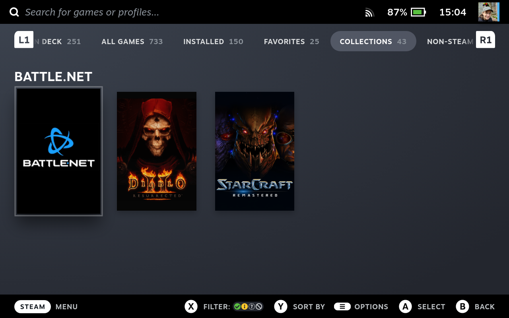
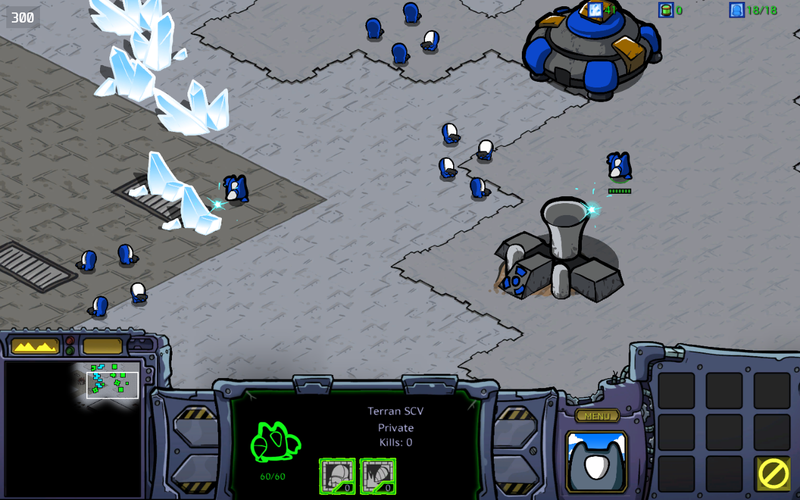

Battle.net is currently having a spring sale and I've been eyeing Diablo II: Resurrected for a while now, so I jumped on the chance (and while at it also got StarCraft Remastered). But given that these days I primarily game on the Steamdeck, I needed to find a way to install Battle.net on my deck and also install individual launchers for the games.

## Battle.net

I first made the mistake of trying my luck with installing the Battle.net launcher directly via Steam Proton. Trust me: Don't. Lots of work, doesn't end up well. Instead, I went with [Lutris](https://lutris.net/). Lutris has been installed for a while, but if that's not yet on your deck, install that first via the Discover app. Then:

1. Enter desktop mode
2. Navigate to https://lutris.net/games/battlenet/ and click on "Install". That will fire up an install script in your Lutris setup. Follow the steps shown to you by the app.
3. Once the installer has run its course, log into Battle.net. You should now be able to download stuff.
4. Right click on Battle.net in Lutris, select "Add steam shortcut" (if that's not available, but "Delete steam shortcut" is - nothing to do, the shortcut has already been added). This will become available after Steam has been restarted, don't worry about it now.

## Diablo II: Resurrected

This will create a Lutris app that uses the same Wine prefix as your Battle.net install. This is important! In desktop mode:

1. Navigate to https://lutris.net/games/diablo-2-ressurected/ (not a typo, there *is* a typo in that slug indeed), click "Install". Follow the steps.
2. If not yet done, launch Battle.net and install Diablo II: Resurrected.
3. Launch Diablo once via Battle.net, exit as soon as you can.
4. In Lutris, right click on the Diablo entry, select "Configure" and go to "Game options"
5. Click "Browse" next to "Executable". Change it to to `/home/deck/Games/battlenet/drive_c/Program Files (x86)/Diablo II Resurrected/D2R.exe` (so, one folder up, into the Diablo folder and there select `D2R.exe`)
6. Under Arguments add `-launch`
7. Save

Make sure the Steam shortcut for the app is added.

## StarCraft

Just as with Diablo II, it is important that the StarCraft entry uses the same Wine prefix as Battle.net. Either duplicate the existing "Diablo II: Resurrected" entry or alternatively follow steps 1 and 2 above. Then do the following with your game entry:

1. Launch Battle.net, install Starcraft Remastered.
2. Right click on the designated game entry (either your duplicate of Diablo II, or the Diablo II entry you don't intend to use), select "Configure"
3. Under "Game info", change the name to "Starcraft Remastered" and the identifier to "starcraft-remastered"
4. Under "Game options", change the executable to `/home/deck/Games/battlenet/drive_c/Program Files (x86)/StarCraft/x86_64/StarCraft.exe` and add `-launch` to the Arguments
5. Save

The art in Lutris should update automatically. Make sure the Steam shortcut for the app is added.

Once all of that is done, head back into game mode. Feel free to change the art for the newly created entries, e.g. through something like the [SteamGridDB](https://github.com/SteamGridDB/decky-steamgriddb) plugin for [Decky](https://deckbrew.xyz/). I also set up a dedicated "Battle.net" collection and added Battle.net itself plus both games to it.

You should now be able to launch your games through their individual Steam shortcuts. Note that the way we have set up things, Battle.net will not be fully available, so if you need that (for multiplayer or for unlocking DLCs) you'll need to launch through the Battle.net shortcut instead. In the case of the Cartoon skin for StarCraft Remastered, launching Starcraft once through Battle.net sufficed however ^^

