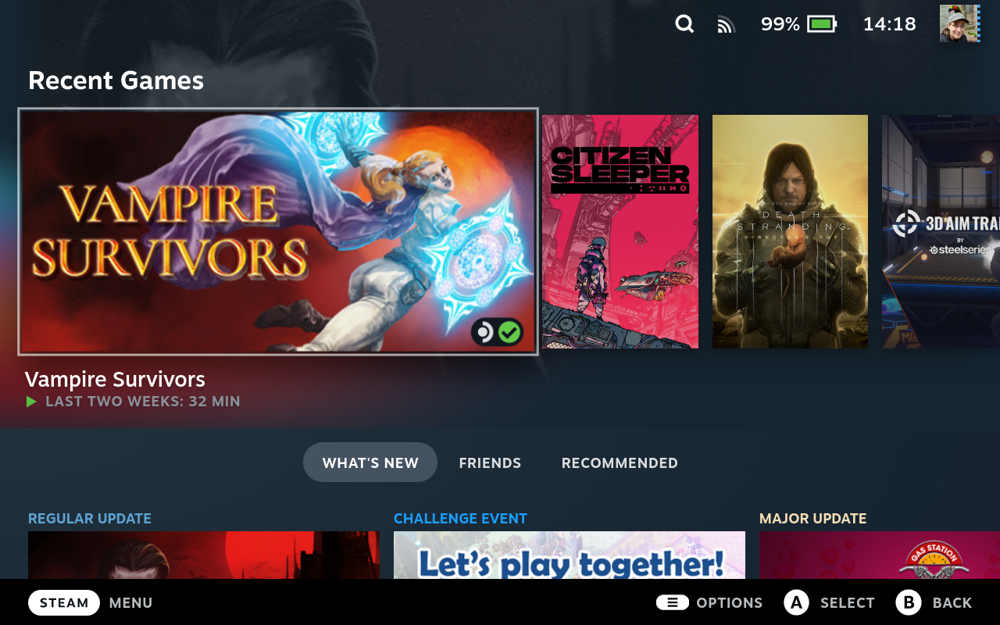

I wanted to automatically sync the screenshots I take on my Steamdeck to some cloud, without having to manually do it for every single one in the Steamdeck's own uploader. 

I came across [this gist by pegasd](https://gist.github.com/pegasd/048bd5d53558f066765253d55a456306) that accomplishes this via rclone, a path monitoring systemd service and some reconfiguration in Steam. However, I had to adjust things slightly for everything to really work - I could imagine that some past Steam update changed things slightly vs when the gist was created:

1. I had to make sure that I selected the option to make Steam create uncompressed screenshots.
2. I had to manually start the path watcher.

Here's a quick summary of how I managed to make things work on my deck (all credits go to [@pegasd](https://github.com/pegasd), replicating things here mostly so they don't get lost in the future).

## Prerequisites

First of all I switched into Desktop mode.

Since I had not yet done this since upgrading my Deck's SSD, I set a password for my user account by opening a terminal and running `passwd`. I also made sure to install Firefox from the package manager.

## Setting up the screenshot directory

I opened a terminal and created a dedicated screenshot folder:

```bash
mkdir ~/.steam_screenshots
```

Next I had to tell Steam to use this folder. Still in desktop mode I opened Steam settings and on the "In-Game" tab set the screenshot folder to the one I had just created. I also made sure to check "Save uncompressed copy", as [otherwise Steam won't use the just configured custom folder](https://steamcommunity.com/discussions/forum/1/4329623982989743690/#c4329623982989971883).

## Installing and configuring rclone

Next, still on the deck, I [downloaded rclone](https://rclone.org/downloads/) ("Intel/AMD - 64 Bit / Linux"). I opened the file browser, opened the archive I had just downloaded and extracted the `rclone` binary into `~/bin` (if that doesn't exist yet, just create it).

I then went back to the terminal, ran `~/bin/rclone config` and configured a new remote `gdrive` following [these steps](https://rclone.org/drive/). Quick summary:

1. `New remote`
2. `gdrive`
3. Empty application ID and secret
4. Full access to all files
5. No service account credentials file
6. Use web browser to authenticate
7. Not configured as a shared drive

## Automatic sync

I created a file `~/bin/sync_screenshots`

```bash
#!/usr/bin/env bash

RCLONE_BIN="${HOME}/bin/rclone"
REMOTE_NAME='gdrive'
REMOTE_DIR='Privat/Steamdeck/Screenshots'
SOURCE_DIR="${HOME}/.steam_screenshots"

${RCLONE_BIN} sync "${SOURCE_DIR}" "${REMOTE_NAME}:${REMOTE_DIR}"
```

and made it executable with `chmod +x ~/bin/sync_screenshots`.

Then I created a service file for it, `~/.config/systemd/user/sync_screenshots.service`:

```plain
[Unit]
Description=Sync Steam Screenshots

[Service]
Type=oneshot
ExecStart=%h/bin/sync_screenshots
```

and another file setting up a path watcher, `~/.config/systemd/user/sync_screenshots.path`:

```plain
[Unit]
Description=Sync Steam Screenshots

[Path]
PathModified=%h/.steam_screenshots
Unit=sync_screenshots.service

[Install]
WantedBy=default.target
```

I enabled the automation:

```bash
sudo systemctl daemon-reload
systemctl --user enable sync_screenshots.path
systemctl --user start sync_screenshots.path
```

## A quick test

I checked that the path watcher was up and running with `systemctl --user status sync_screenshots.path`.

Then I created a quick test file in the synced folder

```bash
touch ~/.steam_screenshots/test
```

and verified it showed up in the target folder on my Google Drive.

Next I deleted the file on the deck and verified it got deleted in Google Drive.

Finally I booted back into Game mode, took a screenshot there as well with `Steam`+`R1` and verified this showed up on my Drive.



Success!

*Update 2023-02-19*: There is now also a [TIL on how to do the same for Google Photos](/til/how-to-automatically-sync-screenshots-from-the-steamdeck-to-google-photos/).