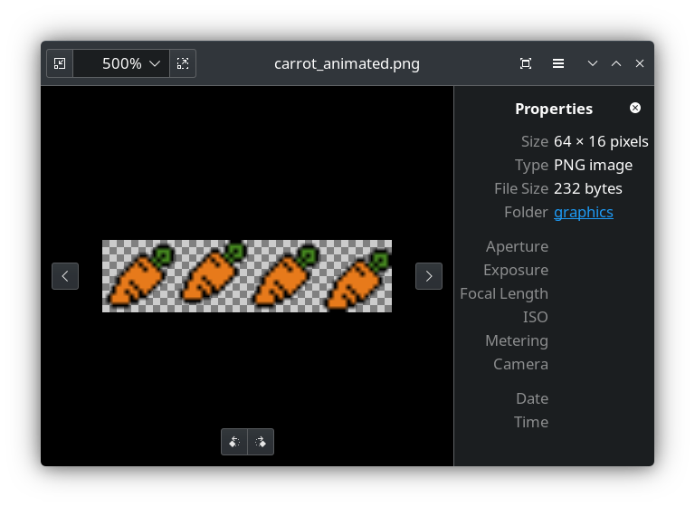
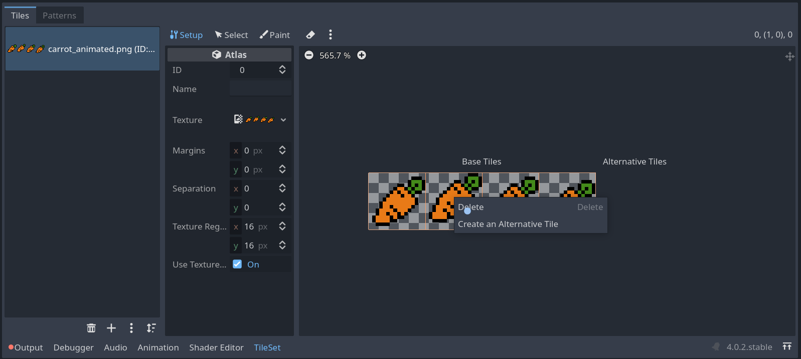
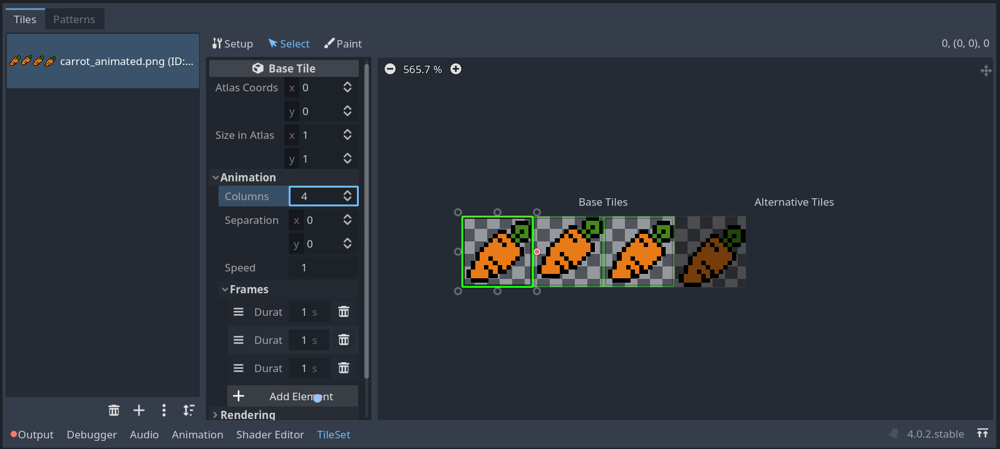

Over the past four days I've been doing [a personal crash course on game development](https://chaos.social/@foosel/110145537112426679) together with my partner[^1], ending up in building [a small platformer in two days](https://chaos.social/@foosel/110165066201016720). We decided to use [Godot Engine](https://godotengine.org), as I had been circling it for a while now [^2], and it turned out this decision was good because it was been a quite amazing experience, even for a total gamedev beginner like me 👍

What cost me a bunch of time however is trying to figure out how to create an animated tile in a [tilemap](https://docs.godotengine.org/en/stable/tutorials/2d/using_tilemaps.html), which I finally figured out yesterday, and so I'm writing it down here for future me and everyone else wondering about this.

First of all, you need a graphic of your tile-to-be-animated. It should have all frames side by side, like this example:

This is going to become a floating 16x16px carot, its animation consisting of four frames.

Add it to a tileset by dragging the resource into the left column, and make sure that *only the first frame* becomes part of your tileset! If you have let automatic atlas tooling do its thing, *delete* the other frames again under "Setup":

Then switch to the tileset editor's "Select" panel and click on the first frame of your animation. On the left you'll see some options for that tile. Open "Animation", then increase the number of animation frames to the number of your available frames (4 for our carrot here), and after that make sure to click on "Add Frame" once for each of your frames. You then can also define how long the frame will be shown, 1s by default. 0.3s will result in something like 10fps.

After that, placing the *first frame* in a tilemap should show it being animated now:



🥳

[^1]: Him focusing on pixel art, me on the coding bits.
[^2]: Not only because it's also open source, though that also plays a big part!
