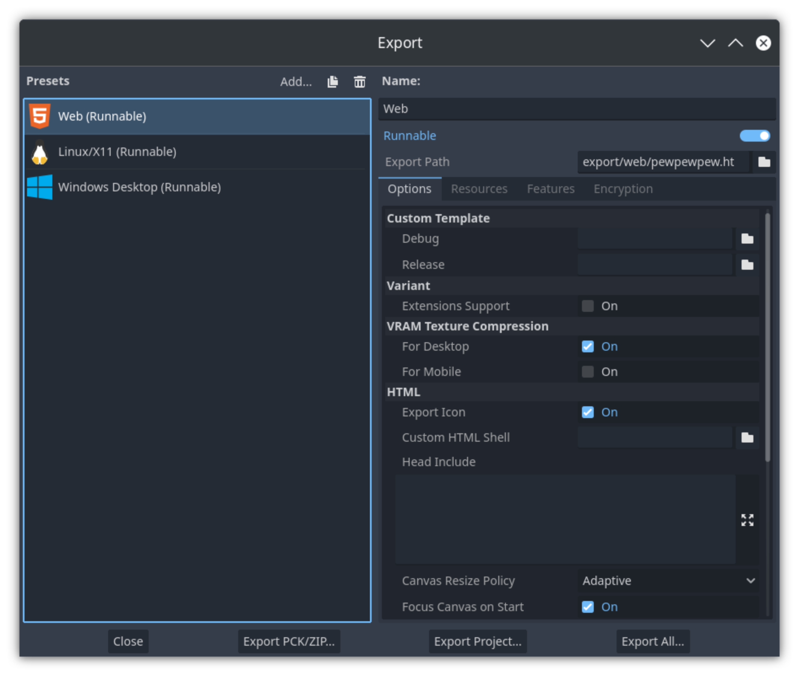
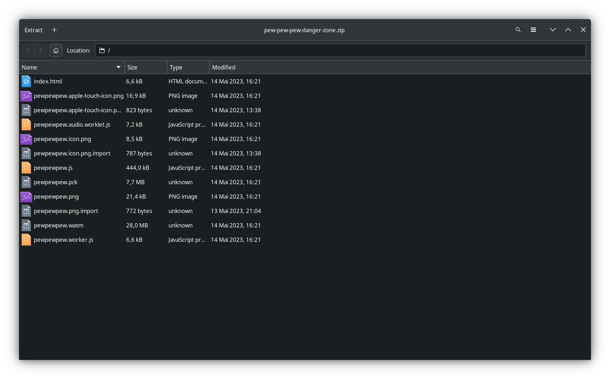
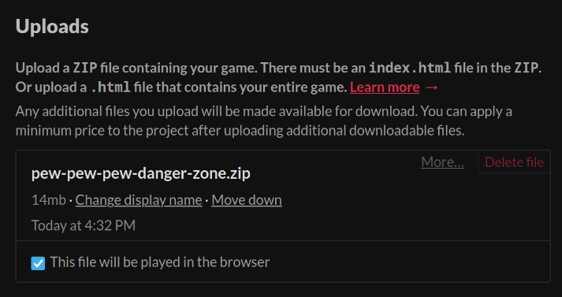
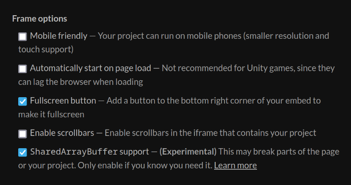

On the [Go Godot Jam 4](https://itch.io/jam/go-godot-jam-4) Discord I just saw some people having issues with how to get HTML5 exports from Godot 4 to work on itch.io, and since I just had to do this for [my own game submission to the jam](https://foosel.itch.io/pew-pew-pew-danger-zone) as well I decided to jot my steps down here (and on the Discord too) as it seems to be a bit of a pain for people.

1. First of all export your game using the "Web" export template

   

2. Navigate to your export folder, make sure to rename your `.html` file to `index.html`
3. Zip all of it up, with all the files right within the root of the zip file

   

4. Upload to itch, make sure to check "This file will be played in the browser"

   

5. Scroll down to "Embed Options" and make sure "`SharedArrayBuffer` support" is checked

   