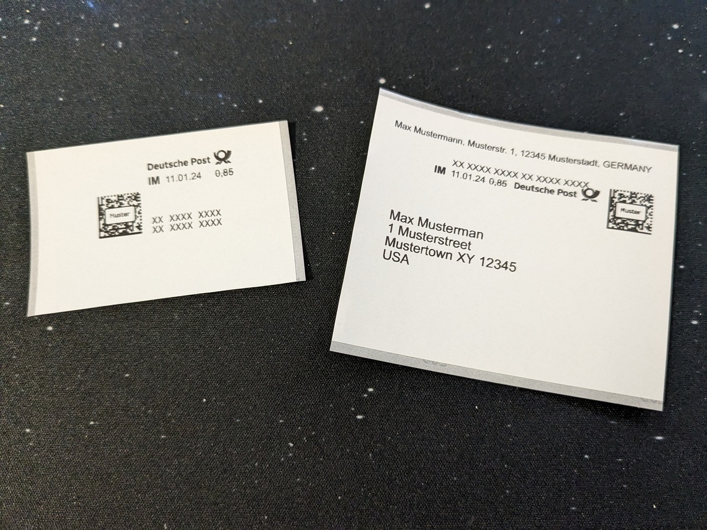

*Update from 2024-01-12: I've updated the scripts to support both 50mm and 62mm wide labels, and added some more whitespace trimming to the basic stamp. The post has been adjusted accordingly.*

I recently acquired a [Brother QL-820NWB label printer](https://www.brother-usa.com/products/QL820NWB) to be able to quickly create labels for boxes and such, and ideally also print out Deutsche Post's "print yourself" stamps with it. The Deutsche Post stamp shop allows me to download PDFs targeting the 62mm wide endless labels for that printer, for the two types of stamps I'm interested in (stamp, and address label with stamp). But my attempts in printing those directly to the printer through Gnome's printer integration weren't successful, things were too small, the cutter didn't work etc.

I knew that printing to the printer via my local instance of [brother_ql_web](https://github.com/pklaus/brother_ql_web) works flawlessly, and that the library this is based on, [brother_ql](https://github.com/pklaus/brother_ql), has a command line interface. So I thought, why not just convert the PDFs to individual PNGs, and then print those?

Through the magic of some shell scripting, I'm now able to do just that, right from the command line.

I installed the `brother_ql` Python package via pip:

```bash
pip install --user brother_ql
```

I had to do a little manual patch to make it work with the latest versions of the required Pillow dependency, by editing `brother_ql/conversion.py` and changing `Image.ANTIALIAS` to `Image.LANCZOS`.

I also made sure my `.bash_profile` contains the address and model of my printer:

``` bash
export BROTHER_QL_PRINTER=tcp://192.168.x.x
export BROTHER_QL_MODEL=QL-820NWB
```

Then I created two shell scripts, one for printing stamps and one for printing labels.

The first one, `porto_print`, takes care of printing the stamps. It resizes, trims, adds a new border and then extends to the native width for the selected label size (50mm by default, or 62mm if requested) while keeping a right alignment:

```bash
#!/bin/bash

# Usage:
#
#   porto_print <pdf> [50|62]

#!/bin/bash

tmpdir=$(mktemp -d)

cleanup() {
  rm -rf "$tmpdir"
}
trap cleanup EXIT

PDF=$1
LABEL=${2:-50}
PNG=$(basename "${PDF%.*}")

case $LABEL in
  "50")
    WIDTH="554"
    ;;
  "62")
    WIDTH="696"
    ;;
  *)
    echo "Unsupported label size: $LABEL"
    exit -1
    ;;
esac

echo "Converting PDF to individual PNGs..."
pdftoppm "$PDF" "$tmpdir/$PNG" -png -r 600

for file in $(ls $tmpdir/*.png); do
  echo "Printing $file..."
  mogrify -background white -bordercolor white -resize 696x -trim -border 25x25 -gravity east -extent ${WIDTH}x284 "$file"
  brother_ql print -l $LABEL "$file" 
done
```

The second one, `porto_address_print`, does basically the same, just with slightly different parameters and left alignment: 

``` bash
#!/bin/bash

# Usage:
#
#   porto_address_print <pdf>

tmpdir=$(mktemp -d)

cleanup() {
  rm -rf "$tmpdir"
}
trap cleanup EXIT

PDF=$1
LABEL=${2:-50}
PNG=$(basename "${PDF%.*}")

case $LABEL in
  "50")
    WIDTH="554"
    ;;
  "62")
    WIDTH="696"
    ;;
  *)
    echo "Unsupported label size: $LABEL"
    exit -1
    ;;
esac

echo "Converting PDF to individual PNGs..."
pdftoppm "$PDF" "$tmpdir/$PNG" -png -r 600

for file in $(ls $tmpdir/*.png); do
  echo "Printing $file..."
  mogrify -bordercolor white -background white -resize 696x -trim -border 25x25 -gravity West -extent ${WIDTH}x839 "$file" 
  brother_ql print -l $LABEL "$file" 
done
```

Both of these were placed under `~/.local/bin` and made executable. I can now call them both from anywhere on the command line, just passing the path to the PDF to print.

The result is one or more nicely printed stamps or address labels, ready to be stuck to an envelope:



Now, this should hopefully make it easier for me to print all those address labels for OctoPrint sticker shipments in the future ;) Next step: Automated QR code labels for the various boxes on my shelves ^^
