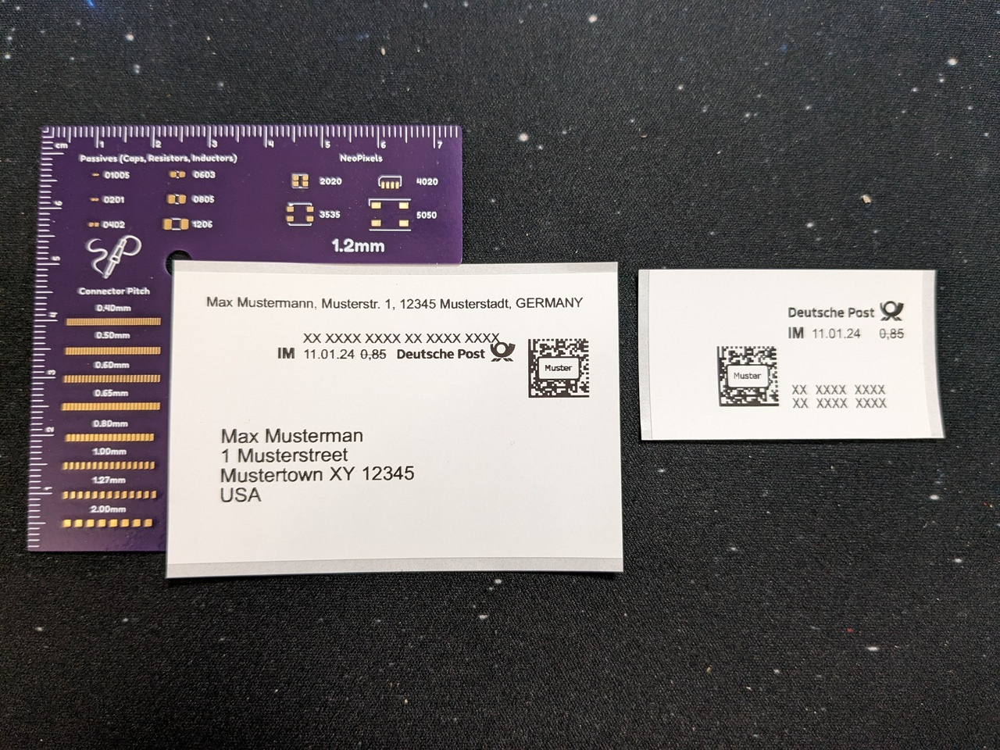

I recently acquired a [Brother QL-820NWB label printer](https://www.brother-usa.com/products/QL820NWB) to be able to quickly create labels for boxes and such, and ideally also print out Deutsche Post's "print yourself" stamps with it. The Deutsche Post stamp shop allows me to download PDFs targeting the 62mm wide endless labels for that printer, for the two types of stamps I'm interested in (stamp, and address label with stamp). But my attempts in printing those directly to the printer through Gnome's printer integration weren't successful, things were too small, the cutter didn't work etc.

I knew that printing to the printer via my local instance of [brother_ql_web](https://github.com/pklaus/brother_ql_web) works flawlessly, and that the library this is based on, [brother_ql](https://github.com/pklaus/brother_ql), has a command line interface. So I thought, why not just convert the PDFs to individual PNGs, and then print those?

Through the magic of some shell scripting, I'm now able to do just that, right from the command line.

I installed the `brother_ql` Python package via pip:

```bash
pip install --user brother_ql
```

I had to do a little manual patch to make it work with the latest versions of the required Pillow dependency, by editing `brother_ql/conversion.py` and changing `Image.ANTIALIAS` to `Image.LANCZOS`.

I also made sure my `.bash_profile` contains the address and model of my printer:

``` bash
export BROTHER_QL_PRINTER=tcp://192.168.x.x
export BROTHER_QL_MODEL=QL-820NWB
```

Then I created two shell scripts, one for printing stamps and one for printing labels.

The first one, `porto_print`, takes care of printing the stamps. Not much work here is needed beyond conversion to individual images via `pdftoppm` and ensuring the native pixel size with `imagemagick`:

```bash
#!/bin/bash

# Usage:
#
#   porto_print <pdf>

tmpdir=$(mktemp -d)

cleanup() {
  rm -rf "$tmpdir"
}
trap cleanup EXIT

PDF=$1
PNG=$(basename "${PDF%.*}")

echo "Converting PDF to individual PNGs..."
pdftoppm "$PDF" "$tmpdir/$PNG" -png -r 600

for file in $(ls $tmpdir/*.png); do
    echo "Printing $file..."
    mogrify -resize 696x "$file" 
    brother_ql print -l 62 "$file" 
done
```

The second one, `porto_address_print`, is a bit more involved. The individual label PDFs provided by Deutsche Post contain a ton of whitespace, so I wanted to do some clean-up first to produce less waste, and also keep the option open for me to switch to the 50mm wide label stock at a later point (which should fit the labels just fine, it's just that Deutsche Post ONLY supports 62mm wide labels for some reason).

So, I extract the images, then for each image, resize it to a target width of 696px, trim all white space, add a border again of 25px, and then blow that up to a width of 696px again, keeping the aspect ration and making sure the source image stays to the left of the new image.[^1] 

``` bash
#!/bin/bash

# Usage:
#
#   porto_address_print <pdf>

tmpdir=$(mktemp -d)

cleanup() {
  rm -rf "$tmpdir"
}
trap cleanup EXIT

PDF=$1
PNG=$(basename "${PDF%.*}")

GEOMETRY=696x839
LABEL=62

# For 50mm labels, these values should work:
# GEOMETRY=554x839
# LABEL=50 

echo "Converting PDF to individual PNGs..."
pdftoppm "$PDF" "$tmpdir/$PNG" -png -r 600

for file in $(ls $tmpdir/*.png); do
    echo "Printing $file..."
    mogrify -resize 696x "$file" 
    mogrify -trim -background white "$file"
    mogrify -bordercolor white -border 25x25 "$file"
    mogrify -background white -gravity West -extent $GEOMETRY "$file" 
    brother_ql print -l $LABEL "$file" 
done
```

Both of these were placed under `~/.local/bin` and made executable. I can now call them both from anywhere on the command line, just passing the path to the PDF to print.

The result is one or more nicely printed stamps or address labels, ready to be stuck to an envelope[^2]:



Now, this should hopefully make it easier for me to print all those address labels for OctoPrint sticker shipments in the future ;) Next step: Automated QR code labels for the various boxes on my shelves ^^

[^1]: Were I to switch to 50mm wide labels, I'd just have to change the target width of the final step to 554px and adjust the label type. The corresponding values have already be added as comments in the script.
[^2]: Looking at this I'll definitely look into saving some more whitespace on the basic stamp too though.