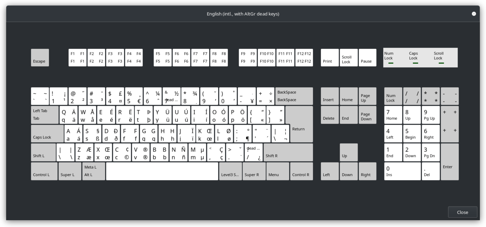

As a German living in Germany with umlauts in my last name and a US ANSI keyboard layout on all my devices[^1] I need to remap some stuff to be able to easily type ä, ö, ü and ß. On Windows I solved this with [Autohotkey](https://www.autohotkey.com/), mapping `AltGr`+`a` to `ä`, `AltGr`+`o` to `ö`, `AltGr`+`u` to `ü` and `AltGr`+`s` to `ß` (well, technically `RAlt` - the right `Alt` key). That has burned itself into my muscle memory now, and so while currently setting up my new Framework laptop under Linux, with Gnome running on Wayland, I was looking for a way to remap the keys to this layout as well.

In the old days, I would have written an `.Xmodmap` file and called it a day, but that no longer works under Wayland. Thankfully however there's a whole new generation of mapping tools that instead of depending on the X server allow remapping right at the kernel input level, and one of them is [keyd](https://github.com/rvaiya/keyd) which I used to solve my umlaut problem, and while at it also added a fancy mod layer and even a mouse layer.

First of all, in Gnome I set the keyboard layout to "English (intl., with AltGr dead keys)", making it look like this:



Then I downloaded, compiled and installed `keyd` and created a config file at `~/.config/keyd/default.cfg` with the following contents:

```
[ids]
*

[main]
capslock = layer(mod)
rightalt = layer(dia)
rightcontrol = overload(control, sysrq)

[dia]
a = G-q
o = G-p
u = G-y
s = G-s
e = G-5
` = G-S-;

[mod]
alt = layer(mouse)
j = left
k = down
l = right
i = up
u = home
o = end
y = pageup
h = pagedown
p = delete
; = insert

[mouse]
j = kp4
k = kp2
l = kp6
i = kp8
f = leftmouse
s = rightmouse
d = middlemouse
```

What this does is first of all attach  two layers `mod` and `dia` to `CapsLock` and right `Alt` respectively, and then it also gives the right `Ctrl` key a second purpose in life. Holding it still makes it act like your regular `Ctrl` key, but merely tapping it now will make it act like `PrintScreen` aka `SysRq`, allowing me to take screenshots more quickly than my laptop's keyboard layout would regularly allow[^2].

But let's take a closer look at the layers.

## Solving my umlaut problem

Let's start with the `dia` layer, since that is what solves my umlaut problem. I couldn't get the compose key to work for me, so I went with mapping my desired shortcuts to the right shortcuts on the international layout for the key to pop up:

- `a` -> `AltGr`+`q` (`ä`)
- `o` -> `AltGr`+`p` (`ö`)
- `u` -> `AltGr`+`y` (`ü`)
- `s` -> `AltGr`+`s` (`ß`)
- `e` -> `AltGr`+`5` (`€`)
- `` ` `` -> `AltGr`+`Shift`+`;` (`°`)

## Adding a mod layer...

While at it I decided to also add another feature I'm used to from my UHK, and that is the Mod layer together with its arrow keys, home, end etc. So I replicated that as well, which is the `mod` layer here. And because I cannot remember a single time in my life where I ever needed `CapsLock`, that became my mod key. With Capslock held, we have the following mappings:

- `j` -> `left`
- `k` -> `down`
- `l` -> `right`
- `i` -> `up`
- `u` -> `home`
- `o` -> `end`
- `y` -> `pageup`
- `h` -> `pagedown`
- `p` -> `delete`
- `;` -> `insert`

I've since also enabled `CapsLock` as `Mod` key on my UHK, in the hopes that this will accelerate my muscle memory learning process.

## ... and adding a mouse layer too!

And then I thought, hm, can I maybe even add a mouse layer? And yes, I can. So I added a `mouse` layer, which is activated by holding `Alt` and `CapsLock` together. I enabled mouse keys in Gnome's accessibility settings, which allows me to move the mouse cursor with the numpad keys. My keyboard does not *have* numpad keys, but keyd doesn't care, and so we end up with this mapping:

- `j` -> move cursor left
- `k` -> move cursor down
- `l` -> move cursor right
- `i` -> move cursor up
- `f` -> left mouse button
- `s` -> right mouse button
- `d` -> middle mouse button

I'm not sure I'll actually use this a lot tbh, this was more a case of "can it be done?" and "why not?". But it's nice to have the option. Something I still need to experiment on however are the acceleration settings, because out of the box this was way too slow for me, so after finding an answer [here](https://askubuntu.com/a/1234995) I changed the mouse key parameters a bit via

```
gsettings set org.gnome.desktop.a11y.keyboard mousekeys-max-speed 2000;
gsettings set org.gnome.desktop.a11y.keyboard mousekeys-init-delay 20;
gsettings set org.gnome.desktop.a11y.keyboard mousekeys-accel-time 2000;
```

But I'm not 100% happy with this yet and need to play around with things a bit more.

## Fixing the "Disable Touchpad while Typing" feature

One problem arose from all of this reconfiguration, and that was that the "Disable Touchpad while Typing" (DWT) feature was no longer working, which turned out to be a rather big deal - I kept unintentionally moving the cursor or even clicking on things while typing. Thankfully a quick search made me stumble over [this helpful post](https://linuxtouchpad.org/libinput/2022/05/07/disable-while-typing.htmls) that not only explained the issue but also showed me how to solve it.

To summarize, DWT works by pairing up touchpad and keyboard either by them having the same vendor and product id, or being marked as "internal". In the case of keyd acting as my keyboard, neither was true anymore and thus DWT no longer worked. The solution was to modify the `libinput` properties of the virtual keyd keyboard such that it would be marked as "internal". Putting this into `/etc/libinput/local-overrides.quirks` sufficed:

```
[Virtual Keyboard]
MatchUdevType=keyboard
MatchName=keyd virtual keyboard
AttrKeyboardIntegration=internal
```

## Conclusion

keyd seems like a powerful tool, and even though I haven't actually yet tested it, should at any point I want to switch to X11 or a blank terminal on this laptop now, all these mappings should continue to function (as long as I set the keyboard layout to English international). That's definitely a way cleaner solution than the `xmodmap` approach I was using in the past. And I can now finally type my name again!

[^1]: US ANSI layout is *so* much nicer for programming than the German ISO DE layout. I switched around three years ago when I got my first [UHK](https://ultimatehackingkeyboard.com/) and haven't looked back.
[^2]: I tend take a *lot* of screenshots (mostly OctoPrint related), so this is a big deal for me.
