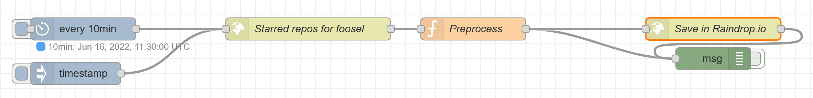

The following flow syncs starred repos of a GitHub user to Raindrop.io every 10min and on trigger:



"Every 10min" is a cron trigger node that fires every 10min. "timestamp" is an inject node for triggering the flow manually.

"Starred repos for foosel" is an HTTP GET request against `https://api.github.com/users/foosel/starred`, set to return an object parsed from the response JSON. Change `foosel` to your own username.

The "Preprocess" function node has this source:

```js
const key = "feed_githubstars_repos";
const repos = flow.get(key) || [];
const added = msg.payload.filter(repo => !repos.includes(repo.full_name));
flow.set(key, repos.concat(added.map(repo => repo.full_name)));

return {
    payload: {
        items: added.map(repo => {
            return {
                title: `${repo.full_name}: ${repo.description}`,
                link: repo.html_url,
                tags: ["github", "starred"]
            }
        })
    }
}
```

"Save in Raindrop.io" performs an HTTP POST request against `https://api.raindrop.io/rest/v1/raindrops` with authentication type"Bearer" and an API token created [here](https://app.raindrop.io/settings/integrations).