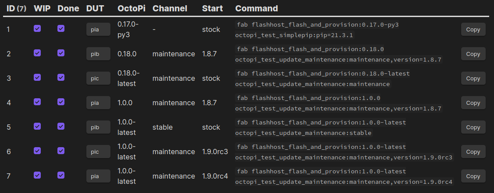

For every [OctoPrint](https://octoprint.org) release I run through several update tests: I flash a specific OctoPi version, push it to a specific OctoPrint version, configure the release channel, then see if updating to the newest release (candidate) works fine. I use [my testrig and its automation scripts](https://octoprint.org/blog/2020/07/29/automating-octoprints-release-tests/) for that and usually go through something between 5 and 10 separate scenarios.

So far all of these scenarios were noted down as a Markdown table in my release checklist that these days I prepare in my [Obsidian](https://obsidian.md) vault, including manually adjusting the testrig commands to match the scenario. Having to take care of the latter is something that has been annoying for a long time now, and during the preparation for [yesterday's release candidate](https://github.com/OctoPrint/OctoPrint/releases/tag/1.9.0rc5) I decided enough is enough and looked into improving my tooling a bit. In the end, I used Obsidian's quite amazing [Dataview plugin](https://blacksmithgu.github.io/obsidian-dataview/) to query the information about the planned test scenarios from the checklist's frontmatter, build the testrig command from that, then render all of this as a table, complete with some checkboxes for state logging during the tests and a copy button for the command.

Here's the format of the frontmatter for the latest release candidate 1.9.0rc5:

```yaml
update_test_type: maintenance
update_tests:
- image: 0.17.0-py3
  update_test_type: simplepip
  additional: pip=21.3.1
  wip: true
  done: true
- image: 0.18.0
  channel: maintenance
  start: 1.8.7
  wip: true
  done: true
- image: 0.18.0-latest
  channel: maintenance
  wip: true
  done: true
- image: 1.0.0
  channel: maintenance
  start: 1.8.7
  wip: true
  done: true
- image: 1.0.0-latest
  channel: stable
  wip: true
  done: true
- image: 1.0.0-latest
  channel: maintenance
  start: 1.9.0rc3
  wip: true
  done: true
- image: 1.0.0-latest
  channel: maintenance
  start: 1.9.0rc4
  wip: true
  done: true
```

And this is the `dataviewjs` query I used:

```js
const createCheckbox = (checked) => {
	const checkbox = this.container.createEl("input", {"type": "checkbox"});
	checkbox.checked = checked;
	return checkbox;
}
const createDropdown = (options, selected) => {
	const dropdown = this.container.createEl("select");
	options.map((value, idx) => {
		const option = dropdown.createEl("option", {"text": value, "value": value});
		option.selected = (value == selected);
	});
	return dropdown;
}
const createCopyButton = (command) => {
	const button = this.container.createEl("button", {"text": "Copy"})
	button.addEventListener("click", (evt) => {
		evt.preventDefault();
		navigator.clipboard.writeText(command);
	});
	return button;
}

const DUTS = ["pia", "pib", "pic"];

const update_type = dv.current().update_test_type || "maintenance";
const tests = dv.current().update_tests;

dv.table(["ID", "WIP", "Done", "DUT", "OctoPi", "Channel", "Start", "Command", ""], tests
	.map((t, idx) => {
		const dut = t.dut || DUTS[idx % DUTS.length];
		const version = (!t.start || t.start == "stock") ? "" : `,version=${t.start}`;

		let command;
        switch (t.update_test_type) {
			case "simplepip": {
				command = `fab flashhost_flash_and_provision:${t.image} octopi_test_simplepip`;
				if (t.additional) {
					command += ":" + t.additional;
				}
				break;
			}
			default: {
				command = `fab flashhost_flash_and_provision:${t.image} octopi_test_update_${update_type}:${t.channel}${version}`;
				if (t.additional) {
				  command += "," + t.additional
				}
				break;
			}
		}

		const wipCheckbox = createCheckbox(t.wip);
		const doneCheckbox = createCheckbox(t.done);
		const dutDropdown = createDropdown(DUTS, dut);
		const copyButton = createCopyButton(command);

		return [idx + 1, wipCheckbox, doneCheckbox, dutDropdown, t.image, t.channel, t.start ? t.start : "stock", "`" + command + "`", copyButton]
	}));
```

This iterates over the list of scenarios, and for each generates a command, assigns one of the DUTs (Device Under Test) of the testrig, creates checkboxes for WIP and Done seeded from the frontmatter data and also a copy button. This then gets rendered as a table.

Throwing that query in a `dataviewjs` typed markdown code fence yields a nice rendition of the data that allows me to check if I have forgotten anything, track my progress with the checkboxes and also allows me to easily copy the generated command with the click of a button, so I don't have to manually copy paste stuff anymore:



What I have not yet figured out is how to manipulate the frontmatter directly via the checkboxes and DUT dropdowns (for logging purposes) - right now I still have to edit the state changes manually to persist them. The [MetaEdit](https://github.com/chhoumann/MetaEdit) plugin for Obsidian looked promising, but that doesn't seem to be flexible enough to manipulate a list of items (yet).

In any case, this helped me a ton yesterday, and will save me a lot of time with future releases and release candidates!
